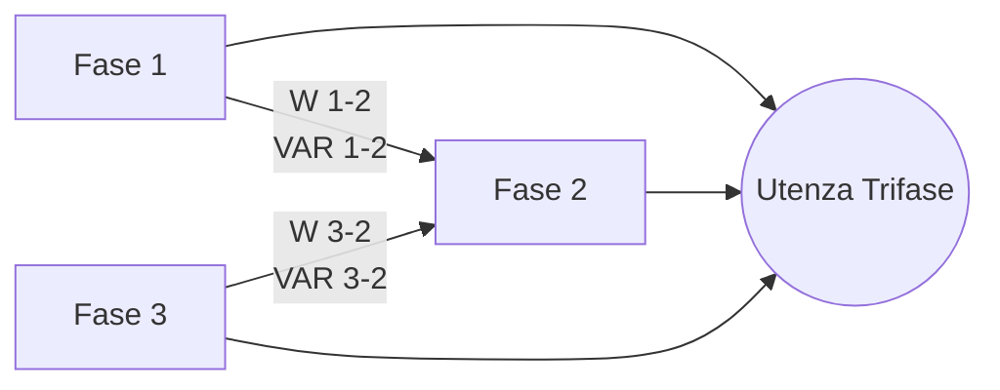

# SOLAR300N

<!-- Language: it -->
<!-- Version: 1.0 -->

<!-- Chunk: Pages 1-58 -->

INDICE

1. PRECAUZIONI E MISURE DI SICUREZZA ............................. 4
    1.1. Generalità ........................................................................ 4
    1.2. Istruzioni preliminari ........................................................ 4
    1.3. Durante l’utilizzo .............................................................. 5
    1.4. Dopo l’utilizzo .................................................................. 5
    1.5. Definizione di Categoria di misura (Sovratensione) ............. 5
2. DESCRIZIONE GENERALE ..................................................... 6
    2.1. Introduzione ..................................................................... 6
    2.2. Sistemi FV e NFV .............................................................. 6
    2.3. Funzionalità dello strumento ............................................. 6
    2.4. Videata Iniziale ................................................................. 7
3. PREPARAZIONE ALL’UTILIZZO ............................................. 7
    3.1. Controlli iniziali ................................................................. 7
    3.2. Alimentazione dello strumento ........................................... 7
    3.3. Taratura ....... Errore. Il segnalibro non è definito.
    3.4. Conservazione ................................................................. 7
4. ISTRUZIONI OPERATIVE ........................................................ 8
    4.1. Descrizione dello strumento ............................................. 8
    4.2. Descrizione della tastiera ................................................... 9
    4.3. Descrizione del display ..................................................... 10
    4.4. Reset dello strumento ........................................................ 10
5. MENU GENERALE ................................................................. 11
    5.1. Sezione Impostazioni Generali ........................................... 12
        5.1.1. Regolazione lingua di sistema .......................................... 12
        5.1.2. Regolazione data/ora di sistema ........................................ 13
        5.1.3. Regolazione luminosità del display ..................................... 13
        5.1.4. Impostazione password di protezione ............................... 14
        5.1.5. Impostazione suoni tastiera ............................................... 15
        5.1.6. Impostazione autospegnimento .......................................... 15
        5.1.7. Impostazione tipo memoria .............................................. 16
        5.1.8. Calibrazione display “touch screen” .................................. 16
    5.2. Sezione Visualizzazione Misure ........................................ 17
        5.2.1. Videata impianto fotovoltaico Mono MPPT – Uscita monofase 17
        5.2.2. Videata impianto fotovoltaico Mono MPPT – Uscita trifase .. 18
        5.2.3. Videata impianti fotovoltaici con inverter Multi MPPT (solo con MPP300) 18
            5.2.3.1. Videata impianto fotovoltaico Multi MPPT – Uscita monofase 19
            5.2.3.2. Videata impianto fotovoltaico Multi MPPT – Uscita trifase . 20
        5.2.4. Videate valori per sistemi NFV ......................................... 20
            5.2.4.1. Visualizzazione valori numerici ........................................ 21
        5.2.5. Videate forme d’onda segnali SCOPE ................................ 24
        5.2.6. Videate analisi armonica ARM ......................................... 26
        5.2.7. Videate diagramma vettoriale ............................................ 28
    5.3. Sezione Impostazione Analizzatore ................................... 30
        5.3.1. Videata Configurazione Analizzatore ................................... 30
            5.3.1.1. Impostazione frequenza del sistema ................................. 34
            5.3.1.2. Impostazione del tipo di pinza .......................................... 34
            5.3.1.3. Impostazione del fondo scala della pinza .......................... 35
            5.3.1.4. Impostazione del rapporto di trasformazione dei TV ........ 35
        5.3.2. Videata Impostazioni Parametri – Sistemi FV .................... 36
            5.3.2.1. Impostazione della potenza nominale del sistema FV ..... 36
            5.3.2.2. Impostazione del Parametro Gamma dei pannelli fotovoltaici 36
            5.3.2.3. Impostazione del parametro NOCT dei pannelli fotovoltaici 37
            5.3.2.4. Impostazione delle temperature Te e Tc .......................... 37
            5.3.2.5. Impostazione N Ingressi DC (solo in abbinamento a MPP300 opz.) 37
            5.3.2.6. Selezione della relazione di compensazione degli effetti della temperatura 38
            5.3.2.7. Impostazione Potenza inverter (Pinv) .............................. 39
        5.3.3. Videata Impostazioni Avanzate – Sistemi FV ..................... 40
            5.3.3.1. Impostazione unità remota ............................................... 40
            5.3.3.2. Impostazione della sensibilità del piranometro (solo per uso di SOLAR - 01) 40
            5.3.3.3. Impostazione della soglia minima di irraggiamento ......... 41
            5.3.3.4. Impostazione della costante correttiva della pinza DC .... 41
        5.3.4. Videata Impostazioni Avanzate – Sistemi NFV ................... 42
            5.3.4.1. Opzione Zoom Grafici ..................................................... 42
            5.3.4.2. Opzione Armoniche visualizzate – Sistemi NFV .............. 43
            5.3.4.3. Opzione valori delle armoniche – Sistemi NFV ............... 43
            5.3.4.4. Opzione Zoom rispetto alla prima armonica – Sistemi NFV 44
            5.3.4.5. Opzione Valori Medi - – Sistemi NFV ............................... 44
    5.4. Sezione Impostazione Registrazione ................................. 45
        5.4.1. Videata Impostazioni Registratore – Sistemi FV ................ 45
            5.4.1.1. Voce Commenti ............................................................... 46
            5.4.1.2. Uso della tastiera virtuale ................................................. 46
            5.4.1.3. Voci Start e Stop ............................................................. 47
            5.4.1.4. Voce Periodo Integrazione ............................................... 47
            5.4.1.5. Voce Parametri Generali per utilizzo con unità SOLAR01 o SOLAR02 47
            5.4.1.6. Descrizione sottolivelli voce Parametri Generali .............. 49
            5.4.1.7. Voci SOLAR01 e SOLAR02 ............................................ 50
            5.4.1.8. Configurazioni predefinite ................................................ 50
            5.4.1.9. Voce Parametri Generali per utilizzo con unità MPP300 . 52
        5.4.2. Videata Impostazioni Registratore – Sistemi NFV ............ 53
            5.4.2.1. Voce Commenti ............................................................... 53
            5.4.2.2. Uso della tastiera virtuale ................................................. 54
            5.4.2.3. Voci Start e Stop ............................................................. 54
            5.4.2.4. Voce Periodo Integrazione ............................................... 55
            5.4.2.5. Voce Cogenerazione ....................................................... 55
            5.4.2.6. Voce Parametri Generali ................................................. 56
            5.4.2.7. Descrizione sottolivelli voce Parametri Generali .............. 58
            5.4.2.8. Descrizione sottolivelli voce Armoniche ........................... 59
            5.4.2.9. Voce Anomalie di Tensione ............................................. 61
            5.4.2.10. Voce Correnti di Spunto .................................................. 62
            5.4.2.11. Voce Flicker .................................................................... 63
            5.4.2.12. Voce Dissimmetria ........................................................... 64
            5.4.2.13. Voce Spike ...................................................................... 64
            5.4.2.14. Configurazioni predefinite ................................................ 65
    5.5. Avvio di un collaudo di un impianto FV .............................. 73
        5.5.1. Durante un collaudo ........................................................ 75
        5.5.2. Fine collaudo ................................................................... 76
    5.6. Avvio di una registrazione ................................................. 77
        5.6.1. Avvio automatico della registrazione (solo per sistemi NFV) 80
        5.6.2. Durante una registrazione ................................................ 81
    5.7. Sezione gestione dati memorizzati ................................... 83
        5.7.1. Analisi registrazione (tipo Reg) ........................................ 84
            5.7.1.1. Informazioni Registrazione ................................................. 84
            5.7.1.2. Grafico Registrazione ...................................................... 85
            5.7.1.3. Anomalie ........................................................................ 87
            5.7.1.4. Spikes ............................................................................. 88
            5.7.1.5. Correnti di Spunto ........................................................... 90
            5.7.1.6. EN50160 ........................................................................ 92
            5.7.1.7. Energia totale consumata ................................................ 94
            5.7.1.8. Energia totale prodotta .................................................... 95
        5.7.2. Analisi registrazione (tipo RegFV e RegMPP) ................... 96
            5.7.2.1. Informazioni Registrazione ............................................... 96
            5.7.2.2. Esito per dati tipo RegFV ................................................. 97
            5.7.2.3. Esito per dati tipo RegMPP ............................................. 99
            5.7.2.4. Grafico Registrazione .................................................... 100
        5.7.3. Analisi registrazione (tipo Istant) .................................... 102
            5.7.3.1. Informazioni Registrazione ............................................ 102
            5.7.3.2. Grafico ........................................................................ 103
            5.7.3.3. Analisi Armonica ........................................................... 103
            5.7.3.4. Vettori ............................................................................ 104
            5.7.3.5. Misure ............................................................................ 105
        5.7.4. Trasferimento di registrazioni su Pen Driver USB esterno .. 106
        5.7.5. Salvataggio registrazioni su Compact Flash esterna ......... 107
    5.8. Sezione Informazioni strumento ...................................... 108
6. COLLEGAMENTO DELLO STRUMENTO AD UN PC (WIN XP) . 109
7. PROCEDURE DI MISURA .................................................... 110
    7.1. Collaudo sistemi FV - 1 con unita’ remota SOLAR - 01 .......... 111
    7.2. Collaudo di un sistema FV - 1 con unita’ remota SOLAR - 02 . 113
    7.3. Collaudo di un sistema FV - 3 con unita’ remota SOLAR - 01 . 115
    7.4. Collaudo di un sistema FV - 3 con unita’ remota SOLAR - 02 . 117
    7.5. Collaudo impianti FV Mono/Multi MPPT – Uscita AC Mono/Trifase 119
    7.6. Registrazione di un sistema FV - 1 con unita’ remota SOLAR - 01 125
    7.7. Registrazione di un sistema FV - 1 con unita’ remota SOLAR - 02 127
    7.8. Registrazione di un sistema FV - 3 con unita’ remota SOLAR - 01 129
    7.9. Registrazione di un sistema FV - 3 con unita’ remota SOLAR - 02 131
    7.10. Registrazione impianti Mono/Multi MPPT – Uscita AC Mono/Trifase 133
    7.11. Uso dello strumento in un Sistema Monofase .......................... 138
    7.12. Uso dello strumento in un Sistema Trifase 4 - fili ..................... 139
    7.13. Uso dello strumento in un Sistema Trifase 3 - fili ..................... 140
    7.14. Uso dello strumento in un Sistema Trifase 3 - fili ARON ........... 141
    7.15. Uso dello strumento in un Sistema 4 - fili 3F HL (sistemi USA) 142
    7.16. Uso dello strumento in un Sistema 3 - fili 3F DA (sistemi USA) 143
    7.17. Uso dello strumento in un Sistema 3 - fili 3F 2e (sistemi USA) 144
    7.18. Uso dello strumento in un Sistema 3 - fili 3F YA (sistemi USA) 145
    7.19. Uso dello strumento in un Sistema 3 - fili 1F PC (sistemi USA) 146
8. MANUTENZIONE ................................................................ 147
    8.1. Generalità ........................................................................ 147
    8.2. Situazioni relative ai LED dell’unita’ SOLAR - 01 ..................... 147
        8.2.1. Sostituzione batteria interna unità SOLAR - 01 e SOLAR - 02 . 147
    8.3. Situazioni relative alla batteria interna dello strumento ............ 147
    8.4. Pulizia degli Strumenti ....................................................... 148
    8.5. Fine vita ........................................................................... 148
9. SPECIFICHE TECNICHE ..................................................... 149
    9.1. Caratteristiche tecniche ................................................... 149
    9.2. Caratteristiche generali ..................................................... 152
    9.3. Ambiente ........................................................................ 152
    9.4. Accessori ........................................................................ 152
10. APPENDICE – CENNI TEORICI .......................................... 153
    10.1. Collaudo degli impianti FV .............................................. 153
    10.2. Registrazione su impianti FV .......................................... 154
    10.3. Cenni su MPPT (Maximum Power Point Tracker) ............. 155
    10.4. Anomalie di tensione ................................................... 156
    10.5. Armoniche di tensione e corrente ................................. 157
        10.5.1. Teoria ............................................................................ 157
        10.5.2. Valori limite per le Armoniche di tensione ........................ 158
        10.5.3. Cause della Presenza di Armoniche ............................... 158
        10.5.4. Conseguenza della Presenza di Armoniche ................... 159
    10.6. Correnti di Spunto .......................................................... 160
    10.7. Flicker ........................................................................... 161
    10.8. Dissimmetria delle tensioni di alimentazione ..................... 162
    10.9. Transitori di tensione veloci (Spikes) ............................... 163
    10.10. Definizioni di Potenza e Fattore di Potenza ..................... 165
        10.10.1. Convenzioni sulle Potenze e Fattori di Potenza ............. 166
        10.10.2. Inserzione ARON ........................................................... 167
    10.11. Cenni sul metodo di misura .......................................... 167
        10.11.1. Uso del periodo di integrazione ..................................... 168
        10.11.2. Calcolo del Fattore di Potenza ..................................... 168
11. ASSISTENZA ........................................................................ 169
    11.1. Condizioni di Garanzia ................................................... 169
    11.2. Assistenza .................................................................... 169

# 1. PRECAUZIONI E MISURE DI SICUREZZA

## 1.1. GENERALITÀ

Lo strumento è stato progettato in conformità alle direttive IEC/EN61010-1, relative agli strumenti di misura elettronici. Per la Sua sicurezza e per evitare di danneggiare lo strumento, La preghiamo di seguire le procedure descritte nel presente manuale e di leggere con particolare attenzione tutte le note precedute dal simbolo ⚠.

Prima e durante l’esecuzione delle misure attenersi alle seguenti indicazioni:

*   Lo strumento è costituito da una unità principale **SOLAR 300** o **SOLAR300N** e da una unità remota di acquisizione (**SOLAR-01** o **SOLAR-02** indicati genericamente come “**SOLAR-0x**” salvo notazione specifica). Se non diversamente indicato, tutte le indicazioni inerenti la sicurezza sono da intendersi sempre riferite all’unità principale
*   Non effettuare misure di tensione o corrente in ambienti umidi
*   Non effettuare misure in presenza di gas o materiali esplosivi, combustibili o in ambienti polverosi
*   Evitare contatti con il circuito in esame se non si stanno effettuando misure
*   Evitare contatti con parti metalliche esposte, con terminali di misura inutilizzati, circuiti, ecc
*   Non effettuare alcuna misura qualora si riscontrino anomalie nello strumento come, deformazioni, rotture, fuoriuscite di sostanze, assenza di visualizzazione sul display, ecc

Nel presente manuale e sullo strumento sono utilizzati i seguenti simboli:

> **Attenzione:** attenersi alle istruzioni riportate nel manuale; un uso improprio potrebbe causare danni allo strumento o ai suoi componenti

> **Pericolo Alta Tensione:** rischi di shock elettrici

> **Doppio isolamento**

> Le tensioni indicate a sinistra di questo simbolo si intendono riferite verso terra

## 1.2. ISTRUZIONI PRELIMINARI

*   Questo strumento è stato progettato per un utilizzo in un ambiente con livello di inquinamento 2
*   Può essere utilizzato per misure di **TENSIONE** e **CORRENTE** su installazioni con categoria di sovratensione CAT IV 600V verso terra con tensione massima 1000V tra gli ingressi.
*   La invitiamo a seguire le normali regole di sicurezza orientate a proteggerLa contro correnti pericolose e proteggere lo strumento contro un utilizzo errato
*   Solo gli accessori forniti a corredo dello strumento garantiscono gli standard di sicurezza. Essi devono essere in buone condizioni e sostituiti, se necessario, con modelli identici
*   Non effettuare misure su circuiti che superano i limiti di corrente e tensione specificati
*   Prima di collegare i cavi, i coccodrilli e le pinze al circuito in esame, controllare che sia selezionata la funzione desiderata

> **ATTENZIONE**
>
> *   Eseguire una ricarica completa della batteria interna per **almeno 5 ore** prima dell’uso dello strumento dopo l’acquisto
> *   Alla prima accensione dello strumento dopo l’acquisto premere e tenere premuto il tasto **ON/OFF** per circa 5s

## 1.3. DURANTE L’UTILIZZO

La preghiamo di leggere attentamente le raccomandazioni e le istruzioni seguenti:

> **ATTENZIONE**
>
> *   La mancata osservazione delle Avvertenze e/o Istruzioni può danneggiare lo strumento e/o i suoi componenti o essere fonte di pericolo per l’operatore
> *   Quando lo strumento è connesso al circuito in esame non toccare mai qualunque terminale inutilizzato
> *   Durante la misura di correnti, ogni altra corrente localizzata in prossimità delle pinze può influenzare la precisione della misura
> *   Durante la misura di corrente posizionare **sempre** il conduttore il più possibile al centro del toroide in modo da ottenere una lettura più accurata
> *   Se durante una misura il valore o il segno della grandezza in esame rimangono costanti controllare se è attivata la funzione "**HOLD**"

## 1.4. DOPO L’UTILIZZO

*   Quando le misure sono terminate, spegnere lo strumento tramite il tasto **ON/OFF**
*   Se si prevede di non utilizzare lo strumento per un lungo periodo attenersi alle prescrizioni relative all’immagazzinamento descritte al § 9.3

## 1.5. DEFINIZIONE DI CATEGORIA DI MISURA (SOVRATENSIONE)

La norma IEC/EN 61010-1: Prescrizioni di sicurezza per apparecchi elettrici di misura, controllo e per utilizzo in laboratorio, Parte 1: Prescrizioni generali, definisce cosa si intenda per categoria di misura, comunemente chiamata categoria di sovratensione. Al § 6.7.4: Circuiti di misura, essa recita:

(OMISSIS)

I circuiti sono suddivisi nelle seguenti categorie di misura:

*   La Categoria di misura **IV** serve per le misure effettuate su una sorgente di un’installazione a bassa tensione
    Esempi sono costituiti da contatori elettrici e da misure sui dispositivi primari di protezione dalle sovracorrenti e sulle unità di regolazione dell’ondulazione.
*   La Categoria di misura **III** serve per le misure effettuate in installazioni all’interno di edifici
    Esempi sono costituiti da misure su pannelli di distribuzione, disgiuntori, cablaggi, compresi i cavi, le barre, le scatole di giunzione, gli interruttori, le prese di installazioni fisse e gli apparecchi destinati all’impiego industriale e altre apparecchiature, per esempio i motori fissi con collegamento ad impianto fisso.
*   La Categoria di misura **II** serve per le misure effettuate su circuiti collegati direttamente all’installazione a bassa tensione
    Esempi sono costituiti da misure su apparecchiature per uso domestico, utensili portatili ed apparecchi similari
*   La Categoria di misura **I** serve per le misure effettuate su circuiti non collegati direttamente alla RETE DI DISTRIBUZIONE.
    Esempi sono costituiti da misure su non derivati dalla RETE e derivati dalla RETE ma con protezione particolare (interna). In quest’ultimo caso le sollecitazioni da transitori sono variabili, per questo motivo (OMISSIS) si richiede che l’utente conosca la capacità di tenuta ai transitori dell’apparecchiatura.

# 2. DESCRIZIONE GENERALE

## 2.1. INTRODUZIONE

Lo strumento consente un approccio totalmente nuovo al mondo delle misure su sistemi fotovoltaici e analisi di rete su impianti elettrici monofase, trifase in quanto la combinazione di strumenti a microprocessore e la tecnologia Windows CE consente di analizzare una enorme mole di dati con una semplicità ed una velocità impossibili da ottenere con qualunque altro sistema.

> **ATTENZIONE**
>
> Il presente manuale descrive i modelli **SOLAR300** e **SOLAR300N**. Nel seguito del presente manuale essi verranno indicati con la descrizione generica “strumento” salvo notazione specifica. In generale ovunque sia contemplata la trattazione dei uno seguenti argomenti:
>
> ✓ Flicker (Pst, Plt)
> ✓ Misura della corrente di avviamento / corrente di spunto
> ✓ Analisi dei transitori veloci sulle tensioni (spikes)
> ✓ Analisi EN50160 (eseguita dallo strumento)
> ✓ Uso dell’accessorio MPP300
>
> è da intendersi **sempre** riferita al modello SOLAR300N

## 2.2. SISTEMI FV E NFV

Nel presente manuale sono adottate le seguenti notazioni:

*   **Sistemi FV**: sistemi FotoVoltaici monofase e trifase
*   **Sistemi NFV**: sistemi elettrici NonFotoVoltaici monofase e trifase
*   **MPPT**: (Maximum Power Point Tracker) Inseguitore di Massima Potenza (vedere § 10.3)

## 2.3. FUNZIONALITÀ DELLO STRUMENTO

Lo strumento consente di effettuare le seguenti operazioni:

*   Visualizzazione in tempo reale dei valori delle grandezze elettriche ed ambientali (irraggiamento, temperatura) di un impianto fotovoltaico per la generazione dell’energia elettrica monofase o trifase
*   Calcolo dei valori inerenti il punto di massimo efficienza
*   Visualizzazione in tempo reale dei valori di ogni grandezze elettriche di un impianto Monofase e Trifase 3-fili o 4-fili, Analisi Armonica di tensioni e correnti fino alla 49a armonica, Anomalie di Tensione (buchi e picchi) con risoluzione 10ms, visualizzazione dei parametri della dissimmetria sulle tensioni, Flicker (Pst, Plt), misura della corrente di avviamento e l’analisi dei transitori veloci sulle tensioni con risoluzione 5 µs
*   Visualizzazione di forme d’onda dei segnali in ingresso, grafici a istogramma dell’analisi armonica e diagrammi vettoriali per la valutazione dello sfasamento tra tensioni e correnti
*   Registrazione (memorizzazione nella memoria dello strumento dei valori assunti dalle grandezze elettriche nel tempo) dei valori delle grandezze elettriche ed ambientali (irraggiamento, temperatura) di un impianto fotovoltaico per la generazione dell’energia elettrica monofase o trifase
*   Registrazione (memorizzazione nella memoria dello strumento dei valori assunti dalle grandezze elettriche nel tempo) dei valori delle Tensioni, delle Anomalie di Tensione, Correnti, Armoniche, Flicker, valori delle Potenze Attive, Reattive e Apparenti, dei Fattori di Potenza e cosφ, dei valori delle Energie Attive e Reattive
*   Salvataggio nella memoria dello strumento (tramite pressione del tasto **SAVE**) di un campionamento di tipo "Istant" contenente i valori istantanei delle grandezze mostrate a display dallo strumento

## 2.4. VIDEATA INIZIALE

Accendendo lo strumento tramite il tasto **ON/OFF** la seguente videata è mostrata per alcuni secondi di inizializzazione:

```
SOLAR 300N
HT
Sn:15030004 Ver:1.35
Data Calibrazione: 09/03/2015
```

In essa sono visualizzati (oltre al costruttore ed al modello dello strumento):

*   Il numero di serie dello strumento (Sn)
*   La versione del Firmware dello strumento (Ver.:)
*   La data dell’ultima calibrazione effettuata (Data Calibrazione)

(Fig. 4: Attivazione funzione HOLD a display - *Nota: Questa figure reference seems misplaced, Fig 4 in text is associated with HOLD key in section 4.2*)

# 3. PREPARAZIONE ALL’UTILIZZO

## 3.1. CONTROLLI INIZIALI

Lo strumento è stato controllato dal punto di vista elettrico e meccanico. Sono state prese tutte le precauzioni possibili affinché potesse essere consegnato senza danni.
Si consiglia comunque, di controllarlo sommariamente per accertare eventuali danni subiti durante il trasporto. Se si dovessero riscontrare anomalie contattare immediatamente il Vs. spedizioniere. Si consiglia inoltre di controllare la dotazione standard indicata nella packing list allegata. In caso di discrepanze contattare il rivenditore. Qualora fosse necessario restituire lo strumento, si prega di seguire le istruzioni riportate al § 11.

## 3.2. ALIMENTAZIONE DELLO STRUMENTO

Lo strumento funziona esclusivamente con una batteria ricaricabile agli ioni di Litio Li-ION (3.7V, 1900mAh) alloggiata all’interno del vano batteria. Utilizzare l’alimentatore esterno in dotazione per la ricarica della batteria. Per le indicazioni sullo stato della batteria dello strumento vedere il § 8.3.

> **ATTENZIONE**
>
> *   Se si intende effettuare una registrazione si consiglia di utilizzare **SEMPRE** l'alimentatore esterno
> *   Eseguire una ricarica completa della batteria interna per **almeno 5 ore** prima dell’uso dello strumento dopo l’acquisto

Al fine di aumentare al massimo l'autonomia della batteria, lo strumento dispone delle seguenti opzioni:

*   Riduzione automatica della luminosità del display dopo circa 30 secondi dall’esecuzione dell’ultima operazione in assenza di alimentatore esterno
*   Funzione Autospegnimento trascorsi circa 5 minuti dalla pressione di un tasto o un contatto sul display touch screen (vedere il § 5.1.6).

## 3.4. CONSERVAZIONE

Per garantire misure precise, dopo un lungo periodo di conservazione in condizioni ambientali estreme, attendere che lo strumento ritorni alle condizioni normali (vedere § 9.3).

# 4. ISTRUZIONI OPERATIVE

## 4.1. DESCRIZIONE DELLO STRUMENTO

LEGENDA:
1. Ingressi per Tensioni e Correnti
2. Display a colori TFT con “touchscreen”.
3. Tasti funzione F1 – F4
4. Tasti freccia e ENTER
5. Tasto GO/STOP
6. Tasto SAVE
7. Tasto ON/OFF
8. Ingresso per alimentatore AC/DC esterno
9. Tasto HELP
10. Tasto ESC
11. Porta per connessione a memoria Flash esterna
12. Collegamento a SOLAR-0x / Porta per Pen Driver USB esterno
13. Porta per connessione a PC tramite interfaccia USB

(Fig. 1: Descrizione parte frontale dello strumento)

LEGENDA:
1. Ingressi A1-A2-A3 per collegamento tensioni AC
2. Ingressi D1-D2 per collegamento tensioni DC
3. Ingressi per collegamento trasduttori corrente AC sulle fasi L1, L2, L3
4. Ingresso per collegamento trasduttore corrente DC

(Fig. 2: Descrizione terminali di ingresso dello strumento)

LEGENDA:
1. Ingresso alimentatore esterno
2. Slot per Compact Flash (*).
3. Collegamento con SOLAR-0x / porta per Pen Driver USB esterno (*)
4. Comando di RESET.
5. Porta per connessione a PC tramite cavo USB (*)

(Fig. 3: Descrizione connettori di uscita dello strumento)

> (*) Accedere alle porte poste entro lo sportello laterale solo a strumento spento(OFF). Le porte potrebbero essere sensibili alle scariche elettrostatiche (ESD)
>
> **ESD Warning**

## 4.2. DESCRIZIONE DELLA TASTIERA

La tastiera è costituita dai seguenti tasti:

*    Tasto **ON/OFF**: La pressione di questo tasto accende lo strumento. Per spegnere lo strumento mantenere premuto questo tasto per alcuni secondi.
*    Tasti **F1**, **F2**, **F3**, **F4**: Tasti multifunzione. La funzione assolta da questi tasti nelle varie funzioni dello strumento è riassunta dal simbolo visualizzato nella parte bassa del display in corrispondenza del tasto stesso.
*    Tasto **ESC**: Tasto di uscita dai vari menu e sotto-modalità di funzionamento. La smart icon presente all’interno delle videate esegue la medesima funzione in modo interattivo.
*    Tasto **ENTER**: Tasto con doppia funzione:
    *   ✓ **ENTER**: Conferma delle impostazioni effettuate all'interno dei menu
    *   ✓ **HOLD**: Funzione che blocca/sblocca l'aggiornamento in tempo reale dei valori in tutte le videate anche durante una registrazione in corso. Il simbolo “H” appare a display ad ogni pressione, come mostrato in Fig. 4:

    (Fig. 4: Attivazione funzione HOLD a display)

*    Tasti , , ,  /ZOOM in/ZOOM out: i tasti freccia consentono di spostare il cursore all’interno delle varie schermate allo scopo di selezionare i desiderati parametri di programmazione. I tasti ZOOM in e ZOOM out consentono di effettuare il cambio scala, in modalità Manuale, per la visualizzazione dei grafici all’interno della funzione SCOPE allo scopo di migliorare la risoluzione a display della forma d’onda del segnale (vedere il § 5.3.4). I tasti freccia  e  consentono inoltre di sfogliare le pagine interne nelle schermate in cui sono disponibili.
*    Tasto **SAVE**: Archivia nella memoria dello strumento un campionamento di tipo "Istant" (vedere il § 5.7) contenente i valori delle grandezze istantaneamente mostrate a display alla pressione del tasto. Lo stesso tasto permette il salvataggio delle impostazioni all’interno dei menù. La smart icon presente all’interno delle videate esegue la medesima funzione in modo interattivo.
*    Tasto **GO/STOP**: avvio/arresto manuale della registrazione (vedere il § 5.6).
*    Tasto **HELP**: attiva una finestra di help contestuale che fornisce un aiuto all’operatore sul significato della schermata presente in quell’istante a display. Il tasto è attivo per ogni funzione.

## 4.3. DESCRIZIONE DEL DISPLAY

Il display é un modulo grafico a colori TFT con dimensioni 73x57mm (VGA 320x240 pxls) di tipo “touch-screen” e quindi con possibilità di interazione diretta dell’operatore attraverso l’uso dell’apposito puntatore a penna PT400 fornito in dotazione e inserito nella parte laterale dello strumento.
La prima riga del display mostra la data e l’ora corrente impostata sullo strumento. Vedere il § 5.1.2 per l’impostazione. Sono inoltre riportate le indicazioni a icone sul livello di batteria, l’uso dell’alimentatore esterno e l’attesa/attivazione della registrazione. La seconda riga mostra la tipologia di misura selezionata mentre l’ultima riga definisce codici abbreviati di funzioni selezionabili con i tasti F1, F4. Un esempio di videata è mostrato in Fig. 5:

(Fig. 5: Esempio di videata a display)

## 4.4. RESET DELLO STRUMENTO

In caso di eventuale blocco di ogni funzione a display, lo strumento consente di effettuare una operazione di Reset Hardware al fine di ripristinare il corretto funzionamento. Per svolgere questa operazione operare come segue:

1.  Usare il puntatore a penna PT400 o altro oggetto toccando lievemente la parte interna del foro presente nella parte laterale dello strumento (vedere la Fig. 3 – voce 4). Lo strumento automaticamente si spegne.
2.  Riaccendere lo strumento con il tasto ON/OFF e verificarne la corretta funzionalità.

> **ATTENZIONE**
>
> L’operazione di RESET **NON** non cancella il contenuto della memoria dello strumento.

# 5. MENU GENERALE

Ad ogni accensione lo strumento mostra automaticamente la videata “Configurazione Analizzatore” in cui è riportata l’ultima configurazione utilizzata dall’operatore (vedere la Fig. 6):

(Fig. 6: Videata iniziale di configurazione)

In tale situazione l’utente può decidere se modificare la configurazione adattandola alle caratteristiche dell’installazione in prova premendo il tasto F1 (oppure la voce “CAMBIA” a display – vedere il § 5.3.1) oppure accedere direttamente al Menu Generale premendo il tasto F4 (la voce “OK” a display) e seguire una delle operazioni descritte nel § 5.2. Se nessuna azione è eseguita entro 10s lo strumento passa automaticamente alla videata del MENU GENERALE. (vedi Fig. 7).

(Fig. 7: Videata MENU GENERALE)

In cui la sezione istantaneamente selezionata appare evidenziata in colore rosso e il corrispondente titolo è riportato nella parte bassa del display. Le seguenti sezioni sono disponibili usando i tasti freccia e confermando con ENTER (oppure toccando l’icona a display):

*   **Sezione Impostazioni Generali** in cui è possibile l’impostazione dei parametri di sistema dello strumento come la data/ora, la lingua, il contrasto del display, l’eventuale password di protezione, il suono nella pressione dei tasti e l’autospegnimento e il tipo di memoria in cui salvare i dati delle registrazioni (vedere il § 5.1)
*   **Sezione Visualizzazione Misure** in cui sono mostrati i risultati delle misure in tempo reale (vedere il § 5.2)
*   **Sezione Impostazione Analizzatore** in cui è possibile definire le configurazioni semplici e avanzate relative al collegamento dello strumento all’impianto (vedere il § 5.3)
*   **Sezione Impostazione Registrazione** in cui è possibile selezionare le impostazioni per ogni singola registrazione e ottenere informazioni sull’autonomia dello strumento durante l’operazione (vedere il § 5.4)
*   **Sezione Gestione Dati Memorizzati** in cui è riportato l’elenco di tutte le registrazioni e operazioni salvate dallo strumento, è possibile la cancellazione della memoria e la eventuale copia su Pen Driver USB esterni (vedere il § 5.7)
*   **Sezione Informazioni Strumento** in cui sono riportate le informazioni di carattere generale sullo strumento (versione interna Firmware, software, ecc…) (vedere il § 5.8)

## 5.1. SEZIONE IMPOSTAZIONI GENERALI

(Fig. 8: Videata MENU GENERALE - Impostazioni Generali)

In questa sezione è possibile impostare i seguenti parametri di controllo sullo strumento:

*   Lingua di sistema
*   Data/Ora di sistema
*   Luminosità del display
*   Password di protezione per le registrazioni
*   Suono associato ai tasti
*   Attivazione/Disattivazione autospegnimento
*   Tipo di memoria in cui salvare le registrazioni
*   Eseguire la calibrazione del display “touch screen” (TOUCH)

Premere il tasto ENTER (oppure toccare la relativa icona a display) per entrare nel menu delle “Impostazioni Generali”. Lo strumento mostra la videata seguente:

(Fig. 9: Videata Impostazioni Generali)

### 5.1.1. Regolazione lingua di sistema

1.  Posizionare il cursore con i tasti freccia alto o basso sul campo corrispondente alla voce “Lingua” evidenziandolo su sfondo blu.
2.  Usare i tasti F3 o F4 (oppure le voci MOD(+) o MOD(-)) per la selezione della lingua desiderata scegliendo tra le opzioni disponibili.
3.  Premere i tasti SAVE o ENTER (o la smart icon ) per salvare l’impostazione selezionata confermando con “Ok”. L’impostazione effettuata permane anche dopo lo spegnimento dello strumento.
4.  Per abbandonare le modifiche effettuate o per uscire senza salvare, premere il tasto ESC (o la smart icon ).

### 5.1.2. Regolazione data/ora di sistema

1.  Premere il tasto F1 (oppure la voce DATA a display) nella videata mostrata in Fig. 9. Lo strumento presenta la videata seguente:

(Fig. 10: Videata impostazione Data/Ora)

2.  Usare i tasti freccia alto, basso, sinistro o destro per posizionarsi nei campi relativi alle voci “Data/Formato” e “Ora/Formato” evidenziandoli su sfondo blu.
3.  Usare i tasti F3 o F4 (oppure le voci MOD(+) o MOD(-)) per l’impostazione della Data in funzione del due tipo di formati possibili (Europeo UE o Americano US):
    GG:MM:AA Opzione UE
    MM:GG:AA Opzione US
4.  Usare i tasti F3 o F4 (oppure le voci MOD(+) o MOD(-)) per l’impostazione dell’Ora in funzione del due tipo di formati possibili (24 ore o 12ore):
    HH:MM:SS Opzione 24h
    HH:MM:AM(PM) Opzione 12h
5.  Premere i tasti SAVE o ENTER (o la smart icon ) per salvare le impostazioni selezionate confermando con “Ok”. Le impostazioni effettuate permangono anche dopo lo spegnimento dello strumento.
6.  Per abbandonare le modifiche effettuate o per uscire senza salvare, premere il tasto ESC (o la smart icon ).

### 5.1.3. Regolazione luminosità del display

1.  Posizionare il cursore con i tasti freccia alto o basso sul campo corrispondente alla voce “Luminosità” evidenziandolo su sfondo blu, come mostrato in Fig. 11:

(Fig. 11: Videata regolazione luminosità del display)

2.  Usare i tasti F3 o F4 (oppure le voci MOD(+) o MOD(-)) per l’impostazione della percentuale della luminosità del display.
3.  Premere i tasti SAVE o ENTER (o la smart icon ) per salvare le impostazioni selezionate confermando con “Ok”. Le impostazioni effettuate permangono anche dopo lo spegnimento dello strumento.
4.  Per abbandonare le modifiche effettuate o per uscire senza salvare, premere il tasto ESC (o la smart icon )

### 5.1.4. Impostazione password di protezione

Lo strumento è dotato di una Password di protezione per evitare accidentali interruzioni durante un’operazione di registrazione in corso.

1.  Posizionare il cursore con i tasti freccia alto o basso sul campo corrispondente alla voce “Password” evidenziandolo su sfondo blu, come mostrato in Fig. 12:

(Fig. 12: Videata Impostazione Password di protezione)

2.  Usare i tasti F3 o F4 (oppure le voci MOD(+) o MOD(-)) per la selezione “SI” oppure deselezione “NO” della Password.
3.  Se tale opzione è selezionata, qualora venga premuto il tasto GO/STOP lo strumento non arresterà la registrazione bensì richiederà l'inserimento della Password come mostrato nella seguente videata:

(Fig. 13: Videata richiesta inserimento Password)

4.  L'inserimento della Password (**non modificabile dall’utente**) comporta la pressione entro 10 secondi in sequenza dei seguenti tasti sullo strumento:
    **F1, F4, F3, F2**
5.  Se viene inserita una password errata o se si impiegano più di 10 secondi per inserirla, lo strumento presenta il messaggio "Password Errata" e occorre ripetere l’operazione. In caso di inserimento corretto della Password lo strumento cessa istantaneamente la registrazione e la corrispondente icona mostrata nella parte alta del display (vedere la Fig. 13) scompare.
6.  Premere i tasti SAVE o ENTER (o la smart icon ) per salvare le impostazioni selezionate confermando con “Ok”. Le impostazioni effettuate permangono anche dopo lo spegnimento dello strumento.
7.  Per abbandonare le modifiche effettuate o per uscire senza salvare, premere il tasto ESC (o la smart icon ).

### 5.1.5. Impostazione suoni tastiera

Lo strumento consente di associare un breve suono alla pressione di qualunque tasto presente nel pannello frontale.

1.  Posizionare il cursore con i tasti freccia alto o basso sul campo corrispondente alla voce “Suono Tasti” evidenziandolo su sfondo blu, come mostrato in Fig. 14:

(Fig. 14: Videata Impostazione Suono Tasti)

2.  Usare i tasti F3 o F4 (oppure le voci MOD(+) o MOD(-)) per la selezione “SI” oppure deselezione “NO” del suono dei tasti.
3.  Premere i tasti SAVE o ENTER (o la smart icon ) per salvare le impostazioni selezionate confermando con “Ok”. Le impostazioni effettuate permangono anche dopo lo spegnimento dello strumento.
4.  Per abbandonare le modifiche effettuate o per uscire senza salvare, premere il tasto ESC (o la smart icon ).

### 5.1.6. Impostazione autospegnimento

Lo strumento consente l’attivazione o disattivazione della funzione di autospegnimento al fine di prevenire la scarica inutile della batteria interna. Tale funzione, se selezionata, si attiva in ciascuna delle seguenti condizioni:

*   Nessuna azione è stata compiuta sia sui tasti sia sul display per circa **5 minuti**.
*   Strumento non collegato all’alimentatore esterno
*   Strumento non in registrazione.

L’effetto è quello di un suono prolungato dello strumento prima dello spegnimento.

1.  Posizionare il cursore con i tasti freccia alto o basso sul campo corrispondente alla voce “Auto Spegnimento” evidenziandolo su sfondo blu, come mostrato in Fig. 15:

(Fig. 15: Videata Impostazione Autospegnimento)

2.  Usare i tasti F3 o F4 (oppure le voci MOD(+) o MOD(-)) per la selezione “SI” oppure deselezione “NO” dell’Autospegnimento.
3.  Premere i tasti SAVE o ENTER (o la smart icon ) per salvare le impostazioni selezionate confermando con “Ok”. Le impostazioni effettuate permangono anche dopo lo spegnimento dello strumento.
4.  Per abbandonare le modifiche effettuate o per uscire senza salvare, premere il tasto ESC (o la smart icon ).

### 5.1.7. Impostazione tipo memoria

Lo strumento consente il salvataggio delle registrazioni effettuate sia nella propria memoria interna (di capacità circa 15Mbytes) sia inserendo comuni Compact Flash esterne (vedere il § 5.7.5) nell’apposito ingresso sulla parte laterale (vedere la Fig. 3). Qualunque sia la capacità di memoria inserita, la massima dimensione per una registrazione è fissata a 32Mbyte. Una compact Flash di capacità maggiore potrà pertanto contenere una numero elevato di registrazioni, ciascuna però avrà una dimensione massima paria 32Mbyte. Per la selezione del tipo di memoria operare come segue:

1.  Posizionare il cursore con i tasti freccia alto o basso sul campo corrispondente alla voce “Tipo Memoria” evidenziandolo su sfondo blu, come mostrato in Fig. 16:

(Fig. 16: Videata Impostazione Tipo Memoria)

2.  Usare i tasti F3 o F4 (oppure le voci MOD(+) o MOD(-)) per la selezione “INTERNA” oppure “ESTERNA” del tipo di memoria.
3.  Premere i tasti SAVE o ENTER (o la smart icon ) per salvare le impostazioni selezionate confermando con “Ok”. Le impostazioni effettuate permangono anche dopo lo spegnimento dello strumento.
4.  Per abbandonare le modifiche effettuate o per uscire senza salvare, premere il tasto ESC (o la smart icon ).

### 5.1.8. Calibrazione display “touch screen”

Questa operazione può essere necessaria qualora si riscontrasse che alcune funzioni all’interne del display “touch screen” non fossero correttamente posizionateo non selezionabili con il puntatore PT400.

1.  Selezionare la voce “TOUCH” all’interno della sezione “Impostazioni generali”. Lo strumento fornisce il messaggio “Vuoi eseguire la calibrazione del touch screen?” Confermare con “OK”. La seguente videata è mostrata:

    ```
    Press and briefly hold stylus on the center of the target.
    Repeat as the target moves around the sceen.
    ```

(Fig. 17: Videata calibrazione "touch screen")

2.  Premendo e mantenendo leggermente premuto il puntatore PT400 sul punto centrale della croce a display (vedere Fig. 17) trascinarla verso i quattro angoli del display
3.  Spegnere a accendere lo strumento con il tasto ON/OFF per completare l’operazione

## 5.2. SEZIONE VISUALIZZAZIONE MISURE

(Fig. 18: Videata MENU GENERALE - Visualizzazione Misure)

In questa sezione lo strumento mostra i valori delle letture eseguite in tempo reale sui canali di ingresso e internamente calcolate relative a:

1.  Valori delle grandezze elettriche ed ambientali (irraggiamento, temp.) di un impianto FV
2.  Valori inerenti il punto di massimo efficienza
3.  Misure di tensioni, correnti AC TRMS e la globalità dei parametri elettrici per ogni singola fase e totali oltre al valore della Dissimmetria sulle tensioni.
4.  Visualizzazione forme d’onda di tensioni/correnti per ogni fase e totali.
5.  Visualizzazione delle Armoniche di tensione e corrente fino alla 49a componente per ogni singola fase e totali sia sotto forma di tabella sia come grafico a istogramma con valori assoluti e percentuali rispetto alle fondamentali.
6.  Visualizzazione diagramma vettoriale in cui sono rappresentate le tensioni e le correnti con i rispettivi angoli di sfasamento al fine di stabilire la natura dei carichi.

Il tipo di dati visualizzati è univocamente determinato dall’impostazione dello strumento nella modalità **Configurazione Analizzatore** (vedi § 5.3). Con riferimento ai soli impianti di tipo FV, nel seguito di questo manuale, si indicherà con l’acronimo **MPPT** (Multiple Power Point Tracker) la caratteristica del convertitore DC/AC (inverter) in grado di massimizzare la potenza DC prelevabile dal campo fotovoltaico e con l’acronimo **PRp** il Perfomance ratio (valutato sulla base delle potenza attive – vedere § 5.3.2.6). Si veda l’Appendice Teorica § 10.1 per ulteriori dettagli.

### 5.2.1. Videata impianto fotovoltaico Mono MPPT – Uscita monofase

Lo strumento visualizza i seguenti parametri:
DC → FV →  AC

LEGENDA PARAMETRI:
*   **PRp**: → Performance Ratio (rel. alle potenze)
*   **Pdc**: → Potenza DC in ingresso all’inverter
*   **ηDC**: → Rendimento pannelli fotovoltaici
*   **Vdc**: → Tensione DC in ingresso all’inverter
*   **Idc**: → Corrente DC in ingresso all’inverter
*   **Pac**: → Potenza AC in uscita all’inverter
*   **Pf**: → Fattore di potenza in uscita all’inverter
*   **ηAC**: → Rendimento Inverter
*   **Vac**: → Tensione AC in uscita all’inverter
*   **Iac**: → Corrente AC in uscita all’inverter
*   **Tc**: → Temperatura default Pannelli fotovoltaico
*   **Te**: → Temperatura default Ambiente

La visualizzazione dei valori di Te o Tc in azzurro indica che i suddetti valori sono quelli di default in quanto non sono disponibili quelli misurati dal SOLAR-0x (vedi § 5.3.2.4).

Se l’unità remota SOLAR-0x è connessa allo strumento sono inoltre disponibili i seguenti valori:
*   **Irr**: → Irraggiamento solare
*   **Pnom**: → Potenza nominale impianto fotovoltaico
*   **Tc**: → Temp. misurata Pannelli fotovoltaico
*   **Te**: → Temperatura misurata Ambiente

(Fig. 19: Pagina sistemi fotovoltaici monofase)

### 5.2.2. Videata impianto fotovoltaico Mono MPPT – Uscita trifase

Lo strumento visualizza i seguenti parametri:
DC → FV →  AC

LEGENDA PARAMETRI:
*   **PRp**: → Performance Ratio (rel. alle potenze)
*   **Pdc**: → Potenza DC in ingresso all’inverter
*   **ηDC**: → Rendimento pannelli fotovoltaici
*   **Vdc**: → Tensione DC in ingresso all’inverter
*   **Idc**: → Corrente DC in ingresso all’inverter
*   **Pac**: → Potenza AC in uscita all’inverter
*   **Pf**: → Fattore di potenza trifase in uscita all’inverter
*   **ηAC**: → Rendimento Inverter Trifase
*   **Vac1,2,3**: → Tensione AC in uscita all’inverter
*   **Iac1,2,3**: → Corrente AC in uscita all’inverter
*   **Tc**: → Temperatura default Pannelli fotovoltaico
*   **Te**: → Temperatura default Ambiente

La visualizzazione dei valori di Te o Tc in azzurro indica che i suddetti valori sono quelli di default in quanto non sono disponibili quelli misurati dal SOLAR-0x (vedere § 5.3.2.4).

Se l’unità remota SOLAR-0x è connessa allo strumento sono inoltre disponibili i seguenti valori:
*   **Irr**: → Irraggiamento solare
*   **Pnom**: → Potenza nominale impianto fotovoltaico
*   **Tc**: → Temp. misurata Pannelli fotovoltaico
*   **Te**: → Temperatura misurata Ambiente

(Fig. 20: Pagina sistemi fotovoltaici trifase)

### 5.2.3. Videata impianti fotovoltaici con inverter Multi MPPT (solo con MPP300)

Per semplicità, nel seguito di questo paragrafo si adotterà spesso il termine “stringa” anche se spesso il termine “campo fotovoltaico” sarebbe il più opportuno. Dal punto vista dello strumento la gestione di una sola stringa o di più stringhe in parallelo fra loro (campo fotovoltaico) è identica.
Lo strumento SOLAR300N abbinato alle unità remote SOLAR-02 e MPP300 (opzionale) consente di eseguire collaudi su installazioni FV caratterizzate da inverter con 1 o più MPPT connessi ai rispettivi campi FV (costituiti da moduli FV aventi lo stesso orientamento ed inclinazione) ed uscita Monofase o Trifase.
L’unità remota MPP300 comunica con il SOLAR300N (per la gestione delle operazioni di impostazione, sincronizzazione e scaricamento dei dati) tramite il cavo di collegamento USB e con l’unità remota SOLAR-02 (dedicata alla registrazione dei valori di Irraggiamento e temperatura) attraverso un collegamento wireless a radiofrequenza (RF) attivo fino ad una distanza massima di circa 1m fra le unità stesse.
Per ulteriori dettagli circa l’utilizzo dell’unità MPP300 si veda il manuale d’uso dell’unità stessa.

#### 5.2.3.1. Videata impianto fotovoltaico Multi MPPT – Uscita monofase

Lo strumento visualizza i seguenti parametri:
DC → FV →  AC

LEGENDA PARAMETRI:
*   **PRp**: → Performance Ratio (rel. alle potenze)
*   **Pdc**: → Potenza DC in ingresso all’inverter
*   **ηDC**: → Rendimento pannelli fotovoltaici
*   **Pac**: → Potenza AC in uscita all’inverter
*   **ηAC**: → Rendimento Inverter
*   **Pnom**: → Potenza nominale impianto fotovoltaico

Se l’unità remota SOLAR-02 è connessa allo strumento sono inoltre disponibili i seguenti valori:
*   **Irr**: → Irraggiamento solare
*   **Tc**: → Temperatura default Pannelli fotovoltaico
*   **Te**: → Temperatura default Ambiente

La visualizzazione dei valori di Te o Tc in azzurro indica che i suddetti valori sono quelli di default in quanto non sono disponibili quelli misurati dal SOLAR-02 (vedi § 5.3.2.4).

(Fig. 21: Pagina sistemi fotovoltaici Multi MPPT – uscita monofase)

La pressione del tasto F3 (DC) comporta la seguente visualizzazione:

LEGENDA PARAMETRI:
*   **Vdcx**: → Tensione DC in ingresso all’inverter
*   **Idcx**: → Corrente DC in ingresso all’inverter
*   **Pdcx**: → Potenza DC in ingresso all’inverter

x=1,2,3 a seconda del numero di MPPT impostati

(Fig. 22: Pagina DC sistemi fotovoltaici Multi MPPT – uscita monofase)

La pressione del tasto F4 (AC) comporta la seguente visualizzazione:

LEGENDA PARAMETRI:
*   **Vac1**: → Tensione AC Fase-Neutro in uscita all’inverter
*   **Iac1**: → Corrente di fase AC in uscita all’inverter
*   **Pac1**: → Potenza AC in uscita all’inverter

(Fig. 23: Pagina DC sistemi fotovoltaici Multi MPPT – uscita monofase)

#### 5.2.3.2. Videata impianto fotovoltaico Multi MPPT – Uscita trifase

Lo strumento visualizza i seguenti parametri:
DC → FV →  AC

LEGENDA PARAMETRI:
*   **PRp**: → Performance Ratio (rel. alle potenze)
*   **Pdc**: → Potenza DC in ingresso all’inverter
*   **ηDC**: → Rendimento pannelli fotovoltaici
*   **Pac**: → Potenza AC in uscita all’inverter
*   **ηAC**: → Rendimento Inverter
*   **Pnom**: → Potenza nominale impianto fotovoltaico

Se l’unità remota SOLAR-02 è connessa allo strumento sono inoltre disponibili i seguenti valori:
*   **Irr**: → Irraggiamento solare
*   **Tc**: → Temperatura default Pannelli fotovoltaico
*   **Te**: → Temperatura default Ambiente

La visualizzazione dei valori di Te o Tc in azzurro indica che i suddetti valori sono quelli di default in quanto non sono disponibili quelli misurati dal SOLAR-02 (vedi § 5.3.2.4).

(Fig. 24: Pagina sistemi fotovoltaici Multi MPPT – uscita trifase)

La pressione del tasto F3 (DC) comporta la seguente visualizzazione:

LEGENDA PARAMETRI:
*   **Vdcx**: → Tensione DC in ingresso all’inverter
*   **Idcx**: → Corrente DC in ingresso all’inverter
*   **Pdcx**: → Potenza DC in ingresso all’inverter

x=1,2,3 a seconda del numero di MPPT impostati

(Fig. 25: Pagina DC sistemi fotovoltaici Multi MPPT – uscita trifase)

La pressione del tasto F4 (AC) comporta la seguente visualizzazione:

LEGENDA PARAMETRI:
*   **Vacxy**: → Tensione AC Fase x - Fase y in uscita all’inverter
*   **Iacx**: → Corrente AC della Fase x in uscita all’inverter
*   **Pacx**: → Potenza della Fase x AC in uscita all’inverter

x=1,2,3 - Fasi dell’impianto lato AC

(Fig. 26: Pagina DC sistemi fotovoltaici Multi MPPT – uscita trifase)

### 5.2.4. Videate valori per sistemi NFV

A titolo di esempio sono mostrate di seguito le videate di un sistema Trifase 4-fili. Considerazioni analoghe valgono per ogni altro sistema di misura selezionato. Premendo in sequenza il tasto F1 o i tasti freccia destro o sinistro lo strumento presenta le restanti pagine dei valori TRMS misurati riportate nelle figure seguenti. La pressione del tasto ESC consente di tornare alle schermate precedenti o tornare al MENU GENERALE

#### 5.2.4.1. Visualizzazione valori numerici

LEGENDA PARAMETRI:
*   **V1N**: → Tensione Fase-Neutro Fase L1
*   **V2N**: → Tensione Fase-Neutro Fase L2
*   **V3N**: → Tensione Fase-Neutro Fase L3
*   **VNPE**: → Tensione Neutro-Terra
*   **V12**: → Tensione Fase L1 - Fase L2
*   **V23**: → Tensione Fase L2 - Fase L3
*   **V31**: → Tensione Fase L3 - Fase L1 (Error in source: should be V31, not V23)
*   **INV%**: → Valore perc. dissimmetria terna Inversa
*   **OMO%**: → Valore perc. dissimmetria terna Omopolare
*   **SEQ**: → Indicazione senso ciclico delle fasi:
    *   ”123” => Corretto
    *   ”132” => Non corretto
    *   ”023” => Tensione nulla sul cavo Nero
    *   ”103” => Tensione nulla sul cavo Rosso
    *   ”120” => Tensione nulla sul cavo Marrone
    *   ”100” => Tensione nulla sui cavi Rosso e Marrone
    *   ”020” => Tensione nulla sui cavi Nero e Marrone
    *   ”003” => Tensione nulla sui cavi Nero e Rosso
*   **Hz**: → Frequenza
*   **I1**: → Corrente sulla Fase L1
*   **I2**: → Corrente sulla Fase L2
*   **I3**: → Corrente sulla Fase L3
*   **IN**: → Corrente di Neutro

(Fig. 27: Pagina valori numerici per sistema Trifase 4-fili)

LEGENDA PARAMETRI:
*   **Patt**: → Potenza Attiva Totale del sistema
*   **Preatt**: → Potenza Reattiva Totale del sistema
*   **Papp**: → Potenza Apparente Totale del sistema
*   **Pf**: → Fattore di Potenza Totale del sistema
*   **CosPhi**: → Fattore di Potenza tra le fondamentali di Tensione e Corrente Totale del sistema

(Fig. 28: Pagina potenze totali)

LEGENDA PARAMETRI:
*   **V1N**: → Tensione Fase L1 - Neutro
*   **I1**: → Corrente Fase L1
*   **Patt1**: → Potenza Attiva Fase L1
*   **Preatt1**: → Potenza Reattiva Fase L1
*   **Papp1**: → Potenza Apparente Fase L1
*   **Pf1**: → Fattore di Potenza Fase L1
*   **CosPhi1**: → Fattore di Potenza tra le fondamentali di tensione e corrente Fase L1

(Fig. 29: Pagina valori Fase 1)

LEGENDA PARAMETRI:
*   **V2N**: → Tensione Fase L2 - Neutro
*   **I2**: → Corrente Fase L2
*   **Patt2**: → Potenza Attiva Fase L2
*   **Preatt2**: → Potenza Reattiva Fase L2
*   **Papp2**: → Potenza Apparente Fase L2
*   **Pf2**: → Fattore di Potenza Fase L2
*   **CosPhi2**: → Fattore di Potenza tra le fondamentali di Tensione e Corrente Fase L2

(Fig. 30: Pagina valori Fase 2)

LEGENDA PARAMETRI:
*   **V3N**: → Tensione Fase L3 - Neutro
*   **I3**: → Corrente Fase L3
*   **Patt3**: → Potenza Attiva Fase L3
*   **Preatt3**: → Potenza Reattiva Fase L3
*   **Papp3**: → Potenza Apparente Fase L3
*   **Pf3**: → Fattore di Potenza Fase L3
*   **CosPhi3**: → Fattore di Potenza tra le fondamentali di Tensione e Corrente Fase L3

(Fig. 31: Pagina valori Fase 3)

LEGENDA PARAMETRI:
*   **Pst1’**: → Severità a breve termine dopo 1 minuto
*   **Pst**: → Severità a breve termine
*   **Pstmax**: → Severità a breve termine massima
*   **Plt**: → Severità a lungo termine
*   **Pltmax**: → Severità a lungo termine massima
*   **Tempo Registrazione**: → durata della registrazione in tempo reale espressa in HH:MM

(Fig. 32: Pagina valori del Flicker)

LEGENDA PARAMETRI:
*   **Eatt**: → Energia attiva totale consumata dall’Avvio Reg.
*   **Ppicco**: → Picco max di Potenza Attiva consumata
*   **Data Picco**: → Data e ora in cui si è rilevato il picco
*   **Start Reg**: → Data di Avvio Registrazione
*   **Stop Reg**: → Data di Arresto Registrazione
*   **Durata Reg**: → Tempo trascorso dall’avvio della Reg.
*   **Per. Int**: → Valore del periodo di Integrazione impostato
*   **Reg**: → Numero della Registrazione in corso

(Fig. 33: Pagina energia totale consumata)

> **ATTENZIONE**
>
> La pagina dell’Energia Totale Consumata è mostrata solo se lo strumento è stato impostato per la registrazione del parametro generale “Potenza &Energia Attiva” Totale (vedere § 5.4.2.7). I valori saranno visualizzati solo durante una registrazione o al termine della stessa e reinizializzati all’avvio di una nuova registrazione o allo spegnimento dello strumento

LEGENDA PARAMETRI:
*   **Eatt**: → Energia attiva totale prodotta dall’Avvio Reg.
*   **Ppicco**: → Picco max di Potenza Attiva prodotta
*   **Data Picco**: → Data e ora in cui si è rilevato il picco
*   **Start Reg**: → Data di Avvio Registrazione
*   **Stop Reg**: → Data di Arresto Registrazione
*   **Durata Reg**: → Tempo trascorso dall’avvio della Reg.
*   **Per. Int**: → Valore del periodo di Integrazione impostato
*   **Reg**: → Numero della Registrazione in corso

(Fig. 34: Pagina energia totale prodotta)

> **ATTENZIONE**
>
> La pagina dell’Energia Totale Prodotta è mostrata solo se nello strumento è stato impostato il parametro di registrazione “Co-Generazione” (vedere § 5.4.2.5) e selezionato il parametro generale “Potenza &Energia Attiva” Totale (vedere il § 5.4.2.7). I valori saranno visualizzati solo durante una registrazione o al termine della stessa e reinizializzati all’avvio di una nuova registrazione o allo spegnimento dello strumento

LEGENDA PARAMETRI:
*   **AVGV**: → Valore medio Tensioni di Fase V1, V2, V3
*   **AVGI**: → Valore medio Correnti di Fase I1, I2, I3
*   **AVGPatt**: → Valore medio Potenze Attive P1, P2, P3
*   **AVGPreat**: → Valore medio Potenze Attive Q1, Q2, Q3

(Fig. 35: Pagina dei valori Medi)

> **ATTENZIONE**
>
> La pagina dei VALORI RMS MEDI è visualizzata solo se è abilitata l’opzione VALORI MEDI “SI” nella sezione delle Impostazioni Avanzate (vedere il § 5.3.4.5)

### 5.2.5. Videate forme d’onda segnali SCOPE

In presenza di una pagina relativa ai valori numerici è possibile selezionare in ogni momento la visualizzazione delle forme d’onda delle grandezze in ingresso premendo il tasto F2 (oppure la voce SCOPE a display). Lo strumento visualizza, premendo ciclicamente il tasto F1 (o la voce PAG a display).
A titolo di esempio sono mostrate di seguito le videate di un sistema Trifase 4-fili. Considerazioni analoghe valgono per ogni altro sistema di misura selezionato.

*   Le forme d’onda simultanee delle tre tensioni V1, V2, V3 e della tensione sul conduttore di neutro Vn (per sistemi trifase 4-fili e Monofase), con i rispettivi valori efficaci, come mostrato nelle figure seguenti:

(Fig. 36: Videata forme d’onda delle tensioni per sistema trifase 4-fili)

*   Le forme d’onda simultanee delle tre correnti I1, I2, I3 e della corrente sul conduttore di neutro In (per sistema trifase 4-fili), con i rispettivi valori efficaci, come mostrato nelle figure seguenti:

(Fig. 37: Videata forme d’onda delle correnti per sistema trifase 4-fili)

*   Le forme d’onda dei segnali sulla fase L1 con i rispettivi valori efficaci:

(Fig. 38: Videata forme d’onda tensione e corrente fase L1 per sistemi trifase 4-fili)

*   Le forme d’onda dei segnali sulla fase L2 con i rispettivi valori efficaci:

(Fig. 39: Videata forme d’onda tensione e corrente fase L2 per sistemi trifase 4-fili)

*   Le forme d’onda dei segnali sulla fase L3 con i rispettivi valori efficaci:

(Fig. 40: Videata forme d’onda tensione e corrente fase L3 per sistemi trifase 4-fili)

Nel modo Manuale delle Impostazioni Avanzate (vedere il § 5.3.4.1) è possibile personalizzare il fondo scala sia della tensione sia della corrente. Premere i tasti freccia ZOOM in o ZOOM out per decrementare o incrementare o il valore del fondo scala desiderato. Premere il tasto F2 per passare dal fondo scala della corrente a quello della tensione. Premere il tasto ESC (o la smart icon a display) per uscire dalla videata di visualizzazione delle forme d’onda e tornare alla videata dei valori di misura.

> **ATTENZIONE**
>
> Lo strumento è dotato della funzione automatica per la determinazione del fondo scala sia per le tensioni sia per le correnti.

### 5.2.6. Videate analisi armonica ARM

In presenza di una pagina relativa ai valori numerici è possibile selezionare in ogni momento la visualizzazione delle tabelle e dei grafici a istogramma dell’analisi armonica di tensioni e correnti in ingresso premendo il tasto F3 (oppure la voce ARM a display). Lo strumento visualizza, premendo ciclicamente il tasto F1 (o la voce PAG a display).
A titolo di esempio sono mostrate di seguito le videate di un sistema Trifase 4-fili. Considerazioni analoghe valgono per ogni altro sistema di misura selezionato.

*   I valori delle armoniche delle tensioni V1, V2, V3 e Vn e delle correnti I1, I2, I3 e In (per sistemi trifase 4-fili) con rispettivi valori della THD% sia sotto forma di grafico a istogramma, sia sotto forma di tabella numerica, in valore percentuale o assoluto in funzione dell’impostazione desiderata, (vedere il § 5.3.4.3) come mostrato nelle figure seguenti. Il valore **positivo** indica la condizione di armoniche **assorbite** (direzione generatore → carico) mentre il valore **negativo** indica la condizione di armoniche **generate** (direzione carico → generatore).

(Fig. 41: Analisi armonica tensioni in valore percentuale per sistemi trifase 4-fili)

In ogni caso il fondo scala è automaticamente settato dallo strumento in funzione dei valori misurati.

*   ➢ Passare alle videate relativa alle correnti premendo il tasto F2 (o la voce “ARM A” a display). Premendo ciclicamente il tasto F1 (o la voce PAG a display) è possibile visualizzare i valori totali e per ogni fase delle correnti I1, I2, I3 e In (per sistemi 4-fili e Monofase). Le principali videate sono mostrate nelle figure seguenti:

(Fig. 42: Analisi armonica correnti in valore percentuale per sistemi trifase 4-fili)

*   ➢ Passare alle videate relative alle tabelle dei valori numerici delle armoniche di tensione e corrente fino alla 49a sia in valore percentuale sia in valore assoluto (vedere il § 5.3.4.3) premendo il tasto F3 (o la voce “TABELLA” a display), come mostrato nelle figure seguenti:

(Fig. 43: Analisi armonica numerica percentuale tensioni per sistemi 4-fili)

(Fig. 44: Analisi armonica numerica percentuale correnti in valore per sistemi 4-fili)

Premere il tasto F3 per tornare alla visualizzazione grafica e il tasto F2 per passare alle videate di tensioni e correnti. Premere il tasto F4 o i tasti freccia alto o basso (o la voce “ARM PAG” a display) per passare alle videate relative alle armoniche di ordine superiore fino alla 49a.

*   I valori delle armoniche delle singole tensioni V1, V2, V3 e Vn e delle singole correnti I1, I2, I3 e In con rispettivi valori della Distorsione Armonica Totale (THD%) sia sotto forma di grafico a istogramma, sia sotto forma di tabella numerica, in valore percentuale o assoluta in funzione dell’impostazione desiderata che sono visualizzati in quattro pagine consecutive e ciclicamente selezionabili. In Fig. 45 e Fig. 46 sono riportati, come esempio, le situazioni relative ai valori della fase L1 rispettivamente per le tensioni e per le correnti per sistemi 4-fili:

(Fig. 45: Analisi armonica tensione V1 in valore percentuale e assoluto per sistemi 4-fili)

### 5.2.7. Videate diagramma vettoriale

In presenza di una pagina relativa ai valori numerici è possibile selezionare in ogni momento la visualizzazione del diagramma vettoriale di tensioni e correnti premendo il tasto F4 (oppure la voce VETTORI a display). Scopo della funzione è quello di visualizzare, con indicazioni grafiche e numeriche, gli angoli di sfasamento, espressi in gradi [°] tra le tensioni V1, V2 e V3, le correnti I1, I2 e I3 e il mutuo sfasamento tra le singole tensioni e le relative correnti in modo da individuare la natura induttiva o capacitiva dell’installazione elettrica. A titolo di esempio sono mostrate di seguito le videate di un sistema Trifase 4-fili. Considerazioni analoghe valgono per ogni altro sistema di misura selezionato. Lo strumento consente di visualizzare, premendo ciclicamente il tasto F1:

*   Il diagramma vettoriale totale degli sfasamenti tra le tensioni V1, V2, V3 e tra V1-I1, V2-I2, V3-I3 oltre all’indicazione dei valori percentuali dei parametri “INV%” e “OMO%” (vedere il § 10.8), come di seguito mostrato:

(Fig. 47: Diagramma vettoriale totale per sistemi 4-fili)

*   Il diagramma vettoriale delle singole tensioni come riportato nelle figure seguenti:

(Fig. 48: Diagramma vettoriale tensioni per sistemi 4-fili)

*   Il diagramma vettoriale delle correnti. La Fig. 49 mostra il caso di sistemi 4-fili:

(Fig. 49: Diagramma vettoriale correnti per sistemi 4-fili)

*   Il diagramma vettoriale di tensione e corrente relativo ad ogni singola fase:

(Fig. 50: Diagramma vettoriale tensione-corrente fase L1 per sistemi 4-fili)

Premere il tasto ESC (o la smart icon a display) per uscire da ogni videata e tornare a quella precedente.

> **ATTENZIONE**
>
> *   I vettori delle tensioni sono riferiti al cerchio più esterno, mentre i vettori delle correnti sono riferiti al secondo cerchio concentrico. Le dimensioni dei vettori sono tali per cui quello corrispondente alla grandezza di ampiezza massima tocca il cerchio e gli altri sono scalati rispetto ad esso in modo proporzionale alla loro ampiezza.
> *   Il senso di rotazione positivo associato ad ogni diagramma vettoriale è quello **orario**.

## 5.3. SEZIONE IMPOSTAZIONE ANALIZZATORE

(Fig. 51: Videata MENU GENERALE - Impostazione Analizzatore)

In questa sezione lo strumento consente di effettuare selezioni di base e avanzate in relazione al tipo di installazione in prova. In particolare è possibile:

Per sistemi fotovoltaici (FV) monofase e trifase:
*   ➢ Selezionare il tipo di sistema, la frequenza e il fondo scala delle pinze usate (sistema **FV**)
*   ➢ Impostare i parametri caratteristici dell’impianto fotovoltaico in esame come la Potenza nominale dell’Impianto, i coefficienti γ (Gamma) e NOCT dei pannelli utilizzati per la realizzazione dell’impianto, i valori di default per la temperatura dei pannelli e la temperatura dell’ambiente in cui si trovano i pannelli, il tipo di relazione matematica per correggere la potenza generabile dai pannelli al variare della temperatura (Impostazioni Parametri) e il numero di MPPT presenti nell’inverter in esame (solo in abbinamento a unità MPP300 opz.).
*   ➢ Impostare il tipo di unità remota, il coefficiente del piranometro (sensibilità), la soglia minima di irraggiamento a cui lo strumento si riferisce e il fattore K correttivo della pinza DC (Impostazioni Avanzate)

Per sistemi elettrici non fotovoltaici (NFV) monofase e trifase:
*   ➢ Selezionare il tipo di sistema, la frequenza, il tipo di pinze in corrente usate, il fondo scala delle pinze usate e il rapporto di trasformazione in caso di collegamento con TV esterni (Configurazione Analizzatore)
*   ➢ Impostare il modo Manuale per la modifica del fondo scala nelle videate dei grafici, il tipo di armoniche da visualizzare, la visualizzazione dei valori assoluti o percentuali delle armoniche, il modo di zoom delle armoniche, il calcolo del valore medio di tensioni, correnti, potenze attive e reattive (Impostazioni Avanzate)

Si consiglia l’uso del touch screen e delle smart icons e per una maggiore rapidità di esecuzione e una completa interattività con lo strumento.

### 5.3.1. Videata Configurazione Analizzatore

Selezionare il modo “Impostazione Analizzatore” usando i tasti freccia e premere ENTER o toccare la corrispondente icona a display. Lo strumento presenta una videata dipendente dal tipo di sistema selezionato dall’operatore durante l’ultima misurazione. In particolare sono possibili i seguenti sistemi:

*   ➢ Sistema FV mono MPPT **FV-1** – uscita monofase:
*   ➢ Sistema FV mono MPPT **FV-3** – uscita trifase
*   ➢ Sistema FV mono/multi MPPT **MPP-1** – uscita monofase (tramite MPP300 opz.)
*   ➢ Sistema FV mono/mono MPPT **MPP-3** – uscita trifase (tramite MPP300 opz.)
*   ➢ Sistema Trifase **4FILI** (trifase + neutro + terra)
*   ➢ Sistema Trifase **3FILI** (trifase senza neutro con collegamento conduttore di terra)
*   ➢ Sistema Trifase 3-fili **ARON** (trifase + neutro + terra)
*   ➢ Sistema Monofase **MONO** (fase + neutro + terra)
*   ➢ Sistema Trifase 4-fili **3FHL** “ (High Leg)” – per sistemi USA
*   ➢ Sistema Bifase 3-fili **3FYA** “ (Open WYE)” – per sistemi USA
*   ➢ Sistema Trifase 3-fili **3FDA** “ (Open DELTA)” – per sistemi USA
*   ➢ Sistema Bifase 3-fili **3F2E** “ (2 elements ½)” – per sistemi USA
*   ➢ Sistema Bifase 3-fili **1FPC** “ (Phase from Center)” – per sistemi USA

Di seguito sono riportate le videate presentate dallo strumento per ognuna delle situazioni sopra elencate:

(Fig. 52: Videata configurazione analizzatore per sistema FV-1)
(Fig. 53: Videata configurazione analizzatore per sistema FV-3)
(Fig. 54: Videata configurazione analizzatore per sistema MPP-1 (richiesto MPP300 opz.))
(Fig. 55: Videata configurazione analizzatore per sistema MPP-3 (richiesto MPP300 opz.))
(Fig. 56: Videata configurazione analizzatore per sistema Trifase 4-fili)
(Fig. 57: Videata configurazione analizzatore per sistema Trifase 3-fili)
(Fig. 58: Videata configurazione analizzatore per sistema trifase ARON)
(Fig. 59: Videata configurazione analizzatore per sistema Monofase)
(Fig. 60: Videata configurazione analizzatore per sistema Bifase 3-fili 1F PC)
(Fig. 61: Videata configurazione analizzatore per sistema Bifase 3-fili 3F 2E)
(Fig. 62: Videata configurazione analizzatore per sistema Trifase 3-fili 3F DA)
(Fig. 63: Videata configurazione analizzatore per sistema Trifase 4-fili 3F HL)
(Fig. 64: Videata configurazione analizzatore per sistema Bifase 3-fili 3F YA)

1.  Posizionare il cursore in corrispondenza della voce “Sistema” utilizzando i tasti freccia alto o basso in modo da evidenziarla con sfondo blu
2.  Premere i tasti F3 o F4 (oppure le voci MOD(+) o MOD(-) a display) e selezionare il tipo di sistema desiderato
3.  Premere il tasto SAVE o ENTER (o la smart icon ) per salvare l’impostazione selezionata confermando con “Ok”. Le impostazioni effettuate rimarranno in tal caso valide anche dopo lo spegnimento dello strumento
4.  Per abbandonare le modifiche effettuate o per uscire senza salvare, premere il tasto ESC (o la smart icon )

#### 5.3.1.1. Impostazione frequenza del sistema

1.  In qualsiasi videata “Configurazione Analizzatore” posizionare il cursore sulla voce “Freq[Hz]” utilizzando i tasti freccia alto o basso in modo da evidenziarla con sfondo blu
2.  Usando i tasti F3 o F4 (oppure le voci MOD(+) o MOD(-) a display) selezionare la frequenza di rete fra i due possibili valori 50Hz e 60Hz. Questo parametro è rilevante SOLO se il valore della tensione in ingresso non è sufficiente per il riconoscimento del valore della frequenza (Es.: sono collegate solo le pinze per la misura della corrente). In questo caso lo strumento genera un sincronismo interno pari al valore della frequenza impostata
3.  Premere i tasti SAVE o ENTER (o la smart icon ) per salvare l’impostazione selezionata confermando con “Ok”. Le impostazioni effettuate rimarranno in tal caso valide anche dopo lo spegnimento dello strumento
4.  Per abbandonare le modifiche effettuate o per uscire senza salvare, premere il tasto ESC (o la smart icon )

#### 5.3.1.2. Impostazione del tipo di pinza

Il valore di questo parametro deve essere sempre uguale al tipo di pinza utilizzata. Le pinze sono state suddivise in due categorie:

*   ✓ **STD**: Pinza con nucleo in materiale ferromagnetico o TA esterno
*   ✓ **FLEX**: Pinza con toroide flessibile (Rogoswki)

> **ATTENZIONE**
>
> Se il tipo di sistema impostato è FV-1 o FV-3 la tipologia di pinza è fissa e non modificabile al valore “STD” (standard) sia per la pinza DC che per le pinze AC. Per i sistemi sopracitati NON sono utilizzabili pinze Flex

1.  Posizionare il cursore sulla voce “Pinze” utilizzando i tasti freccia alto o basso in modo da evidenziarla con sfondo blu
2.  Usando i tasti F3 o F4 (oppure le voci MOD(+) o MOD(-) a display) selezionare il tipo di pinza utilizzata tra le due voci possibili STD e FLEX
3.  Premere i tasti SAVE o ENTER (o la smart icon ) per salvare l’impostazione selezionata confermando con “Ok”. Le impostazioni effettuate rimarranno in tal caso valide anche dopo lo spegnimento dello strumento
4.  Per abbandonare le modifiche effettuate o per uscire senza salvare, premere il tasto ESC (o la smart icon )

#### 5.3.1.3. Impostazione del fondo scala della pinza

> **ATTENZIONE**
>
> *   Il valore di questo parametro deve essere sempre uguale al fondo scala delle pinze di corrente utilizzate per la misura. Nel caso di utilizzo di pinze multiscala, questo parametro deve assumere lo stesso valore del fondo scala selezionato sulle pinze stesse
> *   Se il tipo di sistema impostato è FV-1, FV-3, MPP-1, MPP-3 occorre impostare il fondo scala sia per la pinza DC che per le pinze AC

1.  Utilizzando i tasti freccia alto o basso, posizionare il cursore sulle voci “Pinze AC[A]” e “Pinze DC[A]” per sistemi FV o su “FS Pinze[A]” per sistemi NFV in modo da evidenziarla con sfondo blu
2.  Usando i tasti F3 o F4 (oppure le voci MOD(+) o MOD(-) a display) selezionare il valore del fondo scala desiderato.

> **ATTENZIONE**
>
> *   Nel caso di uso di pinze tipo STD è possibile impostare rapidamente qualsiasi tipo di valore mantenendo premuto i tasti F3 o F4 (oppure le voci MOD(+) o MOD(-) a display). Nel caso di sistemi MPP-1 o MPP-3 per le pinze FLEX saranno selezionabili soltanto i valori 100A e 1000A.
> *   In caso di utilizzo di pinze STD valori di corrente < 0.1%FS sono azzerati
> *   In caso di utilizzo di pinze FLEX con portata 100A o 300A valori di corrente < 1A sono azzerati
> *   In caso di utilizzo di pinze FLEX con portata 1000A o 3000A valori di corrente < 5A sono azzerati

3.  Premere i tasti SAVE o ENTER (o la smart icon ) per salvare l’impostazione selezionata confermando con “Ok”. Le impostazioni effettuate rimarranno in tal caso valide anche dopo lo spegnimento dello strumento
4.  Per abbandonare le modifiche effettuate o per uscire senza salvare, premere il tasto ESC (o la smart icon )

#### 5.3.1.4. Impostazione del rapporto di trasformazione dei TV

Per sistemi NFV, lo strumento consente l'interfacciamento anche con eventuali trasformatori di tensione (TV) presenti nell'impianto in esame visualizzando il valore delle tensioni presenti sul primario degli stessi. A tal fine è necessario impostare il valore del rapporto di trasformazione dei TV presenti.

1.  In qualsiasi videata “Configurazione Analizzatore” posizionare il cursore sulla voce “Rapp.TV” utilizzando i tasti freccia alto o basso in modo da evidenziarla con sfondo blu.
2.  Usando i tasti F3 o F4 (oppure le voci MOD(+) o MOD(-) a display) selezionare il valore del rapporto desiderato (valore selezionabile da 1 a 3000). Lasciare il valore di default “1” in assenza di TV presenti sull’impianto.
3.  Premere i tasti SAVE o ENTER (o la smart icon ) per salvare l’impostazione selezionata confermando con “Ok”. Le impostazioni effettuate rimarranno in tal caso valide anche dopo lo spegnimento dello strumento
4.  Per abbandonare le modifiche effettuate o per uscire senza salvare, premere il tasto ESC (o la smart icon )

### 5.3.2. Videata Impostazioni Parametri – Sistemi FV

Premere il tasto F1 o toccare la voce “PARAM” a display. Lo strumento presenta la seguente videata:

(Fig. 65: Videata Impostazioni Parametri per sistemi Fotovoltaici)

In questa videata è possibile impostare i parametri caratteristici dell’impianto fotovoltaico in esame come la Potenza nominale dell’Impianto, i coefficienti γ e NOCT dei pannelli utilizzati per la realizzazione dell’impianto, i valori di default della temperatura dei pannelli e la temperatura dell’ambiente in cui si trovano i pannelli e il tipo di relazione matematica per correggere la potenza generabile dai pannelli al variare della temperatura (la relazione attualmente in uso è visualizzata nella barra dei messaggi).

#### 5.3.2.1. Impostazione della potenza nominale del sistema FV

Questa opzione consente di impostare il valore nominale massimo della potenza dell’impianto del sistema FV, espresso in kW.

1.  Posizionare il cursore sulla voce “Pnom” utilizzando i tasti freccia alto o basso in modo da evidenziarla con sfondo blu
2.  Usando i tasti F3 o F4 (oppure le voci MOD(+) o MOD(-) a display) selezionare il valore desiderato
3.  Premere i tasti SAVE o ENTER (o la smart icon ) per salvare l’impostazione selezionata confermando con “Ok”. Le impostazioni effettuate rimarranno in tal caso valide anche dopo lo spegnimento dello strumento
4.  Per abbandonare le modifiche effettuate o per uscire senza salvare, premere il tasto ESC (o la smart icon )

#### 5.3.2.2. Impostazione del Parametro Gamma dei pannelli fotovoltaici

Questa opzione consente di impostare il valore del parametro γ, coefficiente di variazione della potenza con la temperatura, uno dei parametri caratteristici dei pannelli utilizzati per la realizzazione di un sistema FV tipicamente indicato sui data sheet dei costruttori dei pannelli espresso in %°C e normalmente negativo

1.  Posizionare il cursore sulla voce “γ” utilizzando i tasti freccia alto o basso in modo da evidenziarla con sfondo blu
2.  Usando i tasti F3 o F4 (oppure le voci MOD(+) o MOD(-) a display) selezionare il valore desiderato, compreso nel range -0.01 ÷ -1.00
3.  Premere i tasti SAVE o ENTER (o la smart icon ) per salvare l’impostazione selezionata confermando con “Ok”. Le impostazioni effettuate rimarranno in tal caso valide anche dopo lo spegnimento dello strumento
4.  Per abbandonare le modifiche effettuate o per uscire senza salvare, premere il tasto ESC (o la smart icon )

#### 5.3.2.3. Impostazione del parametro NOCT dei pannelli fotovoltaici

Questa opzione consente di impostare il valore del coefficiente NOCT temperatura nominale di lavoro della cella un’altro dei parametri caratteristici dei pannelli utilizzati per la realizzazione di un sistema FV tipicamente indicato sui data sheet dei costruttori dei pannelli espresso in °C

1.  Posizionare il cursore sulla voce “NOCT” utilizzando i tasti freccia alto o basso in modo da evidenziarla con sfondo blu.
2.  Usando i tasti F3 o F4 (oppure le voci MOD(+) o MOD(-) a display) selezionare il valore desiderato compreso nel range 0 ÷ 100°C
3.  Premere i tasti SAVE o ENTER (o la smart icon ) per salvare l’impostazione selezionata confermando con “Ok”. Le impostazioni effettuate rimarranno in tal caso valide anche dopo lo spegnimento dello strumento
4.  Per abbandonare le modifiche effettuate o per uscire senza salvare, premere il tasto ESC (o la smart icon )

#### 5.3.2.4. Impostazione delle temperature Te e Tc

Questa opzione consente di impostare il valore di default della temperatura ambiente (Te) e della temperatura delle celle (Tc) espresse in °C

> **ATTENZIONE**
>
> I valori di Te e Tc impostati in questa sezione sono utilizzati qualora non siano misurati tramite il SOLAR-0x in quanto non collegata la sonda di temperatura in dotazione con lo strumento. In tali condizioni i valori indicati sono in colore azzurro

1.  Posizionare il cursore sulla voce “Te” o “Tc” utilizzando i tasti freccia alto o basso in modo da evidenziarla con sfondo blu
2.  Usando i tasti F3 o F4 (oppure le voci MOD(+) o MOD(-) a display) selezionare il valore desiderato compreso nel range 0 ÷ 80°C per Te e 0 ÷ 100°C per Tc
3.  Premere i tasti SAVE o ENTER (o la smart icon ) per salvare l’impostazione selezionata confermando con “Ok”. Le impostazioni effettuate rimarranno in tal caso valide anche dopo lo spegnimento dello strumento
4.  Per abbandonare le modifiche effettuate o per uscire senza salvare, premere il tasto ESC (o la smart icon )

#### 5.3.2.5. Impostazione N Ingressi DC (solo in abbinamento a MPP300 opz.)

Questa opzione consente di impostare il numero dei MPPT presenti nell’inverter dell’impianto FV in esame.

> **ATTENZIONE**
>
> Sarà possibile impostare il suddetto parametro solo se in “Impostazioni Analizzatore → si è selezionato “MPP-1” o “MPP-3” come tipo di sistema.

1.  Posizionare il cursore sulla voce “Ingressi DC” utilizzando i tasti freccia alto o basso in modo da evidenziarla con sfondo blu.
2.  Usando i tasti F3 o F4 (oppure le voci MOD(+) o MOD(-) a display) selezionare il valore desiderato.
3.  Premere i tasti SAVE o ENTER (o la smart icon ) per salvare l’impostazione selezionata confermando con “Ok”. Le impostazioni effettuate rimarranno in tal caso valide anche dopo lo spegnimento dello strumento.
4.  Per abbandonare le modifiche effettuate o per uscire senza salvare, premere il tasto ESC (o la smart icon ).

#### 5.3.2.6. Selezione della relazione di compensazione degli effetti della temperatura

Questa opzione consente di selezionare la relazione da utilizzare per effettuare delle correzioni alle misure effettuate in funzione della temperatura dei moduli. Sono disponibili le seguenti modalità di correzione del termine PRp e nDC:

*   - **T.mod.**: Calcolo del termine Rfv2 in funzione della Temp. moduli in accordo a Guida CEI - 82 - 25
*   - **T.env**: Calcolo del termine Rfv2 in funzione della Temp. ambiente in accordo a Guida CEI - 82 - 25
*   - **ndc**: Correzione PRp tramite Temperatura moduli

> **ATTENZIONE**
>
> Nell’ambito di verifiche di sistemi FV in accordo a quanto prescritto dalla guida CEI 82-25, è consigliabile adottare la relazione “T.env.”, in quanto la temperatura dei moduli FV, calcolata utilizzando la relazione del NOCT, risulta tipicamente superiore a quella che si può misurare sul retro dei moduli stessi.
>
> **N.B**: La terza relazione “nDC” non è contemplata dalla guida CEI 82-25.

| Tipo Correz. | Temperatura utilizzata (Tcel)                                  | Calcolo del PRp                                                                                                                                | Rif.       |
| :----------- | :------------------------------------------------------------ | :--------------------------------------------------------------------------------------------------------------------------------------------- | :--------- |
| T.mod.       | T<sub>cel</sub> = T<sub>moduli_Mi</sub>                     | $R_{fv2} = \begin{cases} 1 & \text{se } T_{cel} \le 40^{\circ}\text{C} \\ 1 - \gamma \times (T_{cel} - 40) & \text{se } T_{cel} > 40^{\circ}\text{C} \end{cases}$ da cui $PRp = \frac{P_{ca}}{P_n} \times \frac{G_{STC}}{G_p} \times R_{fv2}$ | CEI 82-25  |
| T.env.       | $T_{cel} = T_{amb} + NOCT \times \frac{Irr}{800}$             | $PRp = \frac{P_{ca}}{P_n} \times \frac{G_{STC}}{G_p} \times \left[ 1 - \gamma \times (T_{cel} - 25) \right]$                                    | CEI 82-25  |
| ndc          | T<sub>cel</sub> = T<sub>moduli_Mi</sub>                     | -                                                                                                                                              | -          |

dove:

| Simbolo   | Descrizione                                                                                                      | U.di misura   |
| :-------- | :--------------------------------------------------------------------------------------------------------------- | :------------ |
| Gp        | Irraggiamento misurato sul piano dei moduli                                                                      | $[W/m^2]$     |
| GSTC      | Irraggiamento in condizione Standard = 1000                                                                      | $[W/m^2]$     |
| Pn        | Potenza nominale = somma delle Pmax dei moduli FV facenti parte della sezione dell’impianto in esame               | $[kW]$        |
| Pca       | Potenza in ca complessiva misurata all’uscita del/degli inverter facenti parti della sezione dell’impianto in esame | $[kW]$        |
| Rfv2      | Coefficiente correttivo funzione della Temperatura delle Celle FV (Tcel) misurata o calcolata in accordo al tipo di relazione di correzione selezionata |             |
| γ         | Valore assoluto del coef. Termico della Pmax dei moduli FV facenti parte della sezione impianto in esame.        | $[%/°C]$      |
| NOCT      | (Normal Operating Cell Temperature) = Temperatura a cui si portano le celle in condizioni di rif (800 W/m2, 20°C, AM=1.5, vel. Aria =1m/s). | $[°C]$        |

Per ulteriori dettagli vedere il § 10.1

#### 5.3.2.7. Impostazione Potenza inverter (Pinv)

Questa opzione consente di impostare il valore della Potenza nominale della tipologia dell’inverter facente parte della sezione dell’impianto in esame. In accordo con la normativa vigente occorre specificare se l’inverter o gli inverter della parte di impianto in esame sono caratterizzati o meno da una potenza >20kW.

1.  Posizionare il cursore sulla voce “Pinv” utilizzando i tasti freccia alto o basso in modo da evidenziarla con sfondo blu.
2.  Usando i tasti F3 o F4 (oppure le voci MOD(+) o MOD(-) a display) selezionare il valore desiderato (<=20 kW o > 20kW).
3.  Premere i tasti SAVE o ENTER (o la smart icon ) per salvare l’impostazione selezionata confermando con “Ok”. Le impostazioni effettuate rimarranno in tal caso valide anche dopo lo spegnimento dello strumento.
4.  Per abbandonare le modifiche effettuate o per uscire senza salvare, premere il tasto ESC (o la smart icon )

### 5.3.3. Videata Impostazioni Avanzate – Sistemi FV

Premere il tasto F2 o toccare la voce “AVANZATE” a display. Lo strumento presenta la seguente videata:

(Selezione U. remota SOLAR-01)
(Selezione U. remota SOLAR-02)
(Selezione U. remota MPP300)

(Fig. 66: Videata Impostazioni Avanzate per sistemi FV)

### 5.3.3.1. Impostazione unità remota

Questa opzione consente la scelta del tipo di unità remota utilizzabile insieme allo strumento.

1.  Usando i tasti F3 o F4 (oppure le voci MOD(+) o MOD(-) a display) selezionare l’unità remota SOLAR01, SOLAR02, MPP300.

> **ATTENZIONE**
>
> La selezione dell’unità remota SOLAR-02 o MPP300 comporta la disabilitazione del campo “Piranometro” in quanto la sensibilità della sonda di irraggiamento utilizzata (piranometro o cella di riferimento) è programmabile sull’unità SOLAR-02 (vedere manuale d’uso unità SOLAR-02).
>
> La selezione del tipo di sistema MPP-1 o MPP-3 (vedi § 5.3.1) forzerà automaticamente MPP300 come tipo di Unità remota.

2.  Premere i tasti SAVE o ENTER (o la smart icon ) per salvare l’impostazione selezionata confermando con “Ok”. Le impostazioni effettuate rimarranno in tal caso valide anche dopo lo spegnimento dello strumento
3.  Per abbandonare le modifiche effettuate o per uscire senza salvare, premere il tasto ESC (o la smart icon )

### 5.3.3.2. Impostazione della sensibilità del piranometro (solo per uso di SOLAR - 01)

Questa opzione consente di impostare la sensibilità del piranometro fornito in dotazione con lo strumento

> **ATTENZIONE**
>
> *   La sensibilità (Sensitivity) è presente sull’etichetta del piranometro o sul relativo certificato di calibrazione ed è normalmente espressa in µV/Wm-2 pertanto considerando l’unità di misura sullo strumento [mV / kWm-2] occorre inserire il dato letto sull’etichetta senza eseguire nessuna conversione
> *   Una impostazione non corretta di tale parametro sullo strumento comporta un errore sulla lettura dell’irraggiamento e quindi ad un possibile esito negativo di un collaudo FV

4.  Usando i tasti F3 o F4 (oppure le voci MOD(+) o MOD(-) a display) selezionare il valore desiderato compreso nel range 1.00 ÷ 100.00
5.  Premere i tasti SAVE o ENTER (o la smart icon ) per salvare l’impostazione selezionata confermando con “Ok”. Le impostazioni effettuate rimarranno in tal caso valide anche dopo lo spegnimento dello strumento
6.  Per abbandonare le modifiche effettuate o per uscire senza salvare, premere il tasto ESC (o la smart icon )

### 5.3.3.3. Impostazione della soglia minima di irraggiamento

Questa opzione consente di impostare il valore di soglia minimo dell’irraggiamento usata dello strumento come riferimento nella valutazione di un esito positivo o negativo di un collaudo/registrazione su un impianto FV. La guida CEI 82-25 prevede un valore minimo di irraggiamento pari a 600W/m2

1.  Usando i tasti F3 o F4 (oppure le voci MOD(+) o MOD(-) a display) selezionare il valore desiderato compreso nel range 400 ÷ 800 W/m2
2.  Premere i tasti SAVE o ENTER (o la smart icon ) per salvare l’impostazione selezionata confermando con “Ok”. Le impostazioni effettuate rimarranno in tal caso valide anche dopo lo spegnimento dello strumento
3.  Per abbandonare le modifiche effettuate o per uscire senza salvare, premere il tasto ESC (o la smart icon )

### 5.3.3.4. Impostazione della costante correttiva della pinza DC

Questa opzione consente di impostare l’eventuale fattore correttivo K per la **sola** pinza DC modello **HT4004** al fine di migliorare la misura della corrente. Se presente, il fattore correttivo è indicato sull’etichetta posteriore della pinza stessa (vedere Fig. 67).
Nel caso non fosse presente nessuna etichetta impostare k = 1.000

(Fig. 67: Impostazione fattore correttivo pinza DC)

> **ATTENZIONE**
>
> Per le pinze DC HT4004 in cui non sia presente l’etichetta con il fattore correttivo K e per i modelli di pinze DC diversi da HT4004, lasciare il valore 1.000 impostato come di default di fabbrica

1.  Usando i tasti F3 o F4 (oppure le voci MOD(+) o MOD(-) a display) selezionare il valore desiderato compreso nel range 0.950 ÷ 1.050
2.  Premere i tasti SAVE o ENTER (o la smart icon ) per salvare l’impostazione selezionata confermando con “Ok”. Le impostazioni effettuate rimarranno in tal caso valide anche dopo lo spegnimento dello strumento
3.  Per abbandonare le modifiche effettuate o per uscire senza salvare, premere il tasto ESC (o la smart icon )

### 5.3.4. Videata Impostazioni Avanzate – Sistemi NFV

Per sistemi NFV in qualsiasi videata “Configurazione Analizzatore” premere il tasto F2 o toccare la voce “AVANZATE” a display. Lo strumento presenta la seguente videata:

(Fig. 68: Videata Impostazioni Avanzate)

In questa videata è possibile selezionare opzioni di tipo avanzato aventi effetto sulle videate della sezione Visualizzazione Misure dello strumento.

#### 5.3.4.1. Opzione Zoom Grafici

Questa opzione consente di selezionare un fondo scala personalizzato nella visualizzazione delle forme d’onda dei segnali sulle singole fasi (vedere le Fig. 38, Fig. 39, Fig. 40) al fine di migliorare la risoluzione di lettura.

1.  Posizionare il cursore sulla voce “Zoom Grafici” utilizzando i tasti freccia alto o basso in modo da evidenziarla con sfondo blu
2.  Usando i tasti F3 o F4 (oppure le voci MOD(+) o MOD(-) a display) sono selezionabili due voci:
    *   ✓ **MANUALE**: consente di definire un fondo scala personalizzato per la visualizzazione delle forme d’onda dei segnali scegliendo tra i valori resi disponibili dallo strumento. E’ possibile impostare un valore di fondo scala da 2.0A a 5000kA per le correnti e da 2.0V a 2000kV per le tensioni
    *   ✓ **AUTO**: il valore del fondo scala per la visualizzazione delle forme d’onda dei segnali è modificato automaticamente dallo strumento
3.  Premere i tasti SAVE o ENTER (o la smart icon ) per salvare l’impostazione selezionata confermando con “Ok”. Le impostazioni effettuate rimarranno in tal caso valide anche dopo lo spegnimento dello strumento
4.  Per abbandonare le modifiche effettuate o per uscire senza salvare, premere il tasto ESC (o la smart icon )

#### 5.3.4.2. Opzione Armoniche visualizzate – Sistemi NFV

Questa opzione consente di selezionare il tipo di armoniche visualizzate nella sezione Visualizzazione Misure dello strumento.

1.  Posizionare il cursore sulla voce “Arm. Visualizzate” utilizzando i tasti freccia alto o basso in modo da evidenziarla con sfondo blu.
2.  Usando i tasti F3 o F4 (oppure le voci MOD(+) o MOD(-) a display) sono selezionabili tre voci:
    *   ✓ **TUTTE**: lo strumento mostra ogni armonica fino alla 49a
    *   ✓ **PARI**: lo strumento mostra solo le armoniche di ordine pari fino alla 49a
    *   ✓ **DISPARI**: lo strumento mostra solo le armoniche di ordine dispari fino alla 49a
3.  Premere i tasti SAVE o ENTER (o la smart icon ) per salvare l’impostazione selezionata confermando con “Ok”. Le impostazioni effettuate rimarranno in tal caso valide anche dopo lo spegnimento dello strumento.
4.  Per abbandonare le modifiche effettuate o per uscire senza salvare, premere il tasto ESC (o la smart icon ).

> **ATTENZIONE**
>
> Indipendentemente dalle armoniche selezionate per la visualizzazione, lo strumento consente in ogni caso la registrazione dei valori di tutte le armoniche.

#### 5.3.4.3. Opzione valori delle armoniche – Sistemi NFV

Questa opzione consente di selezionare il valore delle armoniche visualizzate nella sezione Visualizzazione Misure dello strumento.

1.  Posizionare il cursore sulla voce “Arm. Valori” utilizzando i tasti freccia alto o basso in modo da evidenziarla con sfondo blu.
2.  Usando i tasti F3 o F4 (oppure le voci MOD(+) o MOD(-) a display) sono selezionabili due voci:
    *   ✓ **ASSOLUTI**: lo strumento mostra i valori di ogni armonica in valore assoluto (V per armoniche di tensione e A per armoniche di corrente).
    *   ✓ **PERCENTUALI**: lo strumento mostra i valori di ogni armonica in valore percentuale rispetto alle rispettive fondamentali.
3.  Premere i tasti SAVE o ENTER (o la smart icon ) per salvare l’impostazione selezionata confermando con “Ok”. Le impostazioni effettuate rimarranno in tal caso valide anche dopo lo spegnimento dello strumento.
4.  Per abbandonare le modifiche effettuate o per uscire senza salvare, premere il tasto ESC (o la smart icon ).

> **ATTENZIONE**
>
> Indipendentemente dal tipo di armoniche selezionate per la visualizzazione, lo strumento esegue in ogni caso la registrazione dei valori **assoluti** delle armoniche.

#### 5.3.4.4. Opzione Zoom rispetto alla prima armonica – Sistemi NFV

Questa opzione fornisce all’operatore la possibilità di visualizzare i grafici a istogramma delle armoniche con zoom relativo riferito alla prima armonica (fondamentale) oppure con zoom relativo all’armonica di ampiezza più elevata visualizzate nella sezione Visualizzazione Misure dello strumento. Anche in tal caso lo scopo è quello di migliorare eventualmente la risoluzione di lettura dei grafici.

1.  Posizionare il cursore sulla voce “Arm. Zoom 1a armonica” utilizzando i tasti freccia alto o basso in modo da evidenziarla con sfondo blu.
2.  Usando i tasti F3 o F4 (oppure le voci MOD(+) o MOD(-) a display) sono selezionabili due voci:
    *   ✓ **SI**: lo strumento esegue lo zoom dei grafici riferiti alla prima armonica.
    *   ✓ **NO**: lo strumento esegue lo zoom dei grafici riferiti all’armonica di ampiezza più elevata, escludendo la prima armonica
3.  Premere i tasti SAVE o ENTER (o la smart icon ) per salvare l’impostazione selezionata confermando con “Ok”. Le impostazioni effettuate rimarranno in tal caso valide anche dopo lo spegnimento dello strumento.
4.  Per abbandonare le modifiche effettuate o per uscire senza salvare, premere il tasto ESC (o la smart icon ).

#### 5.3.4.5. Opzione Valori Medi – Sistemi NFV

Questa opzione, disponibile per i soli sistemi Trifase 4-fili, fornisce la media aritmetica dei valori TRMS delle:

*   Tensioni di fase V1, V2, V3
*   Correnti di fase I1, I2, I3
*   Potenze attive P1, P2, P3
*   Potenze reattive Q1, Q2, Q3 assorbite, generate, induttive e capacitive.

Il risultato è mostrato nella Pagina 9/9 dei valori numerici (vedere la Fig. 35) all’interno della sezione Visualizzazione Misure.

1.  Posizionare il cursore sulla voce “Valori Medi” utilizzando i tasti freccia alto o basso in modo da evidenziarla con sfondo blu.
2.  Usando i tasti F3 o F4 (oppure le voci MOD(+) o MOD(-) a display) sono selezionabili due voci:
    *   ✓ **SI**: lo strumento mostra la pagina 9/9 dei valori medi nella sezione Visualizzazione Misure per il sistema trifase 4-fili.
    *   ✓ **NO**: lo strumento non mostra la pagina dei valori medi e nella sezione Visualizzazione Misure dei valori misurati sarà presente la pagina 8/8.
3.  Premere i tasti SAVE o ENTER (o la smart icon ) per salvare l’impostazione selezionata confermando con “Ok”. Le impostazioni effettuate rimarranno in tal caso valide anche dopo lo spegnimento dello strumento
4.  Per abbandonare le modifiche effettuate o per uscire senza salvare, premere il tasto ESC (o la smart icon )

## 5.4. SEZIONE IMPOSTAZIONE REGISTRAZIONE

(Fig. 69: Videata MENU GENERALE - Impostazione Registrazione)

In questa sezione lo strumento consente di definire ogni possibile dettaglio relativo all’attivazione delle registrazioni, eseguire la selezione dei parametri, il tipo di analisi da effettuare con grande dettaglio ed estrema semplicità grazie all’uso del display “touch screen” e delle smart icons e particolarmente consigliate in tale sezione.

### 5.4.1. Videata Impostazioni Registratore – Sistemi FV

Questa videata è pensata in diversi livelli e sottolivelli con una struttura ad albero del tutto equiparabile alla funzione Risorse del Computer di Windows, in modo da raggiungere con grande dettaglio le opzioni desiderate. Dopo la selezione dell’icona “Impostazione Registrazione” di Fig. 69 lo strumento presenta la seguente videata:

(Fig. 70: Esempio di videata Impostazione Registrazione per Sistemi Fotovoltaici)

Usando i tasti freccia alto e basso oppure operando direttamente sul display è possibile evidenziare le varie voci interne e selezionare/deselezionare i flags all’interno delle caselle (check box). In corrispondenza delle check box con il simbolo “+” il nodo si espande aprendo un sottolivello in cui è possibile eseguire nuove selezioni. Premendo sulla check box con il simbolo “-“ si ritorna al livello precedente. La selezione/deselezione è visivamente definita a display, al fine di aiuto all’utente, nel modo seguente:

*   ➢ Testo **Grigio** e check box vuota → Nodo completamente deselezionato
*   ➢ Testo **Nero** e check box vuota → Nodo parzialmente selezionato
*   ➢ Testo **Nero** e check box selezionata → Nodo completamente selezionato

E’ inoltre possibile lavorare a display sulla barra di scorrimento posta nella parte estrema destra. La barra presente nella parte bassa del display comprende le seguenti funzioni, corrispondenti ai tasti F1, F2, F3, F4:

*   • Funzione **CMP/EXP**: usata per comprimere / espandere i sottolivelli (i tasti freccia sinistra e destra eseguono le medesime funzioni)
*   • Funzione **PREDEF.**: usata per aprire la sezione delle configurazioni predefinite (vedere il § 5.4.2.14)
*   • Funzione **SEL**: usata per la selezione/deselezione dei parametri nei vari livelli.
*   • Funzione **MODIFICA**: usata per eseguire le modifiche all’interno dei livelli.

Sulla parte bassa del display lo strumento visualizza l’Autonomia di registrazione in termini di Ore e Giorni, che si aggiorna dinamicamente in funzione delle scelte di parametri effettuate.

#### 5.4.1.1. Voce Commenti

Questa opzione consente di inserire e/o modificare una riga di commento a display, al fine di identificare il tipo di analisi, che apparirà anche nel report di stampa scaricato a PC dallo strumento. Il commento è impostabile sia tramite il software TopView in dotazione (per informazioni consultare l’Help in linea del software) sia usando interattivamente la tastiera virtuale attivabile premendo il tasto F4 (o la voce MODIFICA a display). Il flag di tale voce è sempre attivo e non deselezionabile.

#### 5.4.1.2. Uso della tastiera virtuale

Con la voce Commenti: evidenziata con sfondo blu, premere il tasto F4 (o la voce MODIFICA a display). La videata seguente della tastiera virtuale è mostrata a display:

(Fig. 71: Videata tastiera virtuale)

Nella tabella seguente è riportata la descrizione dei tasti della tastiera virtuale:

| Tasti    | Descrizione                                                                                   |
| :------- | :-------------------------------------------------------------------------------------------- |
| a, b,c,…z | Tastiera alfabetica standard per la digitazione del commento in lettere minuscole fino a 25 caratteri |
| Cap      | Modifica della tastiera con lettere maiuscole A ÷ Z                                           |
| 123      | Modifica della tastiera con caratteri numerici 0 ÷ 9 più simboli di operazioni matematiche (+, -,*,/,.,=) |
| Sb       | Insieme dei simboli speciali. Premere “abc” per tornare alla visualizzazione alfabetica         |
| àž       | Insieme dei simboli speciali con accenti particolari Premere “abc” per tornare alla visualizzazione alfabetica |
| < -      | Tasto backspace per cancellare il carattere a sinistra del cursore                              |

(Tabella 1: Descrizione tasti funzione della tastiera virtuale)

#### 5.4.1.3. Voci Start e Stop

Questa voce definisce il modo di attivazione e disattivazione delle registrazioni effettuabili con lo strumento (vedere il § 5.6).
Per i sistemi FV la modalità di avvio è fissata a “Manuale” (Manu) non modificabile: La registrazione sarà pertanto attivabile/arrestabile solo manualmente premendo il tasto GO/STOP.

#### 5.4.1.4. Voce Periodo Integrazione

Questa voce consente di impostare il periodo di integrazione (vedere il § 10.11.1) cioè l’intervallo temporale tra due registrazioni consecutive nell’ambito della intera campagna di misura. Il flag di tale voce è sempre attivo e non deselezionabile.

1.  Posizionare il cursore sulla voce “Periodo Integrazione” utilizzando i tasti freccia alto o basso in modo da evidenziarla con sfondo blu.
2.  Premere il tasto F4 (oppure la voce MODIFICA a display). Nella parte bassa del display lo strumento mostra una barra di comando con la voce “Periodo Integrazione” evidenziata.
3.  Premere il tasto F3 (MOD(+)) o F4 (MOD(-)) o i tasti freccia alto o basso per impostare il periodo di integrazione desiderato scegliendo tra i valori: 1s, 5s, 10s, 30s, 1min, 2min, 5min, 10min, 15min, 30min, 60min.
4.  Premere il tasto SAVE o ENTER (o la smart icon ) per salvare l’impostazione eseguita. Il periodo di integrazione impostato è mostrato a display.

#### 5.4.1.5. Voce Parametri Generali per utilizzo con unità SOLAR01 o SOLAR02

Questa voce consente la selezione dei parametri di rete elettrica desiderati nell’ambito della registrazione. Questo livello comprende diversi sottolivelli interni in cui è possibile la definizione dettagliata in funzione del tipo di sistema elettrico (vedere il § 5.3.1).
In funzione delle scelte effettuate, lo strumento può visualizzare le seguenti situazioni:

(Fig. 72: Sezione Parametri Generali: nessuna selezione)

La Fig. 72 mostra la situazione in cui lo strumento fornisce l’errore di nessun parametro selezionato, pur avendo evidenziato la voce “Parametri Generali” a display. Notare la scritta su sfondo grigio e la check box non vistata. Per uscire da questa situazione premere il tasto F3 (oppure la voce “SEL” a display). In tal caso comparirà il flag di selezione a fianco della voce “Parametri Generali” e la situazione precedente si modifica nella videata seguente con testo su sfondo Nero e check box selezionata:

(Fig. 73: Sezione Parametri Generali: parametri selezionati)

Per effetto dell’operazione, nell’esempio di Fig. 73 sono stati selezionati 12 parametri elettrici sul totale dei 251 disponibili e lo strumento fornisce automaticamente l’autonomia di registrazione con le attuali impostazioni.

> **ATTENZIONE**
>
> L’attivazione del flag della voce “Parametri Generali” comporta la selezione automatica dei principali parametri della rete il cui numero è variabile in funzione del sistema elettrico in esame (Tensioni, Correnti, Frequenza, Fattori di Potenza, Potenze Attive, Energie Attive). La deselezione della voce “Parametri Generali” comporta anche l’automatica deselezione delle voci sopraccitate.

#### 5.4.1.6. Descrizione sottolivelli voce Parametri Generali

Premere il tasto F1 (CMP/EXP a display) oppure i tasti freccia destro o sinistro per espandere o comprimere i sottolivelli. Le grandezze mostrate nei sottolivelli sono in stretta relazione al tipo di sistema considerato e selezionato (vedere il § 5.3.1). Nelle figure di seguito presentate sono riportate le diverse situazioni che possono presentarsi:

(Fig. 74: Sottolivello Parametri Generali – Sistema FV-1)

Ogni parametro è selezionabile in modo completamente indipendente dagli altri. Le seguenti grandezze sono considerate per registrazioni nei sistemi Fotovoltaico Monofase:

| Parametro                 | Descrizione                                           |
| :------------------------ | :---------------------------------------------------- |
| Frequenza                 | Valore frequenza fase L1                              |
| Tensione AC               | Valore TRMS tensione L1-N a valle dell’Inverter       |
| Tensione DC               | Valore tensione DC a monte dell’Inverter              |
| Corrente AC               | Valore TRMS corrente fase L1 a valle dell’Inverter    |
| Corrente DC               | Valore corrente DC a monte dell’Inverter              |
| Potenza e Energia attiva  | Potenza attiva e Energia attiva DC e sulla fase L1    |
| Fattore di Potenza        | Fattore di potenza sulla fase L1                      |

(Tabella 2: Parametri selezionabili per sistema FV-1)

Premere i tasti SAVE o ENTER (o la smart icon ) per salvare ogni selezione eseguita. In tale situazione lo strumento presenta una finestra di conferma del salvataggio. Confermare con “Ok” in tale finestra. A operazione completata lo strumento torna alla videata del menu generale di Fig. 69. Per abbandonare le modifiche effettuate o per uscire senza salvare, premere il tasto ESC (o la smart icon ).

(Fig. 75: Sottolivello Parametri Generali – Sistema FV-3)

Le seguenti grandezze sono selezionabili per registrazioni nell’ambito dei sistemi FV-3:

| Parametro                | Descrizione                                                        |
| :----------------------- | :----------------------------------------------------------------- |
| Frequenza                | Valore frequenza fasi L1, L2, L3                                   |
| Tensioni AC              | Valore TRMS tensioni L1-L2, L2-L3, L3-L1 a valle dell’Inverter     |
| Tensione DC              | Valore tensione DC a monte dell’Inverter                           |
| Corrente                 | Valore TRMS correnti L1, L2, L3 a valle dell’Inverter              |
| Correnti DC              | Valore corrente DC a monte dell’inverter                           |
| Potenza e Energia attiva | Potenza attiva e Energia attiva DC e AC Totale                     |
| Fattore di Potenza       | Fattore di potenza Totale                                          |

(Tabella 3: Parametri selezionabili per sistema FV-3)

Premere i tasti SAVE o ENTER (o la smart icon ) per salvare ogni selezione eseguita. In tale situazione lo strumento presenta una finestra di conferma del salvataggio. Confermare con “Ok” in tale finestra. A operazione completata lo strumento torna alla videata del menu generale di Fig. 69. Per abbandonare le modifiche effettuate o per uscire senza salvare, premere il tasto ESC (o la smart icon ).

#### 5.4.1.7. Voci SOLAR01 e SOLAR02

La selezione di questa voce, eseguita sia usando il tasto F3 quando il cursore è posizionato sulla voce SOLAR01 o SOLAR02, sia spuntando direttamente il flag a display, inserisce nell’elenco delle grandezze per la registrazione il valore dei parametri Irraggiamento, Temperatura Cella, Temperatura Ambiente.

#### 5.4.1.8. Configurazioni predefinite

Lo strumento consente la selezione di una configurazione predefinita “DEFAULT” che è sempre usata durante ogni operazione di colluado di una installazione FV. Lo strumento consente inoltre di definire fino a 16 configurazioni personalizzabili, salvabili e richiamabili dall’utente in ogni momento in funzione delle proprie esigenze.
In qualsiasi videata della sezione “Impostazioni Registrazione” premere il tasto F2 (o selezionare la voce PREDEF. a display). Lo strumento fornisce la videata seguente:

(Fig. 76: Videata configurazioni predefinite)

Selezionare la configurazione DEFAULT usando i tasti freccia alto e basso e premere i tasti SAVE o ENTER (o la smart icon ) per salvare. Lo strumento fornisce il messaggio “Cambia impostazione registrazione?” a cui occorre confermare con “Ok”. Lo strumento automaticamente seleziona i parametri e l’autonomia di registrazione.
Per aggiungere una configurazione predefinita personalizzata premere il tasto F1 (o la voce AGG a display). Lo strumento fornisce il messaggio “Salva la configurazione corrente?” a cui occorre confermare con “Ok” e attiva automaticamente la tastiera virtuale (vedere il § 5.4.2.2) in cui è possibile definire e salvare il nome personalizzabile. Al termine di tale operazione lo strumento mostra la videata seguente:

(Fig. 77: Videata configurazione personalizzata)

Nell’esempio sopra la configurazione personalizzata “IMPIANTO ROSSI” è stata creata e può essere caricata premendo i tasti SAVE o ENTER (o la smart icon ). Tale configurazione può essere cancellata in ogni momento premendo il tasto F2 (o la voce CANC a display). Lo strumento fornisce il messaggio “Cancella la configurazione selezionata?” a cui occorre confermare con “Ok” per completare l’operazione.
Per abbandonare le modifiche effettuate o per uscire senza salvare, premere il tasto ESC (o la smart icon ). Di seguito sono riportati i parametri selezionati dallo strumento per ognuna delle configurazioni tipiche:

**CONFIGURAZIONE DEFAULT (sistemi FV)**

| SEZIONE MENU GENERALE      | PARAMETRO                                    | IMPOSTAZIONE                                                                                                |
| :------------------------- | :------------------------------------------- | :---------------------------------------------------------------------------------------------------------- |
| Configurazione Fotovoltaico | - Param                                      |                                                                                                             |
|                            | Pnom[W]                                      | Non modificate                                                                                              |
|                            | Te[°C]                                       |                                                                                                             |
|                            | Tc[°C]                                       |                                                                                                             |
|                            | Y[%°C]                                       |                                                                                                             |
|                            | NOCT[°C]                                     |                                                                                                             |
| Configurazione Fotovoltaico | - Avanzate                                   |                                                                                                             |
|                            | Piranometro [mV/(kW/m2)]                     |                                                                                                             |
|                            | Irr. Min [W/m2]                              |                                                                                                             |
|                            | K Pinza Dc                                   |                                                                                                             |
| Impostazione Registrazione | Commenti                                     | DEFAULT                                                                                                     |
|                            | Start                                        | Manu                                                                                                        |
|                            | Stop                                         | Manu                                                                                                        |
|                            | Periodo integrazione                         | 5 sec                                                                                                       |
|                            | Parametri Generali                           |                                                                                                             |
|                            | Sistema FV-1                                 | Hz, V1N, VDC, I1, IDC, P1, Ea1, PDC, EaDC, Pft1                                                              |
|                            | Sistema FV-3                                 | Hz, V12, V23, V31,VDC, I1, I2, I3, IDC, Pt, Eat, PDC, EaDC, Pft                                            |
|                            | SOLAR-0x                                     | Irraggiamento, Temperatura Cella, Temperatura Ambiente                                                      |

(Tabella 4: Parametri impostati nella configurazione di DEFAULT)

> **ATTENZIONE**
>
> La configurazione di DEFAULT definisce le selezioni dei parametri con cui lo strumento esce dalla fabbrica. Ogni successiva modifica operata e salvata dall’utente nella sezione “Impostazione Analizzatore” modifica tale configurazione con le nuove selezioni che possono differire da quelle iniziali

#### 5.4.1.9. Voce Parametri Generali per utilizzo con unità MPP300

Avendo impostato MPP300 come unità remota (vedere il § 5.3.3) lo strumento visualizzerà un albero di selezione in cui sarà possibile modificare solamente le voci “commenti” ed il valore del periodo di integrazione.

(Fig. 78: Sezione Parametri Generali: nessuna selezione)

La lista delle grandezze registrate è non modificabile e relazionato solamente al numero di ingressi DC impostati (MPPT) ed al tipo di sistema elettrico in uscita dall’inverter (monofase o trifase).

**Sistemi FV con MPP300**

| SEZIONE MENU GENERALE      | PARAMETRO        | IMPOSTAZIONE                                                                                                |
| :------------------------- | :--------------- | :---------------------------------------------------------------------------------------------------------- |
| Impostazione Registrazione | Commenti         | (vuoto)                                                                                                     |
|                            | Start            | Manu                                                                                                        |
|                            | Stop             | Manu                                                                                                        |
|                            | Periodo integrazione | 5 sec .. 60min                                                                                              |
|                            | Parametri Generali |                                                                                                             |
|                            | Sistema MPP300-1 | VDCx, IDCx, PDCx, Hz, V1N, I1, P1, Ea1                                                                      |
|                            | Sistema MPP300-3 | VDCx, IDCx, PDCx,PDCtot Hz, V1N,V2N,V3N,V12,V23,V31, I1, I2, I3, P1, P2, P3,Ptot, Ea1, Ea2, Ea2, Eatot         |
|                            | SOLAR-02         | Irraggiamento, Temperatura Cella, Temperatura Ambiente                                                      |

x= 1,2,3 in relazione al numero di ingressi DC (MPPT) impostati.

Premere i tasti SAVE o ENTER (o la smart icon ) per salvare ogni selezione eseguita. In tale situazione lo strumento presenta una finestra di conferma del salvataggio. Confermare con “Ok” in tale finestra. A operazione completata lo strumento torna alla videata del menu generale di Fig. 69.
Per abbandonare le modifiche effettuate o per uscire senza salvare, premere il tasto ESC (o la smart icon ).

### 5.4.2. Videata Impostazioni Registratore – Sistemi NFV

Questa videata è pensata in diversi livelli e sottolivelli con una struttura ad albero del tutto equiparabile alla funzione Risorse del Computer di Windows, in modo da raggiungere con grande dettaglio le opzioni desiderate. Dopo la selezione dell’icona “Impostazione Registrazione” di Fig. 69 lo strumento presenta la seguente videata:

(Fig. 79: Videata Impostazioni Registratore)

Usando i tasti freccia alto e basso oppure operando direttamente sul display è possibile evidenziare le varie voci interne e selezionare/deselezionare i flags all’interno delle caselle (check box). In corrispondenza delle check box con il simbolo “+” il nodo si espande aprendo un sottolivello in cui è possibile eseguire nuove selezioni. Premendo sulla check box con il simbolo “-“ si ritorna al livello precedente. La selezione/deselezione è visivamente definita a display, al fine di aiuto all’utente, nel modo seguente:

*   ➢ Testo **Grigio** e check box vuota → Nodo completamente deselezionato
*   ➢ Testo **Nero** e check box vuota → Nodo parzialmente selezionato
*   ➢ Testo **Nero** e check box selezionata → Nodo completamente selezionato

E’ inoltre possibile lavorare a display sulla barra di scorrimento posta nella parte estrema destra. La barra presente nella parte bassa del display comprende le seguenti funzioni, corrispondenti ai tasti F1, F2, F3, F4:

*   • Funzione **CMP/EXP**: usata per comprimere / espandere i sottolivelli (i tasti freccia sinistra e destra eseguono le medesime funzioni)
*   • Funzione **PREDEF.**: usata per aprire la sezione delle configurazioni predefinite (vedere il § 5.4.2.14)
*   • Funzione **SEL**: usata per la selezione/deselezione dei parametri nei vari livelli
*   • Funzione **MODIFICA**: usata per eseguire le modifiche all’interno dei livelli

Sulla parte bassa del display lo strumento visualizza l’Autonomia di registrazione in termini di Ore e Giorni, che si aggiorna dinamicamente in funzione delle scelte di parametri effettuate.

#### 5.4.2.1. Voce Commenti

Questa opzione consente di inserire e/o modificare una riga di commento a display, al fine di identificare il tipo di analisi, che apparirà anche nel report di stampa scaricato a PC dallo strumento. Il commento è impostabile sia tramite il software TopView in dotazione (per informazioni consultare l’Help in linea del software) sia usando interattivamente la tastiera virtuale attivabile premendo il tasto F4 (o la voce MODIFICA a display). Il flag di tale voce è sempre attivo e non deselezionabile.

#### 5.4.2.2. Uso della tastiera virtuale

Con la voce Commenti: evidenziata con sfondo blu, premere il tasto F4 (o la voce MODIFICA a display). La videata seguente della tastiera virtuale è mostrata a display:

(Fig. 80: Videata tastiera virtuale)

Nella tabella seguente è riportata la descrizione dei tasti della tastiera virtuale:

| Tasti    | Descrizione                                                                                   |
| :------- | :-------------------------------------------------------------------------------------------- |
| a, b,c,…z | Tastiera alfabetica standard per la digitazione del commento in lettere minuscole fino a 25 caratteri |
| Cap      | Modifica della tastiera con lettere maiuscole A ÷ Z                                           |
| 123      | Modifica della tastiera con caratteri numerici 0 ÷ 9 più simboli di operazioni matematiche (+, -,*,/,.,=) |
| Sb       | Insieme dei simboli speciali. Premere “abc” per tornare alla visualizzazione alfabetica         |
| àž       | Insieme dei simboli speciali con accenti particolari Premere “abc” per tornare alla visualizzazione alfabetica |
| < -      | Tasto backspace per cancellare il carattere a sinistra del cursore                              |

(Tabella 5: Descrizione tasti funzione della tastiera virtuale)

#### 5.4.2.3. Voci Start e Stop

Queste voci permettono di definire il modo di attivazione e disattivazione delle registrazioni effettuabili con lo strumento (vedere il § 5.6). Le opzioni possibili sono:

*   • **Manu**: la registrazione è attivata/disattivata in modo MANUALE premendo il tasto GO/STOP.
*   • **Auto**: la registrazione è attivata/disattivata in modo AUTOMATICO partendo da una data/ora impostata, premendo preliminarmente il tasto GO/STOP.

La configurazione di default è sempre il modo Manuale e i flags di tali voci non sono deselezionabili. Par passare al modo automatico (vedere il § 5.6.1) operare come segue:

1.  Posizionare il cursore sulla voce “Start:Manu” o “Stop:Manu” utilizzando i tasti freccia alto o basso in modo da evidenziarla con sfondo blu.
2.  Premere il tasto F4 (oppure la voce MODIFICA a display). Nella parte bassa del display lo strumento mostra una barra di comando con la voce “Manu” evidenziata.
3.  Premere il tasto F3 (MOD(+)) o F4 (MOD(-)) per selezionare il modo “Auto”.
4.  Usare i tasti freccia destro o sinistro per spostarsi nei campi della data e ora. Usare il tasto freccia alto o il tasto F3 (MOD(+)) per incrementare il valore e il tasto freccia basso o il tasto F4 (MOD(-)) per decrementare il valore.
5.  Premere i tasti SAVE o ENTER (o la smart icon ) per salvare l’impostazione eseguita. Il modo Automatico e la data/ora impostata saranno mostrati a display.

#### 5.4.2.4. Voce Periodo Integrazione

Questa voce consente di impostare il periodo di integrazione (vedere il § 10.11.1) cioè l’intervallo temporale tra due registrazioni consecutive nell’ambito della intera campagna di misura. Il flag di tale voce è sempre attivo e non deselezionabile.

1.  Posizionare il cursore sulla voce “Periodo Integrazione” utilizzando i tasti freccia alto o basso in modo da evidenziarla con sfondo blu.
2.  Premere il tasto F4 (oppure la voce MODIFICA a display). Nella parte bassa del display lo strumento mostra una barra di comando con la voce “Periodo Integrazione” evidenziata.
3.  Premere il tasto F3 (MOD(+)) o F4 (MOD(-)) o i tasti freccia alto o basso per impostare il periodo di integrazione desiderato scegliendo tra i valori: 1s, 5s, 10s, 30s, 1min, 2min, 5min, 10min, 15min, 30min, 60min.
4.  Premere il tasto SAVE o ENTER (o la smart icon ) per salvare l’impostazione eseguita. Il periodo di integrazione impostato è mostrato a display.

#### 5.4.2.5. Voce Cogenerazione

La selezione di questa voce, eseguita sia usando i tasti freccia alto o basso o spuntando direttamente il flag a display, inserisce nell’elenco dei parametri registrabili i valori delle potenze e delle energie generate (cogenerazione) (vedere il § 10.10.1).

#### 5.4.2.6. Voce Parametri Generali

Questa voce consente la selezione dei parametri di rete elettrica desiderati nell’ambito della registrazione. Questo livello comprende diversi sottolivelli interni in cui è possibile la definizione dettagliata in funzione del tipo di sistema elettrico (vedere il § 5.3.1).
In funzione delle scelte effettuate, lo strumento può presentare alcune videate di errore. Le seguenti situazioni sono possibili:

(Fig. 81: Sezione Parametri Generali: nessuna selezione)

La Fig. 81 mostra la situazione in cui lo strumento fornisce l’errore di nessun parametro selezionato, pur avendo evidenziato la voce “Parametri Generali” a display. Notare la scritta su sfondo grigio e la check box non vistata. In tale situazione le analisi Armoniche, Anomalie di tensione, ecc.. non sono possibili. Per uscire da questa situazione premere il tasto F3 (oppure la voce “SEL” a display. In tal caso comparirà il flag di selezione a fianco della voce “Parametri Generali” e la situazione precedente si modifica nella videata seguente con testo su sfondo Nero e check box selezionata:

(Fig. 82: Sezione Parametri Generali: parametri selezionati)

Per effetto dell’operazione, nell’esempio di Fig. 82 sono stati selezionati 156 parametri elettrici sul totale dei 251 disponibili e lo strumento fornisce automaticamente l’autonomia di registrazione con le attuali impostazioni.

> **ATTENZIONE**
>
> L’attivazione del flag della voce “Parametri Generali” comporta la selezione automatica dei principali parametri della rete il cui numero è variabile in funzione del sistema elettrico in esame (Tensioni, Correnti, Frequenza, Fattori di Potenza, Potenze Attive, Reattive, Apparenti, Energie Attive, Reattive, Apparenti). La deselezione della voce “Parametri Generali” comporta anche l’automatica deselezione delle voci sopraccitate.

La situazione opposta è relativa alla selezione di troppi parametri durante le operazioni. In tal caso lo strumento fornisce il seguente tipo di videata:

(Fig. 83:Sezione Parametri Generali: troppi parametri selezionati)

Nella [Fig. 83 - or similar reference to the figure text is referring to] è possibile notare che la selezione dei parametri di analisi armonica comporta un numero di parametri oltre il massimo consentito di 251 e questo genera la condizione di errore. Procedere in tal caso alla deselezione dei parametri per uscire da tale situazione di errore:

> **ATTENZIONE**
>
> La selezione di una grandezza elettrica comporta un aumento del numero di parametri non necessariamente di una sola unità. In particolare:
>
> *   Frequenza → 1 parametro selezionato.
> *   Tensione → da 1 a 7 parametri selezionati in funzione del sistema.
> *   Corrente → da 1 a 4 parametri selezionati in funzione del sistema.
> *   Potenze ed Energie → da 1 a 8 parametri selezionati in funzione del sistema e dalla Cogenerazione.
> *   Fattore di potenza → da 1 a 4 parametri selezionati in funzione del sistema e dalla Cogenerazione.
> *   Armoniche: THD e DC → da 1 a 8 parametri selezionati in funzione del sistema.
> *   Armoniche Dispari → da 25 a 100 parametri selezionati in funzione del sistema.
> *   Armoniche Pari → da 24 a 96 parametri selezionati in funzione del sistema.
> *   Anomalie tensione → nessun parametro selezionato
> *   Flicker → da 1 a 3 parametri selezionati in funzione del sistema
> *   Dissimmetria → 1 parametro selezionato.

<!-- Chunk: Pages 59-116 -->
## 5.4.2.7. Descrizione sottolivelli voce Parametri Generali

Premere il tasto `F1` (`CMP/EXP` a display) oppure i tasti freccia destro o sinistro per espandere o comprimere i sottolivelli. Le grandezze mostrate nei sottolivelli sono in stretta relazione al tipo di sistema considerato e selezionato (vedere il § 5.3.1). A titolo di esempio è mostrato di seguito il caso di un sistema **Tri fase 4-fili**. Considerazioni analoghe valgono per ogni altro sistema di misura selezionato.

Fig. 84: Sottolivello Parametri Generali – Sistema trifase 4-fili

Ogni parametro è selezionabile in modo completamente **indipendente** dagli altri. Le seguenti grandezze sono considerate per registrazioni nei sistemi Monofase:

| Parametro               | Descrizione                                                                    |
| :---------------------- | :----------------------------------------------------------------------------- |
| Frequenza               | Valore frequenza fasi L1, L2, L3                                               |
| Tensioni                | Valore TRMS tensioni L1-N, L2-N, L3-N, N-PE<br/>Valore TRMS tensioni L1-L2, L2-L3, L3-L1 |
| Corrente                | Valore TRMS correnti L1, L2, L3, Neutro                                        |
| Potenza e Energia attiva | Potenza attiva e Energia attiva L1, L2, L3, Totale                             |
| Potenza e Energia reattiva | Potenza reattiva induttiva e capacitiva e Energia attiva induttiva e capacitiva L1, L2, L3, Totale |
| Potenza e Energia apparente | Potenza attiva e Energia apparente L1, L2, L3, Totale                          |
| Fattore di Potenza      | Fattore di potenza L1, L2, L3, Totale                                          |
| CosPhi                  | Fattore di potenza riferito alle fondamentali di tensione e corrente sulle fasi L1, L2, L3, Totale |

Tabella 6: Parametri selezionabili per sistema trifase 4-fili

Premere i tasti `SAVE` o `ENTER` (o la smart icon ) per salvare ogni selezione eseguita. In tale situazione lo strumento presenta una finestra di conferma del salvataggio. Confermare con “Ok” in tale finestra. A operazione completata lo strumento torna alla videata del menu generale. Per abbandonare le modifiche effettuate o per uscire senza salvare, premere il tasto `ESC` (o la smart icon ).

## 5.4.2.8. Descrizione sottolivelli voce Armoniche

I sottolivelli in corrispondenza delle voci “Armoniche” sono mostrati dalla presenza a display della casella “+”. Premere il tasto `F1` (`CMP/EXP` a display) o i tasti freccia destro o sinistro per espandere o comprimere i relativi sottolivelli. In tale situazione la casella “-“ è mostrata a display. Le grandezze mostrate nei sottolivelli sono in stretta relazione al tipo di sistema considerato e selezionato (vedere il § 5.3.1). Nelle figure di seguito presentate sono riportate le diverse situazioni.

Fig. 85: Sottolivello Armoniche – selezione iniziale parametri

Il sottolivello Armoniche contiene un ulteriore livello interno in cui è possibile eseguire la completa **selezione personalizzata** delle armoniche desiderate. Per tale operazione posizionare il cursore sulle voci `Dispari` o `Pari` usando i tasti freccia e premere il tasto `F1` (oppure `CMP/EXP` a display). Il risultato, relativa alle armoniche di ordine Dispari è mostrato nella seguente figura:

Fig. 86: Sottolivello Armoniche – selezione Armoniche Dispari

Anche in questo caso è possibile selezionare/deselezionare ogni singola armonica usando i tasti freccia alto o basso o direttamente sul display, premendo il tasto `F3` (o la voce `SEL` a display). Il numero dei parametri selezionati e l’autonomia di registrazione si aggiornano automaticamente a display.

Premere i tasti `SAVE` o `ENTER` (o la smart icon ) per salvare ogni selezione eseguita. In tale situazione lo strumento presenta una finestra di conferma del salvataggio. Confermare con “Ok” in tale finestra. A operazione completata lo strumento torna alla videata del menu generale. Per abbandonare le modifiche effettuate o per uscire senza salvare, premere il tasto `ESC` (o la smart icon ).

La selezione dei parametri di analisi armonica richiede **necessariamente** la preliminare selezione delle tensioni o delle correnti all’interno del sottolivello dei Parametri Generali. Lo strumento presenta le seguenti videate di errore in caso di mancate selezioni:

Fig. 87: Videata nessuna corrente selezionata

Nel caso in cui lo strumento mostri la situazione di errore di Fig. 87 selezionare la voce relativa alle “Correnti” nel sottolivello “Parametri Generali” (vedere il § 5.4.2.7).

Fig. 88: Videata nessuna tensione selezionata

Nel caso in cui lo strumento mostri la situazione di errore di Fig. 88 selezionare la voce relativa alle “Tensioni” nel sottolivello “Parametri Generali” (vedere il § 5.4.2.7).

## 5.4.2.9. Voce Anomalie di Tensione

Questa voce consente di impostare i parametri di controllo relativi alla registrazione delle anomalie di tensione (buchi, picchi, interruzioni - vedere il § 10.1) in modo completamente **indipendente** dall’analisi periodica in cui è necessaria l’impostazione del periodo di integrazione. Lo strumento presenta la videata seguente:

Fig. 89: Videata Anomalie di Tensione

Premere il tasto `F4` (oppure la voce `MODIFICA` a display) per la programmazione dei parametri della rilevazione delle anomalie. In particolare è possibile impostare:

*   La tensione nominale di riferimento dipendente dal tipo di sistema considerato. In particolare `Vref = VP-N` (sistemi Monofase e Trifase 4-fili), `Vref = VP-P` (sistemi trifase 3-fili e ARON).
*   Il limite superiore della tensione nominale di riferimento, selezionabile dall’1% al 30% per la rilevazione dei picchi di tensione.
*   Il limite inferiore della tensione di riferimento, selezionabile dall’1% al 30% per la rilevazione dei buchi di tensione.

Fig. 90: Videata Anomalie di Tensione - impostazione parametri

1.  Usare i tasti freccia destra o sinistra per evidenziare con sfondo blu il campo desiderato
2.  Usare i tasti freccia alto o basso oppure i tasti `F3` o `F4` (oppure le voci `MOD(+)` o `MOD(-)` a display) per l’impostazione del valore corrispondente. La pressione prolungata di questi tasti consente una rapida definizione del valore, mentre la singola pressione incrementa o decrementa di una singola unità.
3.  Premere i tasti `SAVE` o `ENTER` (o la smart icon ) per salvare ogni impostazione eseguita.

> **ATTENZIONE**
> Il valore della tensione di riferimento nominale deve essere impostato in funzione del tipo di sistema in esame e della tensione misurata. Lo strumento fornisce il messaggio “`Vref errata`” all’avvio della registrazione e non consente l’operazione in caso di errata configurazione (ex: sistema 4-fili e Vnom = 400V). Impostare il corretto valore in tale situazione.

## 5.4.2.10. Voce Correnti di Spunto

Questa voce consente di impostare i parametri di controllo necessari per la registrazione degli eventi relativi alle correnti di spunto delle macchine elettriche (vedere il § 10.6) in modo completamente **indipendente** dall’analisi periodica in cui è necessaria l’impostazione del periodo di integrazione. Lo strumento presenta la videata seguente:

Fig. 91: Videata Correnti di Spunto

Premere il tasto `F4` (oppure la voce `MODIFICA` a display) per la programmazione dei parametri di rilevazione delle correnti di spunto. In particolare è possibile impostare:

*   Il valore di soglia della corrente oltre la quale l’evento corrente di spunto è rilevato e registrato dallo strumento. Tale valore non può essere superiore al fondo scala impostato per le pinze utilizzate (vedere il § 5.3.1.3).
*   Il valore della finestra temporale di rilevazione della corrente di spunto espressa in secondi. Sono possibili i valori `1s`, `2s`, `3s` e `4s`.
*   Il tipo di rilevazione della corrente di spunto. Sono possibili le modalità `fix` (l’evento è rilevato al superamento della soglia di corrente) o `var` (l’evento è rilevato se la differenza tra due valori istantanei in un semiperiodo è superiore alla soglia limite).

Fig. 92: Videata Correnti di Spunto - impostazione parametri

1.  Usare i tasti freccia destra o sinistra per evidenziare con sfondo blu il campo desiderato.
2.  Usare i tasti freccia alto o basso oppure i tasti `F3` o `F4` (oppure le voci `MOD(+)` o `MOD(-)` a display) per l’impostazione del valore corrispondente. La pressione prolungata di questi tasti consente una rapida definizione del valore, mentre la singola pressione incrementa o decrementa di una singola unità.
3.  Premere i tasti `SAVE` o `ENTER` (o la smart icon ) per salvare ogni impostazione eseguita.

## 5.4.2.11. Voce Flicker

Questa voce consente di impostare i parametri di controllo relativi alla registrazione del valore del flicker sulle tensioni in ingresso allo strumento in relazione alle prescrizioni delle normative EN 61000-4-15 e EN50160 (vedere il § 10.7). Sono riportati i valori di:

*   `Pst1'` = severità a breve termine a 1min. `Pst` = severità a breve termine per la durata del P.I.
*   `Plt` = severità a lungo termine.

Lo strumento presenta la videata seguente:

Fig. 93: Videata selezione Flicker

La registrazione del Flicker prevede la selezione di almeno una tensione e del corretto valore del periodo di integrazione. In particolare, in caso di nessuna selezione delle tensioni lo strumento presenta la seguente videata (Vedi § 5.4.2.7 per impostare le tensioni).

Fig. 94: Videata selezione Flicker - Nessuna tensione selezionata

Nel caso in cui il periodo di integrazione impostato sia inferiore a 1 minuto o superiore ai 15 minuti, lo strumento presenta la seguente videata di errore:

Fig. 95: Videata selezione Flicker – errato periodo di integrazione

In tal caso selezionare la voce “Periodo di Integrazione” e impostare un valore corretto come descritto nel § 5.4.2.4. Premere i tasti `SAVE` o `ENTER` (o la smart icon ) per salvare ogni selezione eseguita. Per abbandonare le modifiche effettuate o per uscire senza salvare, premere il tasto `ESC` (o la smart icon ).

## 5.4.2.12. Voce Dissimmetria

La selezione di questa voce, eseguita sia usando i tasti freccia alto o basso o spuntando direttamente il flag a display, inserisce nell’elenco delle grandezze per la registrazione il valore dei parametri `INV%` e `OMO%` indicativi della dissimmetria delle tensioni in ingresso rispettivamente della terna inversa e della terna omopolare (vedere § 10.8). La voce “Dissimmetria” non compare in caso di selezione di sistema Monofase.

## 5.4.2.13. Voce Spike

Questa voce consente di impostare il parametro di controllo necessario per la registrazione degli eventi relativi ai transitori di tensione veloci (spikes) dei segnali in ingresso aventi una risoluzione minima pari a 5µs (vedere il § 10.9) in modo completamente **indipendente** dall’analisi periodica in cui è necessaria l’impostazione del periodo di integrazione. Lo strumento presenta la videata seguente:

Fig. 96: Videata selezione Spike

Premere il tasto `F4` (oppure la voce `MODIFICA` a display) per la programmazione del parametro di rilevazione degli spikes di tensione. In particolare è possibile impostare il valore di soglia della tensione oltre la quale l’evento è rilevato e registrato dallo strumento. Tale parametro è selezionabile tra i valori `100V` e `5000V`.

Fig. 97: Videata Spike - impostazione parametro

1.  Usare i tasti freccia destra o sinistra per evidenziare con sfondo blu il campo desiderato.
2.  Usare i tasti freccia alto o basso oppure i tasti `F3` o `F4` (oppure le voci `MOD(+)` o `MOD(-)` a display) per l’impostazione del valore corrispondente. La pressione prolungata di questi tasti consente una rapida definizione del valore, mentre la singola pressione incrementa o decrementa di una singola unità.
3.  Premere i tasti `SAVE` o `ENTER` (o la smart icon ) per salvare ogni impostazione eseguita.

## 5.4.2.14. Configurazioni predefinite

Al fine di fornire un aiuto prima dell’avvio di una registrazione, lo strumento consente la selezione di 3 configurazioni predefinite corrispondenti ad altrettante tipiche situazioni presenti negli impianti elettrici industriali oltre ad una configurazione di “Default” che definisce le selezioni all’uscita di fabbrica.
Lo strumento consente inoltre di definire fino a **16 configurazioni personalizzabili**, salvabili e richiamabili dall’utente in ogni momento. La selezione di queste configurazioni imposta automaticamente sullo strumento esclusivamente i parametri necessari per l’esecuzione della registrazione o quelli scelti dall’utente. Le configurazioni predefinite sono:

1.  `DEFAULT`: impostazione dei parametri all’uscita di fabbrica dello strumento
2.  `EN50160`: impostazione dei parametri per la qualità di rete secondo la normativa EN 50160 relativamente a anomalie di tensione, analisi armonica, Flicker, Dissimetria e rilevazione Spikes di tensione (vedere il § 10.5.2)
3.  `ANOMALIE DI TENSIONE`: impostazione dei parametri per la qualità di rete relativamente alle anomalie di tensione (buchi, picchi, interruzioni – vedere il § 10.4)
4.  `ARMONICHE`: impostazione dei parametri analisi armonica per tensioni e correnti (vedere il § 10.5)
5.  `AVVIO MACCHINA`: impostazione dei parametri relativi all’avvio di motori e macchine elettriche
6.  `POTENZA & ENERGIA`: impostazione dei parametri relativi alle misure di Potenze e Energie (vedere il § 10.10).

In qualsiasi videata della sezione “Impostazioni Registrazione” premere il tasto `F2` (o selezionare la voce `PREDEF.` a display). Lo strumento fornisce la videata seguente:

Fig. 98: Videata configurazioni predefinite

Selezionare la configurazione desiderata usando i tasti freccia alto e basso e premere i tasti `SAVE` o `ENTER` (o la smart icon ) per salvare l’impostazione. Lo strumento fornisce il messaggio “`Cambia impostazione registrazione?`” a cui occorre confermare con “Ok”. Lo strumento automaticamente seleziona i parametri e l’autonomia di registrazione.
Per aggiungere una configurazione predefinita personalizzata premere il tasto `F1` (o la voce `AGG` a display). Lo strumento fornisce il messaggio “`Salva la configurazione corrente?`” a cui occorre confermare con “Ok” e attiva automaticamente la tastiera virtuale (vedere il § 5.4.2.2) in cui è possibile definire e salvare il nome personalizzabile. Al termine di tale operazione lo strumento mostra la videata seguente:

Fig. 99: Videata configurazione personalizzata

Nell’esempio sopra la configurazione personalizzata “IMPIANTO ROSSI” è stata creata e può essere caricata premendo i tasti `SAVE` o `ENTER` (o la smart icon ). Tale configurazione può essere cancellata in ogni momento premendo il tasto `F2` (o la voce `CANC` a display). Lo strumento fornisce il messaggio “`Cancella la configurazione selezionata?`” a cui occorre confermare con “Ok” per completare l’operazione. Per abbandonare le modifiche effettuate o per uscire senza salvare, premere il tasto `ESC` (o la smart icon )

**EN50160**

| SEZIONE MENU GENERALE        | PARAMETRO                     | IMPOSTAZIONE                                   | SISTEMA           |
| :--------------------------- | :---------------------------- | :--------------------------------------------- | :---------------- |
| Impostazione Analizzatore    | Sistema                       | Non modificata                                 | Ogni sistema      |
|                              | Freq[Hz]                      |                                                |                   |
|                              | Pinze                         |                                                |                   |
|                              | FS Pinze[A]                   |                                                |                   |
|                              | Rapp. TV                      |                                                |                   |
| Impostazione Analizzatore - Avanzate | Zoom Grafici                  |                                                |                   |
|                              | Arm. Visualizzate             |                                                |                   |
|                              | Arm. Valori                   |                                                |                   |
|                              | Arm Zoom 1a Armonica          |                                                |                   |
|                              | Valori Medi                   |                                                |                   |
| Impostazione Registrazione   | Commenti                      | EN50160                                        | Ogni sistema      |
|                              | Start                         | Non modificata                                 |                   |
|                              | Stop                          | Non modificata                                 |                   |
|                              | Periodo integrazione          | 10min                                          |                   |
|                              | Cogenerazione                 | OFF                                            |                   |
|                              | Parametri Generali            | V1N, Freq                                      | Monofase          |
|                              |                               | V12,V23,V31, Hz                                | ARON              |
|                              |                               | V1-PE,V2-PE, V3-PE, V12, V23,V31, Hz          | 3-fili            |
|                              |                               | V1N, V2N, V3N, Media (se attivata), Hz         | 4-fili            |
|                              | Armoniche tensione            | THD, DC, h1, h2, h3…h25                        | Ogni sistema      |
|                              | Armoniche corrente            | OFF                                            |                   |
|                              | Anomalie di tensione          | ON                                             |                   |
|                              | Tensione nom. anomalie        | 230V                                           | Monofase, 4-fili  |
|                              |                               | 400V                                           | 3-fili, ARON      |
|                              | Limite superiore anomalie     | +6%                                            | Ogni sistema      |
|                              | Limite inferiore anomalie     | -10%                                           |                   |
|                              | Correnti di spunto (SOLAR300N) | OFF                                            |                   |
|                              | Flicker (SOLAR300N)           | ON                                             |                   |
|                              | Dissimmetria                  | Non disponibile                                | Monofase          |
|                              |                               | ON                                             | 3-fili,4-fili,ARON |
|                              | Spike (SOLAR300N)             | ON (150V)                                      | Ogni sistema      |

Tabella 7: Elenco parametri configurazione predefinita EN50160

**ANOMALIE TENSIONE**

| SEZIONE MENU GENERALE        | PARAMETRO                 | IMPOSTAZIONE                                | SISTEMA           |
| :--------------------------- | :------------------------ | :------------------------------------------ | :---------------- |
| Impostazione Analizzatore    | Sistema                   | Non modificata                              | Ogni sistema      |
|                              | Freq[Hz]                  |                                             |                   |
|                              | Pinze                     |                                             |                   |
|                              | FS Pinze[A]               |                                             |                   |
|                              | Rapp. TV                  |                                             |                   |
| Impostazione Analizzatore - Avanzate | Zoom Grafici              |                                             |                   |
|                              | Arm. Visualizzate         |                                             |                   |
|                              | Arm. Valori               |                                             |                   |
|                              | Arm Zoom 1a Armonica      |                                             |                   |
|                              | Valori Medi               |                                             |                   |
| Impostazione Registrazione   | Commenti                  | VOLTAGE ANOM.                               | Ogni sistema      |
|                              | Start                     | Non modificata                              |                   |
|                              | Stop                      | Non modificata                              |                   |
|                              | Periodo integrazione      | 1min                                        |                   |
|                              | Cogenerazione             | OFF                                         |                   |
|                              | Parametri Generali        | V1N, VN-PE, Hz                              | Monofase          |
|                              |                           | V12, V23, V31, Hz                           | 3-fili, ARON      |
|                              |                           | V1N, V2N, V3N, VN-PE, Media (se attivata), Hz | 4-fili            |
|                              | Armoniche tensione        | OFF                                         | Ogni sistema      |
|                              | Armoniche corrente        | OFF                                         |                   |
|                              | Anomalie di tensione      | ON                                          |                   |
|                              | Tensione nom. anomalie    | 230V                                        | Monofase, 4-fili  |
|                              |                           | 400V                                        | 3-fili, ARON      |
|                              | Limite superiore anomalie | +6%                                         | Ogni sistema      |
|                              | Limite inferiore anomalie | -10%                                        |                   |
|                              | Dissimmetria              | Non disponibile                             | Monofase          |
|                              |                           | ON                                          | 3-fili,4-fili,ARON |

Tabella 8: Elenco parametri configurazione predefinita Anomalie Tensione

**ARMONICHE**

| SEZIONE MENU GENERALE        | PARAMETRO            | IMPOSTAZIONE                  | SISTEMA           |
| :--------------------------- | :------------------- | :---------------------------- | :---------------- |
| Impostazione Analizzatore    | Sistema              | Non modificata                | Ogni sistema      |
|                              | Freq[Hz]             |                               |                   |
|                              | Pinze                |                               |                   |
|                              | FS Pinze[A]          |                               |                   |
|                              | Rapp. TV             |                               |                   |
| Impostazione Analizzatore - Avanzate | Zoom Grafici         |                               |                   |
|                              | Arm. Visualizzate    |                               |                   |
|                              | Arm. Valori          |                               |                   |
|                              | Arm Zoom 1a Armonica |                               |                   |
|                              | Valori Medi          |                               |                   |
| Impostazione Registrazione   | Commenti             | HARMONICS                     | Ogni sistema      |
|                              | Start                | Non modificata                |                   |
|                              | Stop                 | Non modificata                |                   |
|                              | Periodo integrazione | 10min                         |                   |
|                              | Cogenerazione        | OFF                           |                   |
|                              | Parametri Generali   | V1N, VN-PE, I1, Hz            | Monofase          |
|                              |                      | V1-PE, V2-PE, V3-PE, V12, V23, V31, I1, I2, I3, Hz | 3-fili            |
|                              |                      | V12, V23, V31, I1, I2, I3, Hz | ARON              |
|                              |                      | V1N, V2N, V3N, VN-PE, Hz, I1, I2, I3, IN | 4-fili            |
|                              | Armoniche tensione   | THD, DC, h1, h2, h3…h25       | Ogni sistema      |
|                              | Armoniche corrente   | THD, DC, h1, h2, h3…h25       |                   |
|                              | Anomalie di tensione | OFF                           |                   |
|                              | Tensione nom. anomalie | OFF                           | Monofase, 4-fili  |
|                              |                      | OFF                           | 3-fili, ARON      |
|                              | Limite superiore anomalie | OFF                           | Ogni sistema      |
|                              | Limite inferiore anomalie | OFF                           |                   |
|                              | Dissimmetria         | Non disponibile               | Monofase          |
|                              |                      | OFF                           | 3-fili,4-fili,ARON |

Tabella 9: Elenco parametri configurazione predefinita Armoniche

**AVVIO MACCHINA**

| SEZ. MENU GENERALE           | PARAMETRO                     | IMPOSTAZIONE                                   | SISTEMA           |
| :--------------------------- | :---------------------------- | :--------------------------------------------- | :---------------- |
| Impostazione Analizzatore    | Sistema                       | Non modificata                                 | Ogni sistema      |
|                              | Freq[Hz]                      |                                                |                   |
|                              | Pinze                         |                                                |                   |
|                              | FS Pinze[A]                   |                                                |                   |
|                              | Rapp. TV                      |                                                |                   |
| Impostazione Analizzatore Avanzate | Zoom Grafici                  |                                                |                   |
|                              | Arm. Visualizzate             |                                                |                   |
|                              | Arm. Valori                   |                                                |                   |
|                              | Arm Zoom 1a Armonica          |                                                |                   |
|                              | Valori Medi                   |                                                |                   |
| Impostazione Registrazione   | Commenti                      | AVVIO MACCHINA                                 | Ogni sistema      |
|                              | Start                         | Non modificata                                 |                   |
|                              | Stop                          | Non modificata                                 |                   |
|                              | Periodo integrazione          | 1s                                             |                   |
|                              | Cogenerazione                 | OFF                                            |                   |
|                              | Parametri Generali            | V1N, VN-PE, I1, Hz                             | Monofase          |
|                              |                               | V1-PE, V2-PE, V3-PE, V12, V23, V31, I1, I2, I3, Hz | 3-fili            |
|                              |                               | V12, V23, V31, I1, I2, I3, Hz                  | ARON              |
|                              |                               | V1N, V2N, V3N, VN-PE, I1, I2, I3, IN, Hz       | 4-fili            |
|                              |                               | P1, Q1i, Q1c, S1, Pf1, Cosphi1, Ea1, Eri1, Erc1 | Monofase          |
|                              |                               | Pt, P1, P2, P3, Qti, Qti1, Qti2, Qti3, Qtc, Qtc1, Qtc2, Qtc3, St, S1, S2, S3, Pft, Pf1, Pf2, Pf3, Cosphit, Cosphi1, Cosphi2, Cosphi3, Eat,Eat1, Eat2, Eat3, Erit, Eri1, Eri2, Eri3, Erct, Erc1, Erc2, Erc3 | 3-fili, 4-fili    |
|                              |                               | Pt, P12, P32, Qti, Q12i, Q32i, Qtc, Q12c, Q32c, St, S12, S32, Pft, Pf12, Pf32, Cospht, Cosphi12, Cosphi32, Eat, Ea12, Ea32, Erit, Eri12, Eri32, Erct, Erc12, Erc32 | ARON              |
|                              | Armoniche tensione            | THD, DC, h1, h3, h5…h15                        | Ogni sistema      |
|                              | Armoniche corrente            | THD, DC, h1, h3, h5…h15                        |                   |
|                              | Anomalie di tensione          | ON                                             |                   |
|                              | Tensione nom. anomalie        | 230V                                           | Monofase, 4-fili  |
|                              |                               | 400V                                           | 3-fili, ARON      |
|                              | Limite superiore anomalie     | +6%                                            | Ogni sistema      |
|                              | Limite inferiore anomalie     | -10%                                           |                   |
|                              | Correnti di Spunto (SOLAR300N) | ON(30A,1s,var)                                 |                   |
|                              | Flicker (SOLAR300N)           | OFF                                            |                   |
|                              | Dissimmetria                  | Non disponibile                                | Monofase          |
|                              |                               | ON                                             | 3-fili,4-fili,ARON |
|                              | Spikes (SOLAR300N)            | OFF                                            | Ogni sistema      |

Tabella 10: Elenco parametri configurazione predefinita Avvio Macchina

**POTENZE & ENERGIE**

| SEZ. MENU GENERALE           | PARAMETRO                     | IMPOSTAZIONE                                   | SISTEMA           |
| :--------------------------- | :---------------------------- | :--------------------------------------------- | :---------------- |
| Impostazione Analizzatore    | Sistema                       | Non modificata                                 | Ogni sistema      |
|                              | Freq[Hz]                      |                                                |                   |
|                              | Pinze                         |                                                |                   |
|                              | FS Pinze[A]                   |                                                |                   |
|                              | Rapp. TV                      |                                                |                   |
| Impostazione Analizzatore Avanzate | Zoom Grafici                  |                                                |                   |
|                              | Arm. Visualizzate             |                                                |                   |
|                              | Arm. Valori                   |                                                |                   |
|                              | Arm Zoom 1a Armonica          |                                                |                   |
|                              | Valori Medi                   |                                                |                   |
| Impostazione Registrazione   | Commenti                      | POWER                                          | Ogni sistema      |
|                              | Start                         | Non modificata                                 |                   |
|                              | Stop                          | Non modificata                                 |                   |
|                              | Periodo integrazione          | 15min                                          |                   |
|                              | Cogenerazione                 | ON                                             |                   |
|                              | Parametri Generali            | V1N, I1, Hz                                    | Monofase          |
|                              |                               | V1-PE, V2-PE, V3-PE, V12, V23, V31, I1, I2, I3, Hz | 3-fili            |
|                              |                               | V12, V23, V31, I1, I2, I3, Hz                  | ARON              |
|                              |                               | V1N, V2N, V3N, V12, V23, V31,I1, I2, I3, IN, Hz | 4-fili            |
|                              |                               | P1, Q1i, Q1c, S1, Pf1, Cosphi1, Ea1, Eri1, Erc1 | Monofase          |
|                              |                               | Pt, P1, P2, P3, Qti, Qti1, Qti2, Qti3, Qtc, Qtc1, Qtc2, Qtc3, St, S1, S2, S3, Pft, Pf1, Pf2, Pf3, Cosphit, Cosphi1, Cosphi2, Cosphi3, Eat,Eat1, Eat2, Eat3, Erit, Eri1, Eri2, Eri3, Erct, Erc1, Erc2, Erc3 | 3-fili, 4-fili    |
|                              |                               | Pt, P12, P32, Qti, Q12i, Q32i, Qtc, Q12c, Q32c, St, S12, S32, Pft, Pf12, Pf32, Cospht, Cosphi12, Cosphi32, Eat, Ea12, Ea32, Erit, Eri12, Eri32, Erct, Erc12, Erc32 | ARON              |
|                              | Armoniche tensione            | OFF                                            | Ogni sistema      |
|                              | Armoniche corrente            | OFF                                            |                   |
|                              | Anomalie di tensione          | OFF                                            |                   |
|                              | Tensione nom. anomalie        | OFF                                            | Monofase, 4-fili  |
|                              |                               | OFF                                            | 3-fili, ARON      |
|                              | Limite superiore anomalie     | OFF                                            | Ogni sistema      |
|                              | Limite inferiore anomalie     | OFF                                            |                   |
|                              | Dissimmetria                  | Non disponibile                                | Monofase          |
|                              |                               | OFF                                            | 3-fili,4-fili,ARON |

Tabella 11: Elenco parametri configurazione predefinita Potenze & Energie

**CONFIGURAZIONE DEFAULT (sistemi NFV)**

| SEZIONE MENU GENERALE      | PARAMETRO                                     | IMPOSTAZIONE                                 |
| :------------------------- | :-------------------------------------------- | :------------------------------------------- |
| Impostazione Analizzatore  | Sistema                                       | Non modificata                               |
|                            | Freq[Hz]                                      |                                              |
|                            | Pinze                                         |                                              |
|                            | FS Pinze[A]                                   |                                              |
|                            | Rapp. TV                                      |                                              |
| Impostazione Analizzatore - Avanzate | Zoom Grafici                                  | Non modificata                               |
|                            | Arm. Visualizzate                             |                                              |
|                            | Arm. Valori                                   |                                              |
|                            | Arm Zoom 1a Armonica                          |                                              |
|                            | Valori Medi                                   |                                              |
| Impostazione Registrazione | Commenti                                      | DEFAULT                                      |
|                            | Start                                         | Manu                                         |
|                            | Stop                                          | Manu                                         |
|                            | Periodo integrazione                          | 15min                                        |
|                            | Cogenerazione                                 | OFF                                          |
|                            | Parametri Generali                            | V1N,V2N,V3N,VN-PE,V12,V23,V31, I1, I2, I3, IN, Hz, Pt, P1,P2,P3, Qti, Qi1, Qi2, Qi3, Qtc, Qc1, Qc2, Qc3, St, S1, S2, S3, Pft, Pft1, Pft2, Pft3, Cosphit, Cosphi1, Cosphi2, Cosphi3, Eat, Ea1, Ea2, Ea3, Erit, Eri1, Eri2, Eri3, Erct, Erc1, Erc2, Erc3 |
|                            | Armoniche tensione                            | THD, DC, h1, h2, h3…h11                      |
|                            | Armoniche corrente                            | THD, DC, h1, h2, h3…h11                      |
|                            | Anomalie di tensione                          | ON                                           |
|                            | Tensione nom. anomalie                        | 230V                                         |
|                            | Limite superiore anomalie                     | +6%                                          |
|                            | Limite inferiore anomalie                     | -10%                                         |
|                            | Dissimetria                                   | OFF                                          |

Tabella 12: Parametri impostati nella configurazione di DEFAULT

> **ATTENZIONE**
> La configurazione di DEFAULT definisce le selezioni dei parametri con cui lo strumento esce dalla fabbrica. Ogni successiva modifica operata e salvata dall’utente nella sezione “Impostazione Analizzatore” modifica tale configurazione con le nuove selezioni che possono differire da quelle iniziali.

## 5.5. AVVIO DI UN COLLAUDO DI UN IMPIANTO FV

Ai fini del collaudo di un impianto FV non è necessaria alcuna impostazione dei parametri di registrazione ma solo quelli inerenti la configurazione dell’analizzatore (vedi § 5.3.2 e 5.3.3)
Il collaudo è attivabile **esclusivamente** tramite pressione del tasto `F1` presente nella videata `MENU GENERALE` → `Visualizzazione Misure`
Accedendo a questa videata sono immediatamente visualizzati i valori misurati dallo strumento in tempo reale. Se viene connessa tramite USB anche l’unità SOLAR-0x saranno inoltre disponibili anche i valori di temperatura ed Irraggiamento misurati tramite le sonde esterne connesse ad essa.
Nel seguito si indicherà con l’acronimo `MPPT` (Multiple Power Point Tracker) la caratteristica del convertitore DC/AC (inverter) in grado di massimizzare la potenza DC prelevabile dal campo fotovoltaico e con l’acronimo `PRp` il Perfomance ratio (valutato sulla base delle potenza attive – vedere § 5.3.2.6). Si veda l’Appendice Teorica § 10.1 e § 10.3 per ulteriori dettagli.

Fig. 100: Esempio di videata con parametri relativi ad un impianto FV

In seguito alla connessione con l’unità SOLAR-0x o MPP300 (opzionale) ed alla pressione del tasto `F1` (vedere § 7.1, 7.2, 7.3, 7.4, 7.5) lo strumento si porterà nello stato di attesa di inizio collaudo e successivamente a collaudo in corso. Gli stati di attesa e di registrazione in corso sono evidenziati dalla presenza di opportune icone presenti nella parte alta del display, come mostrato nella figura seguente:

Fig. 101: Esempio di videata con strumento in attesa

Fig. 102: Esempio di videata di collaudo in corso

> **ATTENZIONE**
> Si raccomanda sempre di avviare una registrazione collegando lo strumento all’alimentatore esterno fornito in dotazione per non perdere alcun dato nel corso dell’intera campagna di misura.

Lo strumento fornisce eventualmente i seguenti messaggi alla pressione del tasto `F1`:

| Messaggio                                                                                                                                                                                                 | Descrizione                                                                                                                                                                                                                                                                                                                                                                                                                      |
| :-------------------------------------------------------------------------------------------------------------------------------------------------------------------------------------------------------- | :--------------------------------------------------------------------------------------------------------------------------------------------------------------------------------------------------------------------------------------------------------------------------------------------------------------------------------------------------------------------------------------------------------------------------------- |
| Prima di effettuare il collaudo verificare sempre l’azzeramento della pinza DC quando questa non è collegata all’impianto                                                                                   | Eseguire SEMPRE all’inizio di ogni collaudo l’azzeramento della pinza DC fornita in dotazione collegata allo strumento e non all’impianto premendo il tasto ZERO su di essa. Il risultato deve essere il valore “0.000A” visualizzato sullo strumento oppure è ammesso un margine massimo di “0.02A”<br/>Successivamente si può collegare la pinza DC all’impianto                                                                           |
| Fw SOLAR-01 < 2.02 – Irr.min = 600W/m2                                                                                                                                                                      | La soglia minima di irraggiamento è diversa da 600W/m2 e il Fw interno del SOLAR-01 è < 2.02. L’aggiornamento del Fw di SOLAR-01 richiede l’invio dell’unità presso l’assistenza HT                                                                                                                                                                                                                                               |
| Fw SOLAR-01 < 2.03 – IP=2min                                                                                                                                                                              | Con IP > 2min e Fw interno del SOLAR-01 < 2.03 la registrazione non è attivata in quanto il SOLAR-01 non aggiornato non è in grado di memorizzare valori. Necessario l’aggiornamento del Fw di SOLAR-01 che richiede l’invio dell’unità presso l’assistenza HT                                                                                                                                                                 |
| Alimentatore assente                                                                                                                                                                                      | E’ consigliato inserire l’alimentatore in dotazione sullo strumento prima di avviare un collaudo/registrazione. E’ comunque possibile eseguire un collaudo/registrazione anche senza alimentatore utilizzando la batteria interna dello strumento.                                                                                                                                                                            |
| Sequenza fasi errata                                                                                                                                                                                      | Il valore del parametro “SEQ” nella sezione Visualizzazione Misure (vedere il § 5.2.4) è diverso dal corretto “123”. Controllare il valore della sequenza delle fasi delle Tensioni V1, V2, V3.                                                                                                                                                                                                                                        |
| Potenze negative                                                                                                                                                                                          | Uno o più valori delle Potenze Attive P1, P2, P3 sono negativi (vedere il § 5.2.4). Ruotare eventualmente le pinze in corrente di 180° sui conduttori al fine di ottenere i valori sempre positivi (ad esclusione di casi di cogenerazione).                                                                                                                                                                                    |
| Connesso Solar 01<br/>Connesso Solar 02                                                                                                                                                                   | Conferma dell’avvenuta connessione fra strumento e SOLAR-0x. Questo messaggio DEVE SEMPRE comparire quando si interconnettono l’unità master e il SOLAR-0x tramite il cavo USB. Se all’atto della connessione tale messaggio non dovesse comparire, scollegare e ricollegare nuovamente il cavo USB                                                                                                                            |
| SOLAR-01 non connesso<br/>SOLAR-02 non connesso                                                                                                                                                           | Verificare la connessione del SOLAR-0x sullo strumento. L’errore viene visualizzato quando si cerca di arrestare un collaudo o avviare/arrestare una registrazione in cui la voce SOLAR-0x è flaggata, mentre non è stata rilevata la connessione con l’unità SOLAR-0x                                                                                                                                                           |
| Il SOLAR-0x non è in registrazione. Fermare la registrazione                                                                                                                                                | Messaggio che avverte l’utente che si è connesso allo strumento in fase di collaudo/registrazione una unità SOLAR-0x in cui non è attiva nessuna registrazione.                                                                                                                                                                                                                                                               |
| Collaudo in corso                                                                                                                                                                                         | Questo messaggio viene visualizzato quando è in corso un collaudo e si preme il tasto GO/STOP. Non è possibile avviare una registrazione mentre è già in corso un collaudo. Arrestare il collaudo tramite il tasto F1 (FINE).                                                                                                                                                                                                         |
| Arrestare la registrazione?                                                                                                                                                                               | Messaggio di richiesta conferma per l’arresto della Registrazione/collaudo attualmente in corso.                                                                                                                                                                                                                                                                                                                                  |
| Attendere inizio registrazione                                                                                                                                                                            | Messaggio che avverte l’utente che il collaudo/registrazione partirà al raggiungimento del prossimo minuto o al raggiungimento della data e ora di avvio impostata (solo per registrazioni di sistemi NFV).                                                                                                                                                                                                                     |
| Attendere scarico dati                                                                                                                                                                                    | Messaggio che avverte l’utente della fase di trasferimento dati dall’unità SOLAR-0x verso lo strumento. Non scollegare il cavo USB durante questa fase.                                                                                                                                                                                                                                                                      |
| Impossibile eseguire l’analisi                                                                                                                                                                            | Messaggio che avverte l’utente che i dati registrati non sono compatibili con i requisiti della normativa vigente (esempio Irraggiamento inferiore a 600W/m2) e non è possibile fornire esito.                                                                                                                                                                                                                                       |
| Connesso MPP300                                                                                                                                                                                           | Conferma dell’avvenuta connessione fra strumento e MPP300. Questo messaggio DEVE SEMPRE comparire quando si interconnettono l’unità master e l’MPP300 tramite il cavo USB. Se all’atto della connessione tale messaggio non dovesse comparire, scollegare e ricollegare nuovamente il cavo USB                                                                                                                                 |
| Errore Scarico Dati da SOLAR-02                                                                                                                                                                           | Si è verificato un errore di trasmissione fra l’unità SOLAR-02 e l’unità SOLAR300N o MPP300. Spegnere e riaccendere tutte le unità e rimetterle in collegamento. Le unità eseguiranno un nuovo tentativo di trasferimento dati.                                                                                                                                                                                           |
| MPP300: batteria scarica                                                                                                                                                                                  | La batteria dell’MPP300 è quasi scarica. Collegare l’alimentare esterno a MPP300.                                                                                                                                                                                                                                                                                                                                                 |
| Alimentatore esterno per MPP300 assente. Continuare?                                                                                                                                                      | Questo messaggio ricorda che per eseguire registrazioni molto prolungate è opportuno collegare l’alimentatore esterno a MPP300.                                                                                                                                                                                                                                                                                                |
| MPP300: Tensioni AC e DC scambiate                                                                                                                                                                        | E’ stato rilevato uno scambio delle connessioni fra tensioni DC e AC. Controllare i collegamenti.                                                                                                                                                                                                                                                                                                                                 |
| MPP300: potenza negativa                                                                                                                                                                                  | E’ stato rilevata la misura di una o più potenza negative in AC. Questo è solitamente indicativo di un errore di connessione. Controllare i collegamenti.                                                                                                                                                                                                                                                                       |
| SOLAR-02: non rilevato. Fermare la registrazione?                                                                                                                                                         | Si sta tentando di arrestare una registrazione senza che l’unità SOLAR-02 sia in collegamento con l’unità MPP300.                                                                                                                                                                                                                                                                                                               |
| SOLAR-02: Firmware non corretto                                                                                                                                                                           | Il firmware del SOLAR-02 non è compatibile con quello di SOLAR300N                                                                                                                                                                                                                                                                                                                                                               |
| MPP300: Firmware non corretto                                                                                                                                                                             | Il firmware del MPP300 non è compatibile con quello di SOLAR300N                                                                                                                                                                                                                                                                                                                                                                 |

Tabella 13: Descrizione errori prima di avvio della registrazione

## 5.5.1. Durante un collaudo

Dopo aver avviato un collaudo, lo strumento consente di visualizzare in tempo reale sia i parametri impostati, sia lo stato attuale dell’operazione.

1.  Usare i tasti freccia oppure selezionare l’icona “Gestione Dati Memorizzati” nel MENU GENERALE.
2.  Con registrazione in corso, premere il tasto `ENTER` o toccare l’icona “Gestione Dati Memorizzati” a display. Lo strumento mostra la videata seguente:

Fig. 103: Videata informazioni registrazione in corso con sistema FV impostato

3.  Nella videata sopra sono riportate le seguenti informazioni:
    *   Autonomia di registrazione dello strumento con le selezioni effettuate in Giorni/Ore
    *   Commenti inseriti nel campo omonimo della sezione “Impostazione Analizzatore” (vedere il § 5.4.2.1).
    *   Tipo, data e ora di avvio della registrazione
    *   Tipo di arresto della registrazione (sempre manuale)
    *   Il Periodo di Integrazione impostato
    *   Il numero dei periodi di integrazione effettuati in tempo reale
    *   Il tipo di sistema fotovoltaico considerato
    *   Se i parametri relativi al SOLAR-0x (Irraggiamento, Temperatura Cella, Temperatura Ambiente) sono in registrazione
    *   Il tipo di pinza usato
    *   Il fondo scala selezionato per le pinze usate
4.  Premere il tasto `ESC` (o la smart icon ) per uscire dalla videata informazioni.

> **ATTENZIONE**
>
> *   La sola sezione “Visualizzazione Misure” è disponibile durante un collaudo in corso. Lo strumento fornisce il messaggio “`Menù non disponibile in registrazione`” in caso di selezione di altre sezioni. Terminare il collaudo premendo il tasto `F1`.
> *   Il tasto `ON/OFF` è disabilitato durante un collaudo in corso. Lo strumento fornisce il messaggio “`Registrazione in corso. Funzione non disponibile`”. Terminare il collaudo premendo il tasto `F1`.

## 5.5.2. Fine collaudo

Per arrestare il collaudo (dopo avere connesso l’unità SOLAR-0x o l’unità MPP300 allo strumento) premere il tasto `F1`. L’icona evidenziata nella Fig. 102 scompare dal display.
Dopo la fase automatica di trasferimento dati, sullo strumento sarà automaticamente visualizzato uno dei seguenti messaggi:

*   `ESITO SI`: se esiste almeno 1 valore fra quelli rilevati che soddisfa le relazioni imposte dalla normativa vigente
*   `ESITO NO`: se NON esiste nessun valore fra quelli rilevati che soddisfa le relazioni imposte dalla normativa vigente
*   `Impossibile effettuare l’analisi` se l’irraggiamento non ha mai raggiunto un valore stabile superiore alla soglia minima impostata oppure se non esiste nessun valore valido durante tutto l’arco della registrazione (PRp > 1.15) (vedere § 10.1)
*   Non visualizzerà nessun esito se se lo strumento è stato impostato con correzione di temperatura tipo “`nDC`” (vedere § 5.3.2.6).

Premere:

*   `SAVE`: → per salvare i risultati ottenuti. La pressione del tasto comporterà la visualizzazione della tastiera virtuale per l’inserimento di eventuali commenti. L’ulteriore pressione del tasto `SAVE` archivierà la misura ed i commenti inseriti e tornerà alla maschera iniziale pronto per un nuovo rilievo. I dati saranno memorizzati in un file di tipo RegFV e saranno richiamabili a display in qualsiasi momento (vedi § 5.7.2)
*   `ESC`: → per cancellare i dati rilevati e tornare nella maschera iniziale pronto per un nuovo rilievo

## 5.6. AVVIO DI UNA REGISTRAZIONE

Lo strumento consente l’avvio di una registrazione in modo MANUALE o AUTOMATICO (quest’ultima solo per sistemi NFV - vedere il § 5.4.2.3) a partire dalla pressione del tasto `GO/STOP`.
Terminate le selezioni relative alle sezioni “Impostazione Analizzatore” e “Impostazione Registrazione”, una registrazione è attivabile **esclusivamente** nelle videate relative a:

*   MENU GENERALE (per qualsiasi icona selezionata)
*   Visualizzazione Misure (per qualsiasi videata)

Fig. 104: Esempi di videate per attivazione registrazione

Premere il tasto `ESC` (o la smart icon ) sullo strumento fino a riportarsi alle condizioni come nell’esempio di Fig. 104 prima di attivare una registrazione. L’avvio della registrazione è eseguita nei modi seguenti:

*   **MANUALE**: La registrazione ha inizio al minuto successivo alla pressione del tasto `GO/STOP`.
*   **AUTO**: Solo se lo strumento è configurato per sistemi NFV: Alla pressione del tasto `GO/STOP` (**necessaria**) lo strumento rimane in attesa fino al raggiungimento dalla Data/Ora impostata (vedere il § 5.4.2.3) per poi avviare la registrazione.

Gli stati di attesa e di registrazione in corso sono evidenziati dalla presenza di opportune icone presenti nella parte alta del display, come mostrato nella figura seguente:

Fig. 105: Strumento in attesa

Fig. 106: Registrazione in corso

Premere nuovamente il tasto `GO/STOP` per terminare in qualunque momento la registrazione in corso. L’icona evidenziata nella Fig. 106 scompare a display

> **ATTENZIONE**
> Si raccomanda sempre di avviare una registrazione collegando lo strumento all’alimentatore esterno fornito in dotazione per non perdere alcun dato nel corso dell’intera campagna di misura.

Prima di effettuare l'avvio della registrazione una valutazione preliminare in tempo reale della situazione dell'impianto è opportuna in modo da decidere cosa registrare e impostare quindi coerentemente lo strumento sfruttando eventualmente le configurazioni predefinite (vedere il § 5.4.2.14). Lo strumento fornisce eventualmente la seguente finestra messaggi alla pressione del tasto `GO/STOP`:

Finestra Messaggi

Troppi parametri selezionati

Fig. 107: Finestra messaggio troppi parametri selezionati

nel caso in cui siano stati selezionati troppi parametri per la registrazione. In tale condizione è necessario rientrare nella sezione “Impostazione Registrazione” e deselezionare eventuali voci non necessarie o non possibili con il tipo di sistema selezionato. Lo strumento in ogni caso fornisce, alla pressione del tasto `GO/STOP`, una eventuale ulteriore finestra messaggi le cui voci interne possono variare, utilizzabile come importante promemoria per l’utente e non vincolante per l’avvio della registrazione:

Finestra Messaggi

Alimentatore assente
Sequenza fasi errata
Potenze negative
Vref anomalie tensione errata
Ok Annulla

Fig. 108: Finestra messaggi promemoria errori

Il significato delle voci presenti nella finestra è il seguente:

| Messaggio                                                                                                                                                                                             | Descrizione                                                                                                                                                                                                                                                                                                                                                                                                                   |
| :------------------------------------------------------------------------------------------------------------------------------------------------------------------------------------------------------ | :------------------------------------------------------------------------------------------------------------------------------------------------------------------------------------------------------------------------------------------------------------------------------------------------------------------------------------------------------------------------------------------------------------------------------ |
| Prima di effettuare il collaudo verificare sempre l’azzeramento della pinza DC quando questa non è collegata all’impianto                                                                               | Eseguire SEMPRE all’inizio di ogni collaudo l’azzeramento della pinza DC fornita in dotazione collegata allo strumento e non all’impianto premendo il tasto ZERO su di essa. Il risultato deve essere il valore “0.000A” visualizzato sullo strumento oppure è ammesso un margine massimo di “0.02A”<br/>Successivamente si può collegare la pinza DC all’impianto                                                                          |
| Fw SOLAR-01 < 2.02 – Irr. min = 600W/m2                                                                                                                                                                 | La soglia minima di irraggiamento è diversa da 600W/m2 e il Fw interno del SOLAR-01 è < 2.02. L’aggiornamento del Fw di SOLAR-01 richiede l’invio dell’unità presso l’assistenza HT                                                                                                                                                                                                                                              |
| Fw SOLAR-01 < 2.03 – IP=2min                                                                                                                                                                            | Con IP > 2min e Fw interno del SOLAR-01 < 2.03 la registrazione non è attivata in quanto il SOLAR-01 non aggiornato non è in grado di memorizzare valori. Necessario l’aggiornamento del Fw di SOLAR-01 che richiede l’invio dell’unità presso l’assistenza HT                                                                                                                                                                |
| Alimentatore assente                                                                                                                                                                                  | E’ consigliato inserire l’alimentatore esterno in dotazione sullo strumento prima di avviare un collaudo/registrazione. E’ comunque possibile eseguire un collaudo/registrazione anche senza alimentatore utilizzando la batteria interna dello strumento.                                                                                                                                                                           |
| Sequenza fasi errata                                                                                                                                                                                  | Il valore del parametro “SEQ” nella sezione Visualizzazione Misure (vedere il § 5.2.4) è diverso dal corretto “123”. Controllare il valore della sequenza delle fasi delle Tensioni V1, V2, V3.                                                                                                                                                                                                                                       |
| Potenze negative                                                                                                                                                                                      | Uno o più valori delle Potenze Attive P1, P2, P3 sono negativi (vedere il § 5.2.4). Ruotare eventualmente le pinze in corrente di 180° sui conduttori al fine di ottenere i valori sempre positivi (ad esclusione di casi di cogenerazione).                                                                                                                                                                                   |
| Vref anomalie di tensione errata                                                                                                                                                                      | Il valore della tensione nominale di riferimento per le anomalie di tensione non compatibile con il tipo di sistema selezionato (vedere il § 5.4.2.9).                                                                                                                                                                                                                                                                         |
| Connesso Solar 01<br/>Connesso Solar 02                                                                                                                                                               | Conferma dell’avvenuta connessione fra strumento e SOLAR-0x. Questo messaggio DEVE SEMPRE comparire quando si interconnettono unità master e SOLAR-0x tramite il cavo USB. Se all’atto della connessione tale messaggio non dovesse comparire, scollegare e ricollegare nuovamnete il cavo USB alle due unità                                                                                                                        |
| SOLAR-0x non connesso                                                                                                                                                                                 | Verificare la connessione del SOLAR-0x sullo strumento. L’errore viene visualizzato quando si cerca di avviare/arrestare una registrazione in cui la voce SOLAR-0x è flaggata, mentre non è stata rilevata la connessione con l’unità SOLAR-0x                                                                                                                                                                                         |
| Arrestare la registrazione?                                                                                                                                                                           | Messaggio di richiesta conferma per l’arresto della Registrazione attualmente in corso.                                                                                                                                                                                                                                                                                                                                         |
| Attendere inizio registrazionei                                                                                                                                                                       | Messaggio che avverte l’utente che la registrazione partirà al raggiungimento del prossimo minuto o al raggiungimento della data e ora di avvio impostata (solo per registrazioni di sistemi NFV).                                                                                                                                                                                                                                 |
| Impossibile eseguire l’analisi                                                                                                                                                                        | Messaggio che avverte l’utente che i dati registrati nel corso di un collaudo o Registrazione di un sistema FV non sono compatibili con i requisiti della normativa vigente (esempio Irraggiamento inferiore a 600W/m2) e non è possibile fornire nessun esito.                                                                                                                                                                       |
| Attendere scarico dati                                                                                                                                                                                | Messaggio che avverte l’utente della fase di trasferimento dati dall’unità SOLAR-0x verso lo struemnto. Non scollegare il cavo USB durante questa fase.                                                                                                                                                                                                                                                                      |
| Connesso MPP300                                                                                                                                                                                       | Conferma dell’avvenuta connessione fra strumento e MPP300. Questo messaggio DEVE SEMPRE comparire quando si interconnettono l’unità master e l’MPP300 tramite il cavo USB. Se all’atto della connessione tale messaggio non dovesse comparire, scollegare e ricollegare nuovamente il cavo USB                                                                                                                                |
| Errore Scarico Dati da SOLAR-02                                                                                                                                                                       | Si è verificato un errore di trasmissione fra l’unità SOLAR-02 e l’unità SOLAR300N o MPP300. Spegnere e riaccendere tutte le unità e rimetterle in collegamento. Le unità eseguiranno un nuovo tentativo di trasferimento dati.                                                                                                                                                                                          |
| MPP300: batteria scarica                                                                                                                                                                              | La batteria dell’MPP300 è quasi scarica. Collegare l’alimentare esterno a MPP300.                                                                                                                                                                                                                                                                                                                                                |
| Alimentatore esterno per MPP300 assente. Continuare?                                                                                                                                                  | Questo messaggio ricorda che per eseguire registrazioni molto prolungate è opportuno collegare l’alimentatore esterno a MPP300.                                                                                                                                                                                                                                                                                               |
| MPP300: Tensioni AC e DC scambiate                                                                                                                                                                    | E’ stato rilevato uno scambio delle connessioni fra tensioni DC e AC. Controllare i collegamenti.                                                                                                                                                                                                                                                                                                                                |
| MPP300: potenza negativa                                                                                                                                                                              | E’ stato rilevata la misura di una o più potenza negative in AC. Questo è solitamente indicativo di un errore di connessione. Controllare i collegamenti.                                                                                                                                                                                                                                                                      |
| SOLAR-02: non rilevato. Fermare la registrazione?                                                                                                                                                     | Si sta tentando di arrestare una registrazione senza che l’unità SOLAR-02 sia in collegamento con l’unità MPP300.                                                                                                                                                                                                                                                                                                              |
| SOLAR-02: Firmware non corretto                                                                                                                                                                       | Il firmware del SOLAR-02 non è compatibile con quello di SOLAR300N                                                                                                                                                                                                                                                                                                                                                              |
| MPP300: Firmware non corretto                                                                                                                                                                         | Il firmware del MPP300 non è compatibile con quello di SOLAR300N                                                                                                                                                                                                                                                                                                                                                                |

Tabella 14: Descrizione errori prima di avvio della registrazione

Eseguire le modifiche alla programmazione dello strumento in base al numero degli errori visualizzati nella Fig. 108.

Premere nuovamente il tasto `GO/STOP` per avviare la registrazione verificando eventuali errori residui nella finestra messaggi.
Confermare con `ENTER` o premere il tasto “Ok” o “Annulla” per chiudere la finestra messaggi e procedere con l’avvio della registrazione in ogni caso con il tasto `GO/STOP`.
Siccome il valore predefinito del periodo di integrazione (vedere il § 10.11.1) è impostato a `15min` lo strumento accumulerà dati nella memoria temporanea per tale tempo. Trascorso tale periodo di tempo lo strumento elaborerà i risultati memorizzati nella memoria temporanea e salverà nella memoria definitiva dello strumento la prima serie di valori relativi alla registrazione.
Pertanto, supponendo di aver impostato un periodo di integrazione di 15min, la durata della registrazione dovrà essere almeno di 15 minuti per produrre una serie di valori registrati e quindi trasferibili al PC.

> **ATTENZIONE**
> Nell’esecuzione di una registrazione lasciare lo strumento in collegamento per almeno la durata di un periodo di integrazione al fine di poter salvare un risultato di misura. Interrompendo la registrazione prima del termine di un periodo di integrazione, lo strumento non salverà nulla nella memoria interna.

### 5.6.1. Avvio automatico della registrazione (solo per sistemi NFV)

Il modo di avvio automatico di una registrazione prevede la definizione di una Data/Ora coerente con quella di sistema, all’interno della sezione “Impostazione Analizzatore” (vedere il § 5.4.1). Lo strumento presenta la videata seguente:

Fig. 109: Data/Ora corretta

Fig. 110: Data/Ora non corretta

1.  Usare i tasti freccia destro o sinistro per muovere il cursore sui campi corrispondenti alla Data/Ora.
2.  Premere i tasti `F3` o `F4` (oppure `MOD(+)` o `MOD(-)` a display) per incrementare o decrementare di una unità il valore delle cifre fino ad impostare il valore desiderato coerente con la data di sistema (vedere la Fig. 109).
3.  Premere i tasti `SAVE` o `ENTER` (o la smart icon ) per salvare ogni impostazione eseguita. In caso di errata impostazione lo strumento fornisce la videata di errore riportata in Fig. 110. Premere il tasto `F4` (oppure `MODIFICA` a display) e ripetere le operazioni del punto 2 inserendo una data/ora coerente. In queste condizioni il tasto `SAVE` non ha alcun effetto fino al ripristino della corretta operazione.

### 5.6.2. Durante una registrazione

Dopo aver avviato una registrazione, lo strumento consente di visualizzare in tempo reale sia i parametri impostati, sia lo stato attuale dell’operazione.

Fig. 111: Videata Gestione Dati Memorizzati – Registrazione in corso

3.  Usare i tasti freccia oppure selezionare l’icona “Gestione Dati Memorizzati” nel MENU GENERALE.
4.  Con registrazione in corso, premere il tasto `ENTER` o toccare l’icona “Gestione Dati Memorizzati” a display.
    Lo strumento mostra la videata seguente (con sistema NFV impostato):

Fig. 112: Videata informazioni registrazione in corso con sistema NFV impostato

5.  Nella videata di Fig. 112 sono riportate le seguenti informazioni:
    *   Autonomia di registrazione dello strumento con le selezioni effettuate in Giorni/Ore
    *   Commenti inseriti nel campo omonimo della sezione “Impostazione Analizzatore” (vedere il § 5.4.2.1).
    *   Tipo, data e ora di avvio della registrazione
    *   Tipo di arresto della registrazione
    *   Il Periodo di Integrazione impostato
    *   Il numero dei periodi di integrazione effettuati in tempo reale
    *   L’attivazione eventuale della cogenerazione
    *   Il numero delle Anomalie di tensione rilevate
    *   Il tipo di sistema considerato
    *   Il tipo di pinza usato
    *   Il fondo scala selezionato per le pinze usate
    *   Il rapporto di trasformazione di eventuali TV esterni

Lo strumento mostra la videata seguente (con sistema FV impostato):

Fig. 113: Videata informazioni registrazione in corso con sistema FV impostato

6.  Nella videata di Fig. 113 sono riportate le seguenti informazioni:
    *   Autonomia di registrazione dello strumento con le selezioni effettuate in Giorni/Ore
    *   Commenti inseriti nel campo omonimo della sezione “Impostazione Analizzatore” (vedere il § 5.4.2.1).
    *   Tipo, data e ora di avvio della registrazione
    *   Tipo di arresto della registrazione
    *   Il Periodo di Integrazione impostato
    *   Il numero dei periodi di integrazione effettuati in tempo reale
    *   Il tipo di sistema fotovoltaico considerato
    *   Se i parametri relativi al SOLAR-0x (Irraggiamento, Temperatura Cella, Temperatura Ambiente) sono in registrazione
    *   Il tipo di pinza usato
    *   Il fondo scala selezionato per le pinze usate
7.  Premere il tasto `ESC` (o la smart icon ) per uscire dalla videata informazioni.
    Ogni registrazione effettuata è automaticamente terminata e salvata dallo strumento unicamente alla pressione del tasto `GO/STOP` o al raggiungimento della data/ora di stop automatico.
    I dati saranno memorizzati in un file di tipo Reg (sistemi NFV) o RegFV (per sistemi FV) e saranno richiamabili a display in qualsiasi momento (vedi § 5.7.2)

> **ATTENZIONE**
>
> *   La sola sezione “Visualizzazione Misure” è disponibile durante una registrazione in corso. Lo strumento fornisce il messaggio “`Menù non disponibile in registrazione`” in caso di selezione di altre sezioni. Terminare la registrazione premendo il tasto `GO/STOP`.
> *   Il tasto `ON/OFF` è disabilitato durante una registrazione in corso. Lo strumento fornisce il messaggio “`Registrazione in corso. Funzione non disponibile`”. Terminare la registrazione premendo il tasto `GO/STOP`.

## 5.7. SEZIONE GESTIONE DATI MEMORIZZATI

Fig. 114: MENU GENERALE - Gestione Dati Memorizzati

La sezione “Gestione Dati Memorizzati” consente all’utente di controllare il contenuto della memoria interna al termine della registrazione, cancellare registrazioni presenti ed eventualmente copiare una registrazione (una alla volta) su un Pen Driver USB esterno collegato allo strumento. Premendo il tasto `ENTER` o selezionando l’icona a display, lo strumento presenta la videata seguente:

Fig. 115: Dati Memorizzati

Lo strumento esegue le seguenti tipologie di registrazioni:

*   Tipo `Reg`: registrazioni eseguite e salvate automaticamente sia in modo Manuale sia Automatico di ogni analisi (Periodica, Armoniche, Anomalie di Tensione, ecc…) premendo il tasto `GO/STOP`
*   Tipo `Istant`: campionamenti istantanei dei valori a display (numerici, forme d’onda, armoniche, collaudi FV, ecc…) effettuati premendo il tasto `SAVE`
*   Tipo `RegFV`: registrazioni/collaudi di impianti FV eseguiti e salvati automaticamente di ogni analisi su impianto fotovoltaico premendo il tasto `GO/STOP` e al termine del collaudo di impianto fotovoltaico premendo il tasto `SAVE`
*   Tipo `RegFV*`: tipo di dati del tutto analogo a RegFV ma in cui però non è stata completata la fase di trasferimento dati fra SOLAR-0x e strumento. Per questo tipo di registrazioni NON sarà disponibile nessun esito
*   Tipo `RegMPP`: registrazioni/collaudi di impianti FV eseguiti tramite MPP300 e salvati automaticamente di ogni analisi su impianto fotovoltaico premendo il tasto `GO/STOP` e al termine del collaudo di impianto fotovoltaico premendo il tasto `SAVE`

Ogni riga della videata “Gestione Dati Memorizzati” comprende, oltre al tipo di dato salvato nella memoria, anche le informazioni sulla Data di inizio e fine dell’evento rispettivamente “Tempo1” e “Tempo2” per la registrazione `Reg` e `RegFV`, mentre è indicata la Data e Ora per il campionamento istantaneo `Istant`.

Le seguenti operazioni sono possibili sulla videata di Fig. 115:

1.  Usare i tasti freccia alto o basso per evidenziare su sfondo blu una delle registrazioni presenti sulla videata. Premere il tasto `F1` (oppure la voce `INFO` a display). Lo strumento fornisce la videata con le principali informazioni relative alla registrazione effettuata come descritto nel capitolo 5.7.1)
2.  Premere il tasto `F3` (oppure la voce `CANC.ULT` a display) per cancellare l’ultima registrazione salvata. Lo strumento fornisce il messaggio “`Cancella l’ultima registrazione?`”. Confermare l’operazione con “Ok” oppure “Annulla” per tornare alla videata
3.  Premere il tasto `F4` (oppure la voce `CANC.TOT` a display) per cancellare ogni registrazione presente nella memoria. Lo strumento fornisce il messaggio “`Cancella tutte le registrazioni?`”. Confermare l’operazione con “Ok” oppure “Annulla” per tornare alla videata precedente

### 5.7.1. Analisi registrazione (tipo Reg)

Questa pagina mostra le analisi che si possono effettuare dei dati memorizzati (tipo Reg) in esame.

Fig. 116: Analisi Registrazione (tipo dati Reg)

1.  Usare i tasti freccia alto o basso per evidenziare su sfondo blu una delle analisi presenti sulla videata. Premere il tasto `F1` o `ENTER` (o la voce `APRI` o la smart icon a display) per confermare il tipo di analisi che si vuole effettuare
2.  Premere il tasto `ESC` (o la smart icon ) per uscire dalla funzione e tornare alla pagina “Dati Memorizzati” (Fig. 115)

#### 5.7.1.1. Informazioni Registrazione

In questa pagina vengono visualizzate le informazioni generali relative al file di Registrazione (Reg) precedentemente selezionato nel MENU - Gestione Dati Memorizzati.

Fig. 117: Info Registrazione

1.  In tali condizioni il tasto `F1` (o la voce `MODIFICA` a display) risulta attivo ed è possibile modificare e salvare la riga di commenti usando la tastiera virtuale (vedere il § 5.4.2.2)
2.  Premere il tasto `ESC` (o la smart icon ) per uscire dalla funzione e tornare alla pagina “Analisi Registrazione” (Fig. 116)

#### 5.7.1.2. Grafico Registrazione

Selezionando l’opzione Grafico Registrazione si accede alla seguente pagina che consente la visualizzazione dell’andamento della registrazione (un solo parametro per volta).

Fig. 118: Selezionare un Parametro

1.  Premere il tasto `F1` (o la voce `PARAM` a display) per accedere alla pagina dei parametri selezionabili (Fig. 119).

Fig. 119: Selezione Parametri

All’interno di questa pagina sono attivi i seguenti tasti:

*   I tasti freccia alto o basso spostano il cursore lungo l’albero delle grandezze
*   Il tasto `F1` (o la voce `CMP/EXP` sul display) comprime ed espande l’albero della grandezza che è evidenziata col cursore
*   Il tasto `F2` (o la voce `SEL` sul display) seleziona o deseleziona il parametro che è evidenziato col cursore
*   Il tasto `ENTER` (o la smart icon a display) confermano la scelta effettuata precedentemente e visualizzano il grafico del parametro scelto (Fig. 120)
*   Il tasto `CANC` deseleziona il parametro precedentemente selezionato, indipendentemente dalla posizione del cursore
*   Il tasto `ESC` (o la smart icon ) per uscire dalla funzione e tornare alla pagina “Selezionare un Parametro” (Fig. 118)

Questa pagina mostra grafico, Valore RMS Massimo, Valore RMS Medio e Valore RMS Minimo del parametro selezionato ed il posizionamento del cursore.

Fig. 120: Grafico Registrazione

All’interno di questa pagina sono attivi i seguenti tasti:

*   Il tasto `F1` (o la voce `PARAM` sul display) per accedere alla pagina dei parametri selezionabili (Fig. 119)
*   Il tasto `F4` (o la voce `OPZIONI` a display) per accedere alla pagina di attivazione di “Grafico Avanzato” (Fig. 121)
*   Il tasto `ESC` (o la smart icon ) per uscire dalla funzione e tornare alla pagina “Analisi Registrazione” (Fig. 116).

2.  Premere il tasto `F4` (o la voce `OPZIONI` a display) per accedere alla pagina di attivazione di Grafico Avanzato (Fig. 121).

Fig. 121: Opzioni (Grafico Avanzato)

All’interno di questa pagina sono attivi i seguenti tasti:

*   I tasti `F3` e `F4` (o le voci `MOD(+)` e `MOD(-)` sul display) permettono di effettuare la scelta `SI` o `NO` del Grafico Avanzato
*   Il tasto `ENTER` (o la smart icon a display) conferma la scelta effettuata precedentemente
*   Il tasto `ESC` (o la smart icon ) per uscire dalla funzione e tornare alla pagina “Selezionare un Parametro” (Fig. 118).

Esempio di Grafico Avanzato
Supponiamo di avere una Registrazione di 2000 punti. Il SOLAR300N ha un display con risoluzione utile di circa 200 punti, per cui non è in grado di mostrare distintamente tutti i punti della nostra registrazione. Come opera quindi? Il primo punto del grafico sarà l’analisi dei primi 10 punti della registrazione ovvero, sarà scelto per Valore Massimo il più grande dei 10, per Valore Minimo il più piccolo e per Valore Medio il primo della serie di campioni e così via per creare tutti gli altri punti del grafico

3.  Premere il tasto `ESC` (o la smart icon ) per uscire dalla funzione e tornare alla pagina “Selezionare un Parametro” (Fig. 118).

#### 5.7.1.3. Anomalie

Questa pagina mostra una tabella con tutte le Anomalie di Tensione che si sono verificate durante la registrazione.

Fig. 122: Anomalie

Descrizione colonne:

*   **N.**: numero progressivo anomalia.
*   **L.**: fase su cui è avvenuta l’anomalia.
*   **Data/Ora**: data/ora in cui è avvenuta l’anomalia.
*   **Max/Min**: valore massimo/minimo dell’anomalia.
*   **Durata**: durata dell’anomalia.
*   **Tipo**: tipologia di anomalia (diminuzione di tensione o sovratensione).

All’interno di questa pagina sono attivi i seguenti tasti:

*   I tasti freccia alto o basso spostano il cursore lungo le anomalie di tensione
*   I tasti freccia destro o sinistro spostano la visualizzazione delle colonne a destra o sinistra
*   Il tasto `F1` (o la voce `PAG` sul display) avanza alla pagina successiva di Anomalie di Tensione (da selezionare poi con i tasti `F3` o `F4` oppure con le voci `MOD(+)` o `MOD(-)` sul display)
*   Il tasto `F2` (o la voce `PARAM` sul display) accede alla pagina che mostra le impostazioni eseguite per le Anomalie di Tensione (Fig. 123)
*   Il tasto `ESC` (o la smart icon ) per uscire dalla funzione e tornare alla pagina “Analisi Registrazione” (Fig. 116).

Questa pagina mostra i parametri impostati prima della registrazione per le Anomalie di Tensione:

Fig. 123: Parametri Anomalie

Vengono riportati:

*   **Tensione Nominale**: tensione nominale impostata
*   **Tensione Superiore**: tensione superiore limite
*   **Tensione Inferiore**: tensione inferiore limite
*   **TV**: rapporto di trasformazione dei Trasformatori Voltmetrici

Inoltre visualizza il numero totale delle Anomalie di Tensione che si sono verificate (`Numero Anomalie`)
All’interno di questa pagina sono attivi i seguenti tasti:

*   I tasti freccia alto o basso spostano il cursore alternativamente su `Tipo` o `Fase`
*   I tasti `F3` e `F4` (o la voce `MOD(+)` e `MOD(-)` sul display) permettono di filtrare le anomalie da selezionare. Si possono selezionare `Tutte`, `Up`, `Down`, `Int` (se il cursore evidenzia `Tipo`) e `Tutte`, `Fase1`, `Fase2`, `Fase3` (se il cursore evidenzia `Fase`)
*   Il tasto `ENTER` (o la smart icon a display) conferma la scelta effettuata precedentemente e visualizza la tabella delle Anomalie di Tensione
*   Il tasto `ESC` (o la smart icon ) per uscire dalla funzione e tornare alla pagina “Anomalie” (Fig. 122).

#### 5.7.1.4. Spikes

Questa pagina mostra una tabella con tutti gli Spikes, ovvero quei fenomeni associati alla tensione di fase caratterizzati da:

*   Rapide variazioni della pendenza della forma d’onda della tensione.
*   Superamento di una soglia limite fissata dall’utente prima di eseguire la registrazione.

Fig. 124: Spikes

Descrizione colonne:

*   **N.**: Numero progressivo spike.
*   **L.**: Fase in cui è avvenuto lo spike.
*   **Data/Ora**: Data/ora in cui è avvenuta l’anomalia.
*   **Picco+**: Max valore positivo raggiunto dallo spike durante l’intervallo di osservazione
*   **Picco-**: Min valore negativo raggiunto dallo spike durante l’intervallo di osservazione
*   **Delta+**: Max escursione positiva relativa raggiunto dallo spike durante l’intervallo di osservazione.
*   **Delta-**: Min escursione negativa relativa raggiunto dallo spike durante l’intervallo di osservazione
*   **Tipo**: Tipologia di Spike (Up/Down)
*   **F/S**: Velocità dello Spike (`Veloce` se dV/dt >100V/5µs, `Lento` se dV/dt >100V/78µs)

All’interno di questa pagina sono attivi i seguenti tasti:

*   I tasti freccia alto o basso spostano il cursore lungo gli Spikes
*   I tasti freccia destro o sinistro spostano la visualizzazione delle colonne a destra o sinistra
*   Il tasto `F1` (o la voce `PAG` sul display) avanza alle pagina successive di Spikes (da selezionare poi con i tasti `F3` o `F4` oppure con le voci `MOD(+)` o `MOD(-)` sul display)
*   Il tasto `F2` (o la voce `PARAM` sul display) accede alla pagina che mostra le impostazioni eseguite per gli Spikes (Fig. 125)
*   Il tasto `ESC` (o la smart icon ) per uscire dalla funzione e tornare alla pagina “Analisi Registrazione” (Fig. 116).

Questa pagina mostra i parametri impostati prima della registrazione per gli Spike di tensione:

Fig. 125: Parametri Spike

Vengono riportati:

*   **Limite**: soglia di tensione impostata.

Inoltre visualizza il numero totale degli Spikes che si sono verificati (`Numero Spike`).
All’interno di questa pagina sono attivi i seguenti tasti:

*   I tasti freccia alto o basso spostano il cursore alternativamente su `Tipo`, `Fase` o `F/S`
*   I tasti `F3` e `F4` (o la voce `MOD(+)` e `MOD(-)` sul display) permettono di filtrare gli Spikes da selezionare. Si possono selezionare `Tutte`, `Up`, `Down` (se il cursore evidenzia `Tipo`); `Tutte`, `Fase1`, `Fase2`, `Fase3`, `Neutro` (se il cursore evidenzia `Fase`); `Tutte`, `Veloce`, `Lento` (se il cursore evidenzia `F/S`)
*   Il tasto `ENTER` (o la smart icon a display) conferma la scelta effettuata precedentemente e visualizza la tabella degli Spikes di Tensione
*   Il tasto `ESC` (o la smart icon ) per uscire dalla funzione e tornare alla pagina “Spikes” (Fig. 124)

#### 5.7.1.5. Correnti di Spunto

Questa pagina mostra una tabella con tutte le Correnti di Spunto che si sono verificate durante la registrazione.

Fig. 126: Correnti di Spunto

Descrizione colonne:

*   **N.**: Numero progressivo corrente di spunto.
*   **L.**: Fase dove è avvenuta la corrente spunto.
*   **Data/Ora**: Data/ora in cui è avvenuta la corrente di spunto.
*   **Max[A]**: Valore massimo raggiunto dalla corrente di spunto.

All’interno di questa pagina sono attivi i seguenti tasti:

*   I tasti freccia alto o basso spostano il cursore lungo gli eventi
*   I tasti freccia destro o sinistro spostano la visualizzazione delle colonne a destra o sinistra
*   Il tasto `F1` (o la voce `PAG` sul display) avanza alle pagina successive di correnti di spunto (da selezionare poi con i tasti `F3` o `F4` oppure con le voci `MOD(+)` o `MOD(-)` sul display)
*   Il tasto `F2` (o la voce `PARAM` sul display) accede alla pagina che mostra le impostazioni eseguite per le correnti di spunto (Fig. 127)
*   Il tasto `F3` (o la voce `GRAFICO` sul display) accede alla pagina che mostra il grafico della corrente di spunto selezionata (Fig. 128)
*   Il tasto `ESC` (o la smart icon ) per uscire dalla funzione e tornare alla pagina “Analisi Registrazione” (Fig. 116)

Questa pagina mostra i parametri impostati prima della registrazione per le correnti di spunto:

Fig. 127: Parametri correnti di spunto

Sono riportati:

*   **Tipo**: Tipo di rilevazione impostata:
    *   **Fix**: Lo strumento rileva e memorizza un evento quando il valore RMS della corrente calcolato per ogni semiperiodo supera il valore della soglia definita dall’utente. Affinché lo strumento sia pronto a rilevare un nuovo evento occorre che la corrente scenda al di sotto del valore della soglia limite impostata;
    *   **Var**: Lo strumento rileva e memorizza un evento ogni volta che il valore RMS della corrente calcolato ogni semiperiodo supera il valore RMS precedente (ossia calcolato nel semiperiodo precedente) di una quantità pari alla soglia limite definita dall’utente.
*   **Limite**: Soglia di corrente impostata.
*   **Durata**: Intervallo di osservazione impostato.

Inoltre viene mostrato il numero totale delle correnti di spunto che si sono verificate (`Numero correnti di spunto`)
All’interno di questa pagina sono attivi i seguenti tasti:

*   I tasti `F3` e `F4` (o la voce `MOD(+)` e `MOD(-)` sul display) permettono di filtrare le Correnti di Spunto da selezionare. Si possono selezionare `Tutte`, `Fase1`, `Fase2`, `Fase3`, `Neutro`
*   Il tasto `ENTER` (o la smart icon a display) conferma la scelta effettuata precedentemente e visualizza la tabella delle correnti di spunto
*   Il tasto `ESC` (o la smart icon ) per uscire dalla funzione e tornare alla pagina “correnti di spunto” (Fig. 126).

Questa pagina mostra grafico, posizione del cursore, valori Massimi/Minimi di Corrente e Tensione, valore di Corrente e Tensione relativi alla posizione del cursore della Corrente di Spunto selezionata.

Fig. 128: Grafico correnti di spunto

All’interno di questa pagina sono attivi i seguenti tasti:

*   Il tasto `F1` (o la voce `SEL V,I` sul display) mostra il grafico relativo alla tensione e alla corrente
*   Il tasto `F2` (o la voce `SEL V` a display) mostra il grafico relativo alla tensione
*   Il tasto `F3` (o la voce `SEL I` a display) mostra il grafico relativo alla corrente
*   I tasti freccia destra o sinistro spostano il cursore a destra o sinistra lungo grafico
*   Il tasto `ESC` (o la smart icon ) per uscire dalla funzione e tornare alla pagina “correnti di spunto” (Fig. 126)

#### 5.7.1.6. EN50160

Questa pagina mostra una tabella di valori in accordo con la normativa EN50160.

Fig. 129: Esito analisi EN50160

Descrizione colonne:

*   **Param**: Vengono riportate le percentuali dei valori che devono essere all’interno dei limiti impostati in `Limiti`. Esempio: `Hz 100%` significa che il 100% dei valori registrati di frequenza devono essere all’interno della finestra 1%, -1% del valore nominale di frequenza.
*   **OK**: `SI` indica che l’analisi è superata, `NO` indica che l’analisi non è superata.
*   **p%@Lim**: Percentuale dei valori misurati che è dentro i limiti impostati.
*   **Min**: Minimo valore misurato.
*   **Max**: Massimo valore misurato.
*   **Limiti**: Limiti di riferimento impostati.

All’interno di questa pagina sono attivi i seguenti tasti:

*   I tasti freccia alto o basso spostano il cursore lungo le varie grandezze
*   I tasti freccia destro o sinistro spostano la visualizzazione delle colonne a destra o sinistra
*   Il tasto `F1` (o la voce `PARAM` sul display) accede alla pagina che mostra le impostazioni eseguite (Fig. 130)
*   Il tasto `F2` (o la voce `GRAFICO` sul display) accede alla pagina che mostra l’istogramma delle grandezze in tabella (Fig. 131)
*   Il tasto `ESC` (o la smart icon ) per uscire dalla funzione e tornare alla pagina “Analisi Registrazione” (Fig. 116)

In questa pagina viene riportato l’esito globale dell’analisi EN50160, la condizione di connessione del sistema e i parametri impostati prima della registrazione.

Fig. 130: Parametri impostati per l’analisi EN50160

Vengono riportati:

*   **Tensione Nominale**: Tensione nominale impostata.
*   **Tensione Superiore**: Tensione superiore limite.
*   **Tensione Inferiore**: Tensione inferiore limite.
*   **Frequenza**: Frequenza del sistema.

Inoltre viene mostrato il numero totale delle Anomalie di Tensione che si sono verificate (`Numero Anomalie`).
All’interno di questa pagina sono attivi i seguenti tasti:

*   I tasti `F3` e `F4` (o la voce `MOD(+)` e `MOD(-)` sul display) permettono di effettuare la scelta `SI` o `NO` di Sistema Interconnesso
*   Il tasto `ENTER` (o la smart icon a display) conferma la scelta effettuata precedentemente e visualizza la tabella di valori in accordo con la EN 50160
*   Il tasto `ESC` (o la smart icon ) per uscire dalla funzione e tornare alla pagina “Esito Analisi EN50160” (Fig. 129)

Questa pagina mostra:

*   L’esito globale dell’analisi, evidenziato di colore rosso, in caso di `Non Ok` ed evidenziato di colore verde, in caso di `Ok`
*   L’istogramma delle grandezze. La barra di colore verde indica che il parametro rispetta la norma EN50160, mentre la barra di colore rosso indica che il parametro non rispetta la norma.

Fig. 131: Istogramma Analisi EN50160

All’interno di questa pagina sono attivi i seguenti tasti:

*   I tasti freccia alto o basso spostano la barra verticale in alto o in basso consentendo di visualizzare l’istogramma delle grandezze dell’Analisi EN50160
*   Il tasto `ESC` (o la smart icon ) per uscire dalla funzione e tornare alla pagina “Esito Analisi EN50160” (Fig. 129).

#### 5.7.1.7. Energia totale consumata

Questa pagina mostra i valori di energia e Potenza di Picco consumati durante la registrazione.

Fig. 132: Videata energia totale consumata

Descrizione valori visualizzati:

*   `Eatt`: Energia attiva totale consumata durante la registrazione
*   `Ppicco`: Picco max di potenza attiva (misurato su 16 periodi della frequenza di rete) consumata durante la registrazione
*   `Data Picco`: Data e ora in cui si è rilevato il picco di potenza
*   `Start Reg`: Data di avvio registrazione
*   `Stop Reg`: Data di arresto registrazione
*   `Durata Reg`: Tempo di registrazione espresso in giorni (d), ore (h) e minuti (m)
*   `Per. Int.`: Valore del periodo di integrazione impostato

> **ATTENZIONE**
> La pagina dell’energia totale consumata è mostrata solo se è stata effettuata la registrazione del Parametro Generale “Potenza &Energia Attiva” Totale (vedere il § 5.4.2.7).

#### 5.7.1.8. Energia totale prodotta

Questa pagina mostra i valori di energia e potenza di picco prodotti durante la registrazione.

Fig. 133: Videata energia totale prodotta

Descrizione valori visualizzati:

*   `Eatt`: Energia attiva totale prodotta durante la Registrazione
*   `Ppicco`: Picco max di potenza attiva (misurato su 16 periodi della frequenza di rete) prodotta durante la registrazione
*   `Data Picco`: Data e ora in cui si è rilevato il picco di potenza
*   `Start Reg`: Data di avvio registrazione
*   `Stop Reg`: Data di arresto registrazione
*   `Durata Reg`: Tempo di registrazione espresso in giorni (d), ore (h) e minuti (m)
*   `Per. Int.`: Valore del periodo di integrazione impostato

> **ATTENZIONE**
> La pagina dell’Energia Totale Prodotta è mostrata solo se è stata effettuata la registrazione del Parametro Generale “Potenza &Energia Attiva” Totale (vedere il § 5.4.2.7). ed abilitato il parametro di Registrazione “Co-Generazione” (vedere il § 5.4.2.5).

### 5.7.2. Analisi registrazione (tipo RegFV e RegMPP)

Questa pagina mostra le analisi che si possono effettuare dei dati memorizzati (tipo RegFV e RegMPP) in esame.

Fig. 134: Analisi Registrazione (tipo dati RegFV*)

1.  Usare i tasti freccia alto o basso per evidenziare su sfondo blu una delle analisi presenti sulla videata. Premere il tasto `F1` o `ENTER` (o la voce `APRI` o la smart icon a display) per confermare il tipo di analisi che si vuole effettuare.
2.  Premere il tasto `ESC` (o la smart icon ) per uscire dalla funzione e tornare alla pagina “Dati Memorizzati” (Fig. 115).

#### 5.7.2.1. Informazioni Registrazione

In questa pagina vengono visualizzate le informazioni generali relative al file di Registrazione (RegFV) precedentemente selezionato nel MENU - Gestione Dati Memorizzati.

Fig. 135: Info Registrazione

1.  In tali condizioni il tasto `F1` (o la voce `MODIFICA` a display) risulta attivo ed è possibile modificare e salvare la riga di commenti usando la tastiera virtuale (vedere il § 5.4.2.2).
2.  Premere il tasto `ESC` (o la smart icon ) per uscire dalla funzione e tornare alla pagina “Analisi Registrazione” (Fig. 134).

#### 5.7.2.2. Esito per dati tipo RegFV

In questa pagina (non disponibile per dati RegFV* in quanto registrazioni di fatto incomplete) vengono visualizzati i valori dei parametri misurati e calcolati durante la fase di collaudo / registrazione. Sarà inoltre visualizzato nella barra del titolo l’esito della verifica in accordo con le normative vigenti. In particolare lo strumento:

*   Non visualizzerà nessun esito se non esiste nessun valore stabile di irraggiamento superiore alla soggia minima impostata (vedere § 5.3.3.3) o se lo strumento è stato impostato con correzione di temperatura tipo “`nDC`” (vedi § 5.3.2.6).
*   Visualizzerà esito `SI` se fra tutti i valori di PRp rilevati corrispondenti a valori di irraggiamento stabile e superiore alla soglia minima impostata esiste almeno uno che soddisfa i limiti minimi imposti dalla normativa vigente
*   Visualizzerà esito `NO` se fra tutti i valori di PRp rilevati corrispondenti a valori di irraggiamento stabile e superiore alla soglia minima impostata NON esiste almeno uno che soddisfa i limiti minimi imposti dalla normativa vigente.

> **ATTENZIONE**
> Lo strumento riconosce la condizione di “`irraggiamento stabile`” per un punto di misura rilevato quando, con valore MEDIO dell’irraggiamento misurato dal piranometro > soglia minima impostata (vedere § 5.3.3.3), la differenza tra i valori massimi e minimi di irraggiamento misurati è < 20W/m2 (con IP ≤ 1min). Se esistono più punti che soddisfano la condizione sopracitata, lo strumento considera quello in cui la combinazione dei rendimenti assume il valore massimo

Si vedano i § 5.3.2 e § 10.1 per ulteriori informazioni circa le relazioni matematiche utilizzate.
Di seguito sono mostrate alcune videate relative ad tipici risultati di collaudo FV:

DC → FV →  AC

Legenda parametri per impianti FV Monofase:

*   `PRp`: → Performance Ratio (rel. alle potenze)
*   `Pdc`: → Potenza DC in ingresso all’inverter
*   `ηDC`: → Rendimento pannelli fotovoltaici
*   `Vdc`: → Tensione DC in ingresso all’inverter
*   `Idc`: → Corrente DC in ingresso all’inverter
*   `Pac`: → Potenza AC in uscita all’inverter
*   `Pf`: → Fattore di potenza in uscita all’inverter
*   `ηAC`: → Rendimento Inverter
*   `Vac`: → Tensione AC in uscita all’inverter
*   `Iac`: → Corrente AC in uscita all’inverter
*   `Irr`: → Irraggiamento solare
*   `Pnom`: → Potenza nominale impianto fotovoltaico
*   `Tc`: → Temperatura Pannelli fotovoltaico
*   `Te`: → Temperatura Ambiente

Fig. 136: Esempio di esito positivo di un collaudo su un sistema FV - 1

DC → FV →  AC

Legenda parametri per Impianti FV Trifase:

*   `PRp`: → Performance Ratio (rel. alle potenze)
*   `Pdc`: → Potenza DC in ingresso all’inverter
*   `ηDC`: → Rendimento pannelli fotovoltaici
*   `Vdc`: → Tensione DC in ingresso all’inverter
*   `Idc`: → Corrente DC in ingresso all’inverter
*   `Pac`: → Potenza AC in uscita all’inverter
*   `Pf`: → Fattore di potenza trifase in uscita dall’inverter
*   `ηAC`: → Rendimento Inverter Trifase
*   `Vac1,2,3`: → Tensione AC in uscita all’inverter
*   `Iac1,2,3`: → Corrente AC in uscita all’inverter
*   `Irr`: → Irraggiamento solare
*   `Pnom`: → Potenza nominale impianto fotovoltaico
*   `Tc`: → Temperatura Pannelli fotovoltaico
*   `Te`: → Temperatura Ambiente

Fig. 137: Esempio di esito positivo di un collaudo su un sistema FV - 3

DC → FV →  AC

Commenti sulla videata

*   Nella videata di figura l’esito del collaudo è negativo in quanto il PRp è minore di 0.80 (vedere § 10.1)
*   Controllare i valori di FS delle pinze AC e DC (vedere § 5.3.1) e verificare il corretto azzeramento della pinza DC

Fig. 138: Esempio di esito negativo di un collaudo su un sistema FV - 1 nella parte AC

Premere il tasto `ESC` (o la smart icon ) per uscire dalla funzione e tornare alla pagina “Analisi Registrazione” (Fig. 134).

#### 5.7.2.3. Esito per dati tipo RegMPP

In questa pagina vengono visualizzati i valori dei parametri misurati e calcolati durante la fase di collaudo / registrazione in abbinamento all’unità MPP300. Sarà inoltre visualizzato nella barra del titolo l’esito della verifica in accordo con le normative vigenti. In particolare lo strumento:

*   Non visualizzerà nessun esito se non esiste nessun valore stabile di irraggiamento superiore alla soglia minima impostata (vedere § 5.3.3.3) o se lo strumento è stato impostato con correzione di temperatura tipo “`nDC`” (vedi § 5.3.2.6).
*   Visualizzerà esito `SI` se fra tutti i valori di PRp rilevati corrispondenti a valori di irraggiamento stabile e superiore alla soglia minima impostata esiste almeno uno che soddisfa i limiti minimi imposti dalla normativa vigente
*   Visualizzerà esito `NO` se fra tutti i valori di PRp rilevati corrispondenti a valori di irraggiamento stabile e superiore alla soglia minima impostata NON esiste almeno uno che soddisfa i limiti minimi imposti dalla normativa vigente.

> **ATTENZIONE**
> Lo strumento riconosce la condizione di “`irraggiamento stabile`” per un punto di misura rilevato quando, con valore MEDIO dell’irraggiamento misurato dal piranometro > soglia minima impostata (vedere § 5.3.3.3), la differenza tra i valori massimi e minimi di irraggiamento misurati è < 20W/m2 (con IP ≤ 1min)
> Se esistono più punti che soddisfano la condizione sopracitata, lo strumento considera quello in cui la combinazione dei rendimenti assume il valore massimo

Fig. 139: Esempio di esito positivo di un collaudo eseguito con MPP300.

Si vedano i paragrafi 5.3.2 e 10.1 per ulteriori informazioni circa le relazioni matematiche utilizzate.

1.  Premere i tasti `F2`, `F3` `F4` per visualizzare rispettivamente i valori Totali, DC e AC in ingresso ed uscita all’inverter corrispondenti al punto di massima prestazione
2.  Premere il tasto `ESC` (o la smart icon ) per uscire dalla funzione e tornare alla pagina “Analisi Registrazione” (Fig. 134).

#### 5.7.2.4. Grafico Registrazione

Selezionando l’opzione Grafico Registrazione si accede alla seguente pagina che consente la visualizzazione dell’andamento della registrazione (un solo parametro per volta).

Fig. 140: Selezionare un Parametro

1.  Premere il tasto `F1` (o la voce `PARAM` a display) per accedere alla pagina dei parametri selezionabili (Fig. 141).

Fig. 141: Selezione Parametri

All’interno di questa pagina sono attivi i seguenti tasti:

*   I tasti freccia alto o basso spostano il cursore lungo l’albero delle grandezze.
*   Il tasto `F1` (o la voce `CMP/EXP` sul display) comprime ed espande l’albero della grandezza che è evidenziata col cursore.
*   Il tasto `F2` (o la voce `SEL` sul display) seleziona o deseleziona il parametro che è evidenziato col cursore.
*   Il tasto `ENTER` (o la smart icon a display) confermano la scelta effettuata precedentemente e visualizzano il grafico del parametro scelto (Fig. 142).
*   Il tasto `CANC` deseleziona il parametro precedentemente selezionato, indipendentemente dalla posizione del cursore.
*   Il tasto `ESC` (o la smart icon ) per uscire dalla funzione e tornare alla pagina “Selezionare un Parametro” (Fig. 140).

Questa pagina mostra grafico, Valore RMS Massimo, Valore RMS Medio e Valore RMS Minimo del parametro selezionato ed il posizionamento del cursore.

Fig. 142: Grafico Registrazione

All’interno di questa pagina sono attivi i seguenti tasti:

*   Il tasto `F1` (o la voce `PARAM` sul display) per accedere alla pagina dei parametri selezionabili (Fig. 141).
*   Premere il Tasto `F2` per vedere i parametri caratteristici dell’impianto fotovoltaico relativi al punto in esame. Le informazioni sono del tutto analoghe a quelle descritte al § 5.7.2.2. ma riferite all’istante selezionato sul grafico (quindi sono le prestazioni dell’impianto nell’istante in esame e non necessariamente quelle massime precedentemente illustrate). Questa funzione NON è disponibile per registrazioni effettuate con MPP300.
*   Il tasto `F4` (o la voce `OPZIONI` a display) per accedere alla pagina di attivazione di “Grafico Avanzato” (Fig. 143).
*   Il tasto `ESC` (o la smart icon ) per uscire dalla funzione e tornare alla pagina “Analisi Registrazione” (Fig. 134).

2.  Premere il tasto `F4` (o la voce `OPZIONI` a display) per accedere alla pagina di attivazione di Grafico Avanzato (Fig. 121).

Fig. 143: Opzioni (Grafico Avanzato)

All’interno di questa pagina sono attivi i seguenti tasti:

*   I tasti `F3` e `F4` (o le voci `MOD(+)` e `MOD(-)` sul display) permettono di effettuare la scelta `SI` o `NO` del Grafico Avanzato.
*   Il tasto `ENTER` (o la smart icon a display) conferma la scelta effettuata precedentemente.
*   Il tasto `ESC` (o la smart icon ) per uscire dalla funzione e tornare alla pagina “Selezionare un Parametro” (Fig. 140).

Esempio di Grafico Avanzato.
Supponiamo di avere una Registrazione di 2000 punti. Lo strumento ha un display con risoluzione utile di circa 200 punti, per cui non è in grado di mostrare distintamente tutti i punti della nostra registrazione. Come opera quindi? Il primo punto del grafico sarà l’analisi dei primi 10 punti della registrazione ovvero, sarà scelto per Valore Massimo il più grande dei 10, per Valore Minimo il più piccolo e per Valore Medio il primo della serie di campioni e così via per creare tutti gli altri punti del grafico.

#### 5.7.3. Analisi registrazione (tipo Istant)

Questa pagina mostra le analisi che si possono effettuare dei dati memorizzati (tipo Istant) in esame.

Fig. 144: Analisi Registrazione (tipo dati Istant)

1.  Usare i tasti freccia alto o basso per evidenziare su sfondo blu una delle analisi presenti sulla videata. Premere il tasto `F1` o `ENTER` (o la voce `APRI` o la smart icon a display) per confermare il tipo di analisi che si vuole effettuare.
2.  Premere il tasto `ESC` (o la smart icon ) per uscire dalla funzione e tornare alla pagina “Dati Memorizzati” (Fig. 115).

#### 5.7.3.1. Informazioni Registrazione

In questa pagina vengono visualizzati, le informazioni generali relative al file salvato (Istant) precedentemente selezionato nel MENU - Gestione Dati Memorizzati.

Fig. 145: Info Registrazione

1.  In tali condizioni il tasto `F1` (o la voce `MODIFICA` a display) risulta attivo ed è possibile modificare e salvare la riga di commenti usando la tastiera virtuale (vedere il § 5.4.2.2).
2.  Premere il tasto `ESC` (o la smart icon ) per uscire dalla funzione e tornare alla pagina “Analisi Registrazione” (Fig. 144).

#### 5.7.3.2. Grafico

In questa videata (Fig. 146) vengono visualizzate simultaneamente i valori istantanei salvati delle forme d’onda delle tensioni V1, V2, V3, Vn scalate rispetto al Fondo Scala (Fs) ed i rispettivi valori efficaci; tali valori sono stati salvati dallo strumento al momento della pressione del tasto `SAVE`. A titolo di esempio è mostrata di seguito la videata di un sistema Trifase 4-fili. Considerazioni analoghe valgono per ogni altro sistema di misura selezionato

Fig. 146: Scope Tensioni in Sistema Trifase 4 fili

All’interno di questa pagina sono attivi i seguenti tasti:

*   I tasti freccia alto (`ZOOM+`) o basso (`ZOOM-`) ingrandiscono o riducono le forme d’onda visualizzate
*   Il tasto `F1` (o la voce `PAG` sul display) avanza alla pagina successiva di valori salvati relativa alle correnti
*   Il tasto `ESC` (o la smart icon ) per uscire dalla funzione e tornare alla pagina “Analisi Registrazione” (Fig. 144)

#### 5.7.3.3. Analisi Armonica

In questa videata (Fig. 147) vengono visualizzati i valori delle armoniche e del THD% della tensione V1, V2, V3, Vn e delle correnti I1, I2, I3 e della Corrente di Neutro In in forma Grafica (scalati rispetto al Fondo Scala Fs) o Tabellare. I valori visualizzati sono in percentuale della fondamentale o in valore assoluto in funzione dell’impostazione del menù `IMPOSTAZIONI ANALIZZATORE -> AVANZATE`. A titolo di esempio è mostrata di seguito la videata di un sistema Trifase 4-fili. Considerazioni analoghe valgono per ogni altro sistema di misura selezionato

Fig. 147: Armoniche Totali in Sistema Trifase 4 fili

Qualora agli ingressi dello strumento siano connessi solo i segnali di Tensione o solo i segnali di Corrente tutte le armoniche visualizzate saranno rappresentate nel semipiano superiore del grafico. Se invece agli ingressi dello strumento sono connessi sia i segnali di Tensione che quelli di Corrente, le barre dell’istogramma rappresentative delle armoniche saranno rappresentate rispettivamente:

*   Nel semipiano superiore del grafico se le armoniche sono Introdotte nel sistema elettrico in esame dalla Rete di alimentazione
*   Nel semipiano inferiore del grafico se le armoniche sono Iniettate dal sistema elettrico in esame nella Rete di alimentazione

All’interno di questa pagina sono attivi i seguenti tasti:

*   I tasti freccia alto (`ZOOM+`) o basso (`ZOOM-`) ingrandiscono o riducono l’istogramma
*   I tasti freccia destro o sinistro spostano il cursore a destra o sinistra lungo le armoniche
*   Il tasto `F1` (o la voce `PAG` sul display) avanza alla pagina successiva di valori salvati, relativa alle armoniche di Fase1
*   Il tasto `F2` (o le voci `ARM V` o `ARM I` sul display) commuta fra la visualizzazione delle Armoniche Totali di Tensione e Corrente
*   Il tasto `F4` (o la voce `ARM PAG` sul display) visualizza il successivo gruppo di armoniche: 0..9, 10..19, 20..29, 30..39, 40..49
*   Il tasto `ESC` (o la smart icon ) per uscire dalla funzione e tornare alla pagina “Analisi Registrazione” (Fig. 144)

#### 5.7.3.4. Vettori

A titolo di esempio è mostrata di seguito la videata di un sistema Trifase 4-fili. Considerazioni analoghe valgono per ogni altro sistema di misura selezionato. In questa videata (Fig. 148) vengono visualizzati, con indicazioni grafiche e numeriche, gli angoli di sfasamento, espressi in gradi [°] tra:

*   Tensione V1 e V2, V2 e V3, V3 e V1.
*   Tensione V1 e corrente I1.
*   Tensione V2 e corrente I2.
*   Tensione V3 e corrente I3.

Questi ultimi consentono di individuare la natura induttiva o capacitiva dell’installazione elettrica. In particolare:

*   Angolo positivo: carico induttivo
*   Angolo negativo: carico capacitivo

Vengono infine anche rappresentati i vettori della Tensione N-PE (blu) e della corrente di Neutro (azzurro).

Fig. 148: Diagramma vettoriale totale in Sistema Trifase 4 fili

All’interno di questa pagina sono attivi i seguenti tasti:

*   Il tasto `F1` (o la voce `PAG` sul display) avanza alla pagina successiva di valori salvati relativa al Diagramma vettoriale delle Tensioni.
*   Il tasto `ESC` (o la smart icon ) per uscire dalla funzione e tornare alla pagina “Analisi Registrazione” (Fig. 144).

#### 5.7.3.5. Misure

A titolo di esempio è mostrata di seguito la videata di un sistema Trifase 4-fili. Considerazioni analoghe valgono per ogni altro sistema di misura selezionato.
Nella funzione misure lo strumento visualizza i valori salvati in TRMS come mostrato nelle seguenti figure:

In questa pagina sono utilizzati i seguenti simboli:

*   `V1N`: Tensione Fase - Neutro fase L1.
*   `V2N`: Tensione Fase - Neutro fase L2.
*   `V3N`: Tensione Fase - Neutro fase L3.
*   `VNPE`: Tensione Neutro - Terra.
*   `V12`: Tensione Fase L1 – Fase L2.
*   `V23`: Tensione Fase L2 – Fase L3.
*   `V31`: Tensione Fase L3 – Fase L1.
*   `Inv%`: Valore % dissimmetria terna Inversa.
*   `Omo%`: Valore % dissimmetria terna Omopolare.
*   `SEQ`: Indicazione senso ciclico delle fasi:
    *   ”123” => Corretto.
    *   ”132” => Non corretto.
    *   ”023” => Tensione nulla su A1.
    *   ”103” => Tensione nulla su A2.
    *   ”120” => Tensione nulla su A3.
    *   ”100” => Tensione nulla su A2 e A3.
    *   ”020” => Tensione nulla su A1 e A3.
    *   ”003” => Tensione nulla su A1 e A2.
*   `Hz`: Frequenza.
*   `I1`: Corrente sulla fase L1.
*   `I2`: Corrente sulla fase L2.
*   `I3`: Corrente sulla fase L3.
*   `IDC`: Corrente di Neutro

Fig. 149: Pagina 1/5 dei valori numerici per Sistema Trifase 4 fili

All’interno di questa pagina sono attivi i seguenti tasti:

*   Il tasto `F1` (o la voce `PAG` sul display) avanza alla pagina successiva di valori salvati.
*   Il tasto `ESC` (o la smart icon ) per uscire dalla funzione e tornare alla pagina “Analisi Registrazione” (Fig. 144).

## 5.7.4. Trasferimento di registrazioni su Pen Driver USB esterno

È possibile effettuare il trasferimento di una o più registrazioni (una per volta) presenti sulla videata di Fig. 115 ad un Pen Driver USB esterno collegato allo strumento (vedere la Fig. 3). Lo strumento presenta la videata seguente:

Fig. 150: Videata Gestione Dati Memorizzati con inserimento Pen Driver USB

Premere il tasto `F2` (oppure la voce `COPIA` a display ora attiva). Lo strumento presenta la videata della tastiera virtuale seguente in cui è possibile personalizzare il nome del file da copiare sul Pen Driver USB:

Fig. 151: Definizione nome del file trasferito su Pen Driver USB

Premere i tasti `SAVE` o `ENTER` (o la smart icon ) per confermare il nome del file digitato oppure premere il tasto `ESC` (o la smart icon ) per uscire senza salvare. Nel caso in cui all’interno del Pen Driver USB sia già presente il file che si desidera salvare, lo strumento presenta il seguente messaggio:

Finestra Messaggi

File già esistente. Sovrascriverlo?
Ok Annulla

Fig. 152: Conferma sovrascrittura del file

Premere “Ok” per sovrascrivere il nome del file oppure “Annulla” per uscire senza modificare. Premere il tasto `ESC` (o la smart icon ) per tornare alla videata del MENU PRINCIPALE.

## 5.7.5. Salvataggio registrazioni su Compact Flash esterna

Lo strumento consente di eseguire il salvataggio delle registrazioni anche su Compact Flash standard inserite nell’apposito ingresso (vedere la Fig. 3) dopo aver abilitato l’opzione “ESTERNA” nella voce `Tipo di Memoria` (vedere il § 5.1.7). In tali condizioni lo strumento presenta le seguenti situazioni:

Fig. 153: Esempio di uso della memoria esterna - non presenza Compact Flash

Nell’esempio di Fig. 153 si è considerata una configurazione predefinita “POTENZA & ENERGIA che comporta una autonomia di 540 g 2 h in assenza di Compact Flash esterna. Introducendo la Compact Flash, uscendo dalla videata premendo il tasto `ESC` (o la smart icon ) e rientrando nella stessa sezione, lo strumento presenta la videata seguente:

Fig. 154: Esempio di uso della memoria esterna - presenza Compact Flash

L’inserimento della Compact Flash comporta la presenza dell’icona sulla parte alta del display e un aumento dell’autonomia in tempo reale (1941 g 19 h nell’esempio di Fig. 154).

> **ATTENZIONE**
> Il passaggio dalla memoria interna (15Mbytes) alla memoria esterna con Compact Flash consente di salvare una registrazione al massimo di 32Mbytes indipendentemente dalla capacità della Compact Flash usata

## 5.8. SEZIONE INFORMAZIONI STRUMENTO

In questa sezione sono riportati i parametri generali relativi alle caratteristiche interna dello strumento di utilità in caso di contatto con il servizio di Assistenza Tecnica di HT ITALIA.

Fig. 155: Videata MENU GENERALE – Informazioni Strumento

Premendo il tasto `ENTER` o selezionando la corrispondente icona a display, lo strumento presenta la videata seguente:

Fig. 156: Videata Informazioni Strumento

Il significato delle voci presenti è il seguente:

| Voce                | Descrizione                         |
| :------------------ | :---------------------------------- |
| Costruttore         | Nome del costruttore                |
| Modello             | Nome modello                        |
| SN                  | Numero di serie dello strumento     |
| Hw                  | Versione hardware dello strumento   |
| Fw                  | Versione Firmware dello strumento   |
| Calibrazione        | Data dell’ultima calibrazione effettuata |
| Selezione tipo di memoria | Memoria interna o esterna         |
| Carica Batteria     | Percentuale del livello di batteria |

Nel caso lo strumento sia connesso all’unità esterna MPP300 (opzionale) tramite il cavo USB, saranno invece visualizzate le informazioni inerenti l’unità MPP300 stessa.
Premere il tasto `ESC` (o la smart icon ) per tornare alla videata del MENU GENERALE.

## 6. COLLEGAMENTO DELLO STRUMENTO AD UN PC (WIN XP)

1.  Installare il software di gestione `TopView` in dotazione sul PC.
2.  Verificare la presenza dell’icona ActiveSync con sfondo grigio nella parte bassa destra del PC, in corrispondenza della barra dei processi in esecuzione, come evidenziato nella Fig. 157:

Fig. 157: Icona ActiveSync non attiva

3.  Collegare lo strumento al PC usando il cavo C2007 (USB “A” → USB “B”) fornito in dotazione come mostrato in Fig. 158:

Fig. 158: Collegamento strumento a PC

4.  Verificare che l’icona ActiveSync presente nella parte bassa destra del PC in corrispondenza della barra dei processi in esecuzione sia con sfondo verde, come mostrato in Fig. 159 In tal modo lo strumento comunica regolarmente con il PC:

Fig. 159: Icona ActiveSync attiva

5.  Lanciare il software `TopView` e cliccare sul tasto “`Coll. PC < - > Strum.`” Premere il tasto “Rileva strumento“ nella videata del software al fine del riconoscimento dello strumento collegato, visibile nella barra di stato corrispondente. Selezionare il modello “`SOLAR300N`” nell’elenco degli strumenti disponibili solo durante la prima connessione.
6.  Selezionare il comando “Acquisisci Dati dallo Strumento” e premere il tasto “Avanti” per visualizzare la finestra “`Download`” sul software in cui è presente l’intero contenuto della memoria dello strumento. Selezionare una o più registrazioni desiderate e cliccare sul tasto “Download”.
7.  Il software inizia la procedura di trasferimento dei dati presentando, al termine, la finestra di analisi con l’insieme dei dati della registrazione.

Per ogni dettaglio sull’analisi dei risultati consultare l’HELP ON LINE del software TopView

> **ATTENZIONE**
>
> *   Non è possibile effettuare il trasferimento a PC dei dati durante una registrazione. Premere il tasto `GO/STOP` sullo strumento per terminare la registrazione prima di eseguire l’operazione
> *   Per la comunicazione bidirezionale con PC impostare sempre la videata “MENU GENERALE” sullo strumento

## 7. PROCEDURE DI MISURA

Il corretto funzionamento dello strumento in sistemi FV è garantito solo per i seguenti sistemi:
Sistemi FV (Fotovoltaici)

*   Monofase (Fase, Neutro, Terra)
*   Trifase (Trifase 120° + Terra)

Nella restante parte del presente manuale verranno adottate le seguenti notazioni, relativamente alle prove su installazioni FV:

*   **Collaudo**: controllo dei parametri strettamente necessari ai fini della verifica della conformità ai requisiti della normativa vigente con `PI = 5s` non modificabile. Non è necessaria nessuna selezione dei parametri di registrazione da parte dell’utente. Ai fini del collaudo sarà strettamente necessario il collegamento dell’unità SOLAR-0x e relative sonde, inoltre sarà necessario che l’irraggiamento solare misurato superi la soglia minima impostata (vedere § 5.3.3.3)
*   **Registrazione**: registrazione prolungata nel tempo dei parametri elettrici ed ambientali selezionati dall’operatore

Per semplicità, nel seguito di questo paragrafo si adotterà spesso il termine “stringa” anche se spesso il termine “campo fotovoltaico” sarebbe il più opportuno. Dal punto vista dello strumento la gestione di una sola stringa o di più stringhe in parallelo fra loro (campo fotovoltaico) è identica. Si indicherà inoltre con l’acronimo `MPPT` (Multiple Power Point Tracker) la caratteristica del convertitore DC/AC (inverter) in grado di massimizzare la potenza DC prelevabile dal campo fotovoltaico (vedere il § 10.3 per ulteriori dettagli) e con l’acronimo `PRp` il Perfomance ratio (valutato sulla base delle potenza attive – vedere § 5.3.2.6).
Nel caso di collaudo / registrazione su impianti FV realizzati tramite inverter con Multi MPPT (multistringa) si potrà procedere in uno dei due modi seguenti:

*   Suddividere l’impianto in più “sezioni” (una per ogni MPPT) e testarle singolarmente una ad una sezionando opportunamente i campi fotovoltaici non interessati alla misura.
    oppure
*   Utilizzare l’unità esterna MPP300 (opzionale) in grado di gestire simultaneamente la misura fino a 3 campi fotovoltaici distinti ciascuno connesso ad un MPPT dell’inverter

> **ATTENZIONE**
> Ai fini della valutazione del solo PRp, la misura delle grandezze DC (tensione e corrente) NON è strettamente necessaria. E’ invece necessaria tale valutazione se si desidera ottenere anche le prestazione della sezione fotovoltaica (ndc) e della sezione di conversione DC/AC (nac)

## 7.1. COLLAUDO SISTEMI FV-1 CON UNITA’ REMOTA SOLAR-01

> **ATTENZIONE**
>
> *   La massima tensione fra gli ingressi D1, D2, A1, A2 e A3 è 1000V / CAT IV 600V verso Terra. Non misurare tensioni che eccedono i limiti indicati in questo manuale. Il superamento dei limiti di tensione potrebbe causare shock elettrici all’utilizzatore e danni allo strumento
> *   Ove possibile togliere alimentazione ai punti di connessione dello strumento prima di effettuarne il collegamento agendo sui sezionatori S1 ed S2

Fig. 160: Collegamento dello strumento in un sistema FV - 1 con SOLAR - 01

1.  Controllare ed eventualmente modificare le impostazioni di base dello strumento relativi alla configurazione FV-1 e i parametri impostati relativamente al tipo di installazione in esame (vedere i § 5.3.1, 5.3.2 e 5.3.3)
2.  Collegare gli ingressi `D1` e `D2` rispettivamente ai poli positivo e negativo di uscita della stringa. Collegare gli ingressi A1, A2 ai conduttori di Fase e Neutro rispettando i colori come mostrato in Fig. 160

> **ATTENZIONE**
> **PRIMA DI COLLEGARE LA PINZA DC SUL CONDUTTORE**
> Accendere la pinza, selezionare la portata corretta e premere il tasto `ZERO` sulla pinza DC in modo da annullare eventuali magnetizzazioni residue presenti nel toroide (valori fino a 0.02A sono comunque accettabili). Collegare l’uscita della pinza all’ingresso IDC

3.  Collegare la pinza di corrente DC sul conduttore positivo in uscita dalla stringa rispettando il verso della freccia presente sulla pinza stessa come indicato in Fig. 160. Controllare lo stato delle batterie interne della pinza prima del collegamento
4.  Collegare la pinza AC sul conduttore di Fase L1 rispettando il verso della freccia presente sulla pinza stessa come indicato in Fig. 160. Collegare l’uscita della pinza all’ingresso `I1` dello strumento
5.  Alimentare il sistema elettrico in esame qualora questo fosse stato messo momentaneamente fuori servizio per il collegamento dello strumento
6.  Verificare che la potenza attiva Pac sia positiva e che il fattore di potenza Pf sia corrispondente al carico, (tipicamente circa pari ad 1.00 per misure effettuate a valle di Inverter in ambito di sistemi fotovoltaici). In caso di valori negativi della potenza attiva aprire la pinza, ruotarla di 180° e ricollegarla al conduttore
7.  Accendere l’unità SOLAR-01 tramite il tasto di accensione posto sull’unità stessa. L’unità si porterà nello stato di attesa (`LED STATUS` lampeggiante)
8.  Collegare l’unita SOLAR-01 all’unità principale tramite il cavo USB. Sull’unità principale deve apparire il messaggio “Connesso SOLAR-01”. Se tale messaggio non dovesse apparire disconnettere e riconnettere nuovamente il connettore USB
9.  Per avviare il collaudo dell’impianto premere il tasto `F1` (vedere § 5.5). Conseguentemente apparirà l’icona sullo strumento e il lampeggio del `LED REC` sull’unità SOLAR-01. Per il significato del lampeggio dei LED dell’unità SOLAR-01 si veda il § 8.2
10. Attendere l’icona a display dello strumento (all’istante 00 successivo alla pressione del tasto F1, quindi scollegarla dallo strumento e portarla in prossimità delle celle fotovoltaiche
11. Posizionare il piranometro sul piano dei pannelli fotovoltaici (evitando di oscurare le celle) e il sensore di temperatura in intimo contatto con il retro del pannello fissandolo con nastro e evitando di toccarlo al fine di falsare la misura
12. Attendere qualche secondo per consentire alle sonde di raggiungere una misura stabile e poi collegare la sonda di Irraggiamento all’ingresso `PYRA` e la sonda di temperatura all’ingresso `TEMP` dell’unità SOLAR-01
13. Attendere l’inizio del lampeggio del `LED READY`. Tale evento indica che lo strumento ha rilevato dei dati con Irraggiamento solare > soglia minima impostata (vedere § 5.3.3.3)
14. Quando il `LED READY` dell’unità SOLAR-01 lampeggia per la prima volta, attendere per circa 1 minuto in modo da raccogliere un certo numero di campioni, quindi scollegare le sonde di Irraggiamento e temperatura dall’unità SOLAR-01, portare l’unità SOLAR-01 in prossimità dell’unità principale e collegarla ad essa tramite il cavo USB. Sull’unità principale SOLAR300N deve apparire il messaggio “Connesso SOLAR-01” (se tale messaggio non dovesse apparire scollegare e ricollegare il connettore USB)
15. Premere il tasto `F1` (Fine) sullo strumento per terminare il collaudo
16. Dopo la fase automatica di trasferimento dati, sullo strumento saranno automaticamente visualizzati i valori di massima prestazione (ossia quelli che massimizzano lo scostamento dalle soglie di prestazione minima imposte dalla normativa vigente). Nella barra del titolo della finestra sarà visualizzato
    *   `ESITO SI`: se esiste almeno 1 valore fra quelli rilevati che soddisfa le relazioni imposte dalla normativa vigente
    *   `ESITO NO`: se NON esiste nessun valore fra quelli rilevati che soddisfa le relazioni imposte dalla normativa vigente
    *   `Impossibile effettuare l’analisi` se l’irraggiamento non ha mai raggiunto un valore stabile superiore alla soglia minima impostata oppure se non esiste nessun valore valido durante tutto l’arco della registrazione (PRp > 1.15).
    *   Non visualizzerà nessun esito (SI o NO) se se lo strumento è stato impostato con correzione di temperatura tipo “`nDC`” (vedi 5.3.2.6)
17. Premere `SAVE` per salvare i risultati ottenuti. La pressione del tasto comporterà la visualizzazione della tastiera virtuale per l’inserimento di eventuali commenti. L’ulteriore pressione del tasto `SAVE` archivierà la misura ed i commenti inseriti e tornerà alla maschera iniziale pronto per un nuovo rilievo
18. Premere `ESC` per annullare i dati rilevati e tornare alla videata iniziale per un nuovo rilievo

## 7.2. COLLAUDO DI UN SISTEMA FV-1 CON UNITA’ REMOTA SOLAR-02

> **ATTENZIONE**
>
> *   La massima tensione fra gli ingressi D1, D2, A1, A2 e A3 è 1000V / CAT IV 600V verso Terra. Non misurare tensioni che eccedono i limiti indicati in questo manuale. Il superamento dei limiti di tensione potrebbe causare shock elettrici all’utilizzatore e danni allo strumento
> *   Ove possibile togliere alimentazione ai punti di connessione dello strumento prima di effettuarne il collegamento agendo sui sezionatori S1 ed S2

Fig. 161: Collegamento dello strumento in un sistema FV - 1 con SOLAR - 02

1.  Controllare ed eventualmente modificare le impostazioni di base dello strumento relativi alla configurazione FV-1 e i parametri impostati relativamente al tipo di installazione in esame (vedere i § 5.3.1, 5.3.2 e 5.3.3). Per l’impostazione della sensibilità del piranometro o della cella di riferimento fare riferimento al manuale d’uso del SOLAR-02
2.  Usare l’unità SOLAR-02 in funzionamento indipendente per eventuale misura e visualizzazione preliminare dei valori di irraggiamento
3.  Collegare gli ingressi `D1` e `D2` rispettivamente ai poli positivo e negativo di uscita della stringa. Collegare gli ingressi A1, A2 ai conduttori di Fase e Neutro rispettando i colori come mostrato in Fig. 161

> **ATTENZIONE**
> **PRIMA DI COLLEGARE LA PINZA DC SUL CONDUTTORE**
> Accendere la pinza, selezionare la portata corretta e premere il tasto ZERO sulla pinza DC in modo da annullare eventuali magnetizzazioni residue presenti nel toroide (valori fino a 0.02A sono comunque accettabili). Collegare l’uscita della pinza all’ingresso IDC

4.  Collegare la pinza di corrente DC sul conduttore positivo in uscita dalla stringa rispettando il verso della freccia presente sulla pinza stessa come indicato in Fig. 161. Controllare lo stato delle batterie interne della pinza prima del collegamento
5.  Collegare la pinza AC sul conduttore di Fase L1 rispettando il verso della freccia presente sulla pinza stessa come indicato in Fig. 161. Collegare l’uscita della pinza all’ingresso `I1` dello strumento
6.  Alimentare il sistema elettrico in esame qualora questo fosse stato messo momentaneamente fuori servizio per il collegamento dello strumento
7.  Verificare che la potenza attiva Pac sia positiva e che il fattore di potenza Pf sia corrispondente al carico, (tipicamente circa pari ad 1.00 per misure effettuate a valle di Inverter in ambito di sistemi fotovoltaici). In caso di valori negativi della potenza attiva aprire la pinza, ruotarla di 180° e ricollegarla al conduttore
8.  Accendere l’unità SOLAR-02 tramite il tasto di accensione posto sull’unità stessa. L’unità si porterà nello stato di attesa. Selezionare il sensore di irraggiamento sull’unità (vedere § 4.5 del manuale d’uso di SOLAR-02)
9.  Collegare l’unita SOLAR-02 all’unità principale tramite il cavo USB. Sull’unità principale deve apparire il messaggio “Connesso SOLAR-02”. Se tale messaggio non dovesse apparire disconnettere e riconnettere nuovamente il connettore USB
10. Per avviare il collaudo dell’impianto premere il tasto `F1` (vedere § 5.5). Conseguentemente apparirà l’icona sullo strumento e i messaggi “`HOLD`” oltre all’indicazione del tempo in secondi in attesa dell’istante “00” sono mostrati a display dell’unità SOLAR-02
11. Attendere l’icona a display dello strumento (all’istante 00 successivo alla pressione del tasto F1, quindi scollegare l’unità SOLAR-02 dallo strumento e portarla in prossimità delle celle fotovoltaiche. Sull’unità remota il messaggio “`Recording…`” è presente a display
12. In caso di uso del piranometro, posizionarlo sul piano dei pannelli fotovoltaici (evitando di oscurare le celle). In caso di uso della cella di riferimento fare riferimento al § 4.2 del relativo manuale d’uso per un corretto montaggio
13. Posizionare il sensore di temperatura in intimo contatto con il retro del pannello fissandolo con nastro e evitando di toccarlo al fine di falsare la misura
14. Attendere qualche secondo per consentire alle sonde di raggiungere una misura stabile e poi collegare la sonda di Irraggiamento all’ingresso `PYRA/CELL` e la sonda di temperatura all’ingresso `TEMP` dell’unità SOLAR-02
15. Attendere il messaggio “`READY`” a display del SOLAR-02 ad indicare che lo strumento ha rilevato dei dati con Irraggiamento solare > soglia minima impostata (vedere § 5.3.3.3)
16. Con messaggio “READY” a display attendere per circa 1 minuto in modo da raccogliere un certo numero di campioni, quindi scollegare le sonde di Irraggiamento e temperatura dall’unità SOLAR-02, portarla in prossimità dell’unità principale e collegarla ad essa tramite il cavo USB. Sull’unità principale deve apparire il messaggio “Connesso SOLAR-02” (se tale messaggio non dovesse apparire scollegare e ricollegare il conn. USB)
17. Premere il tasto `F1` (Fine) sullo strumento per terminare il collaudo. Il messaggio “`SEND`” è mostrato a display dell’unità SOLAR-02 ad indicare il trasferimento dei dati all’unità principale
18. Dopo la fase automatica di trasferimento dati, sullo strumento saranno automaticamente visualizzati i valori di massima prestazione (ossia quelli che massimizzano lo scostamento dalle soglie di prestazione minima imposte dalla normativa vigente). Nella barra del titolo della finestra sarà visualizzato
    *   `ESITO SI`: se esiste almeno 1 valore fra quelli rilevati che soddisfa le relazioni imposte dalla normativa vigente
    *   `ESITO NO`: se NON esiste nessun valore fra quelli rilevati che soddisfa le relazioni imposte dalla normativa vigente
    *   `Impossibile effettuare l’analisi` se l’irraggiamento non ha mai raggiunto un valore stabile superiore alla soglia minima impostata oppure se non esiste nessun valore valido durante tutto l’arco della registrazione (PRp > 1.15).
    *   Non visualizzerà nessun esito (SI o NO) se se lo strumento è stato impostato con correzione di temperatura tipo “`nDC`” (vedi 5.3.2.6).
19. Premere `SAVE` per salvare i risultati ottenuti. La pressione del tasto comporterà la visualizzazione della tastiera virtuale per l’inserimento di eventuali commenti. L’ulteriore pressione del tasto `SAVE` archivierà la misura ed i commenti inseriti e tornerà alla maschera iniziale pronto per un nuovo rilievo
20. Premere `ESC` per annullare i dati rilevati e tornare alla videata iniziale per un nuovo rilievo

## 7.3. COLLAUDO DI UN SISTEMA FV-3 CON UNITA’ REMOTA SOLAR-01

> **ATTENZIONE**
>
> *   La massima tensione fra gli ingressi D1, D2, A1, A2 e A3 è 1000V / CAT IV 600V verso Terra. Non misurare tensioni che eccedono i limiti indicati in questo manuale. Il superamento dei limiti di tensione potrebbe causare shock elettrici all’utilizzatore e danni allo strumento
> *   Ove possibile togliere alimentazione ai punti di connessione dello strumento prima di effettuarne il collegamento agendo sui sezionatori S1 ed S2

Fig. 162: Collegamento dello strumento in un sistema FV - 3 con SOLAR - 01

1.  Controllare ed eventualmente modificare le impostazioni di base dello strumento relativi alla configurazione FV-3 e i parametri impostati relativamente al tipo di installazione in esame (vedere i § 5.3.1, 5.3.2 e 5.3.3)
2.  Collegare gli ingressi `D1` e `D2` rispettivamente ai poli positivo e negativo di uscita della stringa. Collegare gli ingressi `A1`, `A2`, `A3` ai conduttori di Fase rispettando i colori come mostrato in Fig. 162

> **ATTENZIONE**
> **PRIMA DI COLLEGARE LA PINZA DC SUL CONDUTTORE**
> Accendere la pinza, selezionare la portata corretta e premere il tasto ZERO sulla pinza DC in modo da annullare eventuali magnetizzazioni residue presenti nel toroide (valori fino a 0.02A sono comunque accettabili). Collegare l’uscita della pinza all’ingresso IDC

3.  Collegare la pinza di corrente DC sul conduttore positivo in uscita dalla stringa rispettando il verso della freccia presente sulla pinza stessa come indicato in Fig. 162.. Controllare lo stato delle batterie interne della pinza prima del collegamento
4.  Collegare le pinze AC sui conduttore di Fase L1, L2, L3 rispettando il verso della freccia presente sulle pinze stesse come indicato in Fig. 162. Collegare l’uscita delle pinze rispettivamente agli ingressi `I1`, `I2`, `I3` dello strumento.

<!-- Chunk: Pages 117-172 -->
SOLAR300 - SOLAR300N IT - 116
5. Alimentare il sistema elettrico in esame qualora questo fosse stato messo momentaneamente fuori servizio per il collegamento dello strumento
6. Verificare che la potenza attiva `Pac` sia positiva e che il fattore di potenza `Pf` sia corrispondente al carico, (tipicamente circa pari ad 1.00 per misure effettuate a valle di `Inverter` in ambito di sistemi fotovoltaici). In caso di valori negativi della potenza attiva aprire la pinza, ruotarla di 180° e ricollegarla al conduttore
7. Accendere l’unità `SOLAR - 0 1` tramite il tasto di accensione posto sull’unità stessa. L’unità si porterà nello stato di attesa (`LED STATUS` lampeggiante)
8. Collegare l’unita `SOLAR - 0 1` all’unità principale tramite il cavo `USB`. Sull’unità principale deve apparire il messaggio “`Connesso SOLAR - 0 1`”. Se tale messaggio non dovesse apparire disconnettre e riconnettere nuovamente il connettore `USB`
9. Per avviare il collaudo dell’impianto premere il tasto `F1` (vedere § `5.5`). Conseguentemente apparirà l’icona ![Icona] sullo strumento e il lampeggio del `LED REC` sull’unità `SOLAR - 0 1`. Per il significato del lampeggio dei `LED` dell’unità `SOLAR - 0 1` si veda il § `8.2`
10. Attendere l’icona ![Icona] a display dello strumento (all’istante `00` successivo alla pressione del tasto `F1`), quindi scollegarla dallo strumento e portarla in prossimità delle celle fotovoltaiche
11. Posizionare il piranometro sul piano dei pannelli fotovoltaici (evitando di oscurare le celle) e il sensore di temperatura in intimo contatto con il retro del pannello fissandolo con nastro e evitando di toccarlo al fine di falsare la misura
12. Attendere qualche secondo per consentire alle sonde di raggiungere una misura stabile e poi collegare la sonda di Irraggiamento all’ingresso `PYRA` e la sonda di temperatura all’ingresso `TEMP` dell’unità `SOLAR - 01`
13. Attendere l’inizio del lampeggio del `LED READY`. Tale evento indica che lo strumento ha rilevato dei dati con Irraggiamento solare `>` soglia minima impostata (vedere § `5.3.3.3`)
14. Quando il `LED READY` dell’unità `SOLAR - 01` lampeggia per la prima volta, attendere per circa `1 minuto` in modo da raccogliere un certo numero di campioni, quindi scollegare le sonde di Irraggiamento e temperatura dall’unità `SOLAR - 0 1`, portare l’unità `SOLAR - 0 1` in prossimità dell’unità principale e collegarla ad essa tramite il cavo `USB`. Sull’unità principale deve apparire il messaggio “`Connesso SOLAR - 0 1`” (se tale messaggio non dovesse apparire scollegare e ricollegare il connettore `USB`)
15. Premere il tasto `F1` (Fine) sull’unità principale per terminare il collaudo
16. Dopo la fase automatica di trasferimento dati, sull’unità principale saranno automaticamente visualizzati i valori di massima prestazione (ossia quelli che massimizzano lo scostamento dalle soglie di prestazione minima imposte dalla normativa vigente). Nella barra del titolo della finestra sarà visualizzato
    - `ESITO SI`: se esiste almeno 1 valore fra quelli rilevati che soddisfa le relazioni imposte dalla normativa vigente
    - `ESITO NO`: se NON esiste nessun valore fra quelli rilevati che soddisfa le relazioni imposte dalla normativa vigente
    - `Impossibile effettuare l’analisi`: se l’irraggiamento non ha mai raggiunto un valore stabile superiore alla soglia minima impostata oppure se non esiste nessun valore valido durante tutto l’arco della registrazione (`PRp > 1.15`).
    - Non visualizzerà nessun esito (`SI` o `NO`) se se lo strumento è stato impostato con correzione di temperatura tipo “`nDC`” (vedi § `5.3.2.6`).
17. Premere `SAVE` per salvare i risultati ottenuti. La pressione del tasto comporterà la visualizzazione della tastiera virtuale per l’inserimento di eventuali commenti. L’ulteriore pressione del tasto `SAVE` archivierà la misura ed i commenti inseriti e tornerà alla maschera iniziale pronto per un nuovo rilievo
18. Premere `ESC` per annullare i dati rilevati e tornare alla videata iniziale per un nuovo rilievo

SOLAR300 - SOLAR300N IT - 117
## 7.4. COLLAUDO DI UN SISTEMA FV - 3 CON UNITA’ REMOTA SOLAR - 02

> **ATTENZIONE**
> * La massima tensione fra gli ingressi `D1`, `D2`, `A1`, `A2` e `A3` è `1000V` / `CAT IV 600V` verso Terra. Non misurare tensioni che eccedono i limiti indicati in questo manuale. Il superamento dei limiti di tensione potrebbe causare shock elettrici all’utilizzatore e danni allo strumento
> * Ove possibile togliere alimentazione ai punti di connessione dello strumento prima di effettuarne il collegamento agendo sui sezionatori `S1` ed `S2`

Fig. `163`: Collegamento dello strumento in un sistema `FV - 3` con `SOLAR - 02`

1. Controllare ed eventualmente modificare le impostazioni di base dello strumento relativi alla configurazione `FV - 3` e i parametri impostati relativamente al tipo di installazione in esame (vedere i § `5.3.1`, `5.3.2` e `5.3.3`). Per l’impostazione della sensibilità del piranometro o della cella di riferimento fare riferimento al manuale d’uso del `SOLAR - 02`
2. Usare l’unità `SOLAR - 02` in funzionamento indipendente per eventuale misura e visualizzazione preliminare dei valori di irraggiamento

> **ATTENZIONE**
> PRIMA DI COLLEGARE LA PINZA DC SUL CONDUTTORE
> Accendere la pinza, selezionare la portata corretta e premere il tasto `ZERO` sulla pinza `DC` in modo da annullare eventuali magnetizzazioni residue presenti nel toroide (`valori fino a 0.02A sono comunque accettabili`). Collegare l’uscita della pinza all’ingresso `IDC`

3. Collegare gli ingressi `D1` e `D2` rispettivamente ai poli positivo e negativo di uscita della stringa. Collegare gli ingressi `A1`, `A2`, `A3` ai conduttori di Fase rispettando i colori come mostrato in `Fig. 163`
4. Collegare le pinze `AC` sui conduttore di Fase `L1`, `L2`, `L3` rispettando il verso della freccia presente sulle pinze stesse come indicato in `Fig. 163`. Collegare l’uscita delle pinze rispettivamente agli ingressi `I1`, `I2`, `I3` dello strumento
5. Alimentare il sistema elettrico in esame qualora questo fosse stato messo momentaneamente fuori servizio per il collegamento dello strumento
6. Verificare che la potenza attiva `Pac` sia positiva e che il fattore di potenza `Pf` sia corrispondente al carico, (tipicamente circa pari ad 1.00 per misure effettuate a valle di `Inverter` in ambito di sistemi fotovoltaici). In caso di valori negativi della potenza attiva aprire la pinza, ruotarla di 180° e ricollegarla al conduttore

SOLAR300 - SOLAR300N IT - 118
7. Accendere l’unità `SOLAR - 02` tramite il tasto di accensione posto sull’unità stessa. L’unità si porterà nello stato di attesa. Selezionare il sensore di irraggiamento sull’unità (vedere § 4.5 del manuale d’uso di `SOLAR - 02`)
8. Collegare l’unita `SOLAR - 02` all’unità principale tramite il cavo `USB`. Sull’unità principale deve apparire il messaggio “`Connesso SOLAR - 02`”. Se tale messaggio non dovesse apparire disconnettre e riconnettere nuovamente il connettore `USB`
9. Per avviare il collaudo dell’impianto premere il tasto `F1` (vedere § `5.5`). Conseguentemente apparirà l’icona ![Icona] sullo strumento e i messaggi “`HOLD`” oltre all’indicazione del tempo in secondi in attesa dell’istante “`00`” sono mostrati a display dell’unità `SOLAR - 02`
10. Attendere l’icona ![Icona] a display dello strumento (all’istante `00` successivo alla pressione del tasto `F1`), quindi scollegare l’unità `SOLAR - 02` dallo strumento e portarla in prossimità delle celle fotovoltaiche. Sull’unità remota il messaggio “`Recording…`” è presente a display
11. In caso di uso del piranometro, posizionarlo sul piano dei pannelli fotovoltaici (evitando di oscurare le celle). In caso di uso della cella di riferimento fare riferimento al § 4.2 del relativo manuale d’uso per un corretto montaggio
12. Posizionare il sensore di temperatura in intimo contatto con il retro del pannello fissandolo con nastro e evitando di toccarlo al fine di falsare la misura
13. Attendere qualche secondo per consentire alle sonde di raggiungere una misura stabile e poi collegare la sonda di Irraggiamento all’ingresso `PYRA/CELL` e la sonda di temperatura all’ingresso `TEMP` dell’unità `SOLAR - 02`
14. Attendere il messaggio “`READY`” a display del `SOLAR - 02` ad indicare che lo strumento ha rilevato dei dati con Irraggiamento solare `>` soglia minima impostata (vedere § `5.3.3.3`)
15. Con messaggio “`READY`” a display attendere per circa `1 minuto` in modo da raccogliere un certo numero di campioni, quindi scollegare le sonde di Irraggiamento e temperatura dall’unità `SOLAR - 02`, portarla in prossimità dell’unità principale e collegarla ad essa tramite il cavo `USB`. Sull’unità principale deve apparire il messaggio “`Connesso SOLAR - 02`” (se tale messaggio non dovesse apparire scollegare e ricollegare il conn. `USB`)
16. Premere il tasto `F1` (Fine) sull’unità principale per terminare il collaudo. Il messaggio “`SEND`” è mostrato a display dell’unità `SOLAR - 02` ad indicare il trasferimento dei dati all’unità principale
17. Dopo la fase automatica di trasferimento dati, sull’unità principale saranno automaticamente visualizzati i valori di massima prestazione (ossia quelli che massimizzano lo scostamento dalle soglie di prestazione minima imposte dalla normativa vigente). Nella barra del titolo della finestra sarà visualizzato
    - `ESITO SI`: se esiste almeno 1 valore fra quelli rilevati che soddisfa le relazioni imposte dalla normativa vigente
    - `ESITO NO`: se NON esiste nessun valore fra quelli rilevati che soddisfa le relazioni imposte dalla normativa vigente
    - `Impossibile effettuare l’analisi`: se l’irraggiamento non ha mai raggiunto un valore stabile superiore alla soglia minima impostata oppure se non esiste nessun valore valido durante tutto l’arco della registrazione (`PRp > 1.15`).
    - Non visualizzerà nessun esito (`SI` o `NO`) se se lo strumento è stato impostato con correzione di temperatura tipo “`nDC`” (vedi `5.3.2.6`).
18. Premere `SAVE` per salvare i risultati ottenuti. La pressione del tasto comporterà la visualizzazione della tastiera virtuale per l’inserimento di eventuali commenti. L’ulteriore pressione del tasto `SAVE` archivierà la misura ed i commenti inseriti e tornerà alla maschera iniziale pronto per un nuovo rilievo
19. Premere `ESC` per annullare i dati rilevati e tornare alla videata iniziale per un nuovo rilievo

SOLAR300 - SOLAR300N IT - 119
## 7.5. COLLAUDO IMPIANTI FV MONO/MULTI MPPT – USCITA AC MONO/TRIFASE

Lo strumento `SOLAR 300N` abbinato alle unità remote `SOLAR - 02` e `MPP300` (opzionale) consente di eseguire collaudi su installazioni `FV` caratterizzate da 1 o più campi `FV` (aventi lo stesso orientamento ed inclinazione) ciascuno connesso ad un `MPPT` dell’inverter (vedi § `10.3`) ed uscita Monofase o Trifase. L’unità remota `MPP300` è in grado di comunicare con il `SOLAR 300N` tramite cavo `USB` (per la gestione delle operazioni di sincronizzazione e scaricamento dei dati) e con l’unità remota `SOLAR - 02` (dedicata alla registrazione dei valori di Irraggiamento e temperatura) attraverso un collegamento wireless a radiofrequenza (`RF`) attivo fino ad una distanza massima di circa `1m` tra di esse.

Fig. `164`: Collegamento dell’`MPP300` per collaudo di un impianto `FV` Monofase
Fig. `165`: Collegamento dell’`MPP300` per collaudo di un impianto `FV` Trifase

SOLAR300 - SOLAR300N IT - 120
> **ATTENZIONE**
> * Quando il `SOLAR300N` è impostato in modo da utilizzare `MPP300` come unità remota TUTTI i collegamenti relativi a grandezze elettriche (`Tensioni` e `correnti`) vanno eseguiti sull’unità `MPP300`. Il `SOLAR 300N` non deve avere nessuna tensione o corrente collegata a propri ingressi.
> * La massima tensione per gli ingressi di `MPP300` è `1000VDC` tra gli ingressi `VDC1`, `VDC2`, `VDC3` e `600VAC` fra gli ingressi `VAC1`, `VAC2`, `VAC3`. Non misurare tensioni che eccedano i limiti espressi in questo manuale. Il superamento di tali limiti potrebbe causare shock elettrici all’utilizzatore e danni allo strumento
> * Per garantire la sicurezza dell’operatore, durante la fase dei collegamenti mettere fuori servizio il sistema in esame agendo sugli interruttori/sezionatori a monte ed a valle del convertitore `DC/AC (inverter)`.

1. Controllare ed eventualmente impostare sul `SOLAR - 02` la sensibilità della cella di riferimento coerentemente con il tipo di moduli `FV` che si andrà ad esaminare (vedere manuale d’uso del `SOLAR - 02`).
2. Si raccomanda di eseguire una valutazione preliminare del valore dell’`Irraggiamento` sul piano dei moduli `FV` in esame tramite l’unità `SOLAR - 02` (in funzionamento indipendente) e la cella di riferimento. Si ricorda che in accordo alla `Guida CEI 82 - 25` l’irraggiamento minimo per eseguire una verifica di efficienza su un impianto fotovoltaico è pari a `600W/m2`
3. Accendere il `SOLAR300N` e controllare ed eventualmente modificare le impostazioni relativamente al tipo di unità remota, alla soglia minima di irraggiamento, al fondo scala delle pinze `AC` e `DC` e i parametri del sistema in esame (vedere § `5.3.3.1`, § `5.3.3.3`, § `5.3.1.2`, § `5.3.1.3`, § `5.3.2`)
4. Per garantire la sicurezza dell’operatore mettere fuori servizio il sistema in esame agendo sugli interruttori/sezionatori a monte ed a valle del convertitore `DC/AC (inverter)`.
5. Collegare il `SOLAR300N` all’unità `MPP300` tramite il cavo `USB` e avvicinare fra loro (`max 1 m` circa) il `SOLAR - 02` e l’unità `MPP300`. Tutti gli strumenti devono essere accesi (vedere i manuali d’uso di `SOLAR - 2` e `MPP300` per ulteriori dettagli). Sul display del `SOLAR300N` deve venire visualizzato (per 5 secondi) il messaggio “`Connesso MPP300`”.
6. Su `SOLAR300N` accedere al `MENU GENERALE`, selezionare la funzione `Visualizzazione Misure` e premere `ENTER` ed attendere che le tre unità inizino a comunicare fra loro. Questa condizione è evidenziata dalla presenza simultanea dei seguenti indicatori:
    a. Simbolo ![Icona] fisso (non intermittente) sul display del `SOLAR - 02`
    b. Lampeggio verde dei `LED MASTER` e `REMOTE` sull’unità `MPP300`
7. Collegare gli ingressi `VDC1(+)` e `VDC1(-)` dell’unità `MPP300` ai terminali di uscita della stringa rispettando le polarità ed i colori indicati in `Fig. 164` o `Fig. 165`.
8. Ripetere l’operazione indicata al punto sopra per altri eventuali inseguitori di potenza `DC` da monitorare utilizzando gli ingressi `VDC2` e `VDC3` in accordo al numero di ingressi `DC` impostato (vedi § `5.3.2.5`)
9. Collegare il connettore di uscita della pinza `DC` all’ingresso `IDC1` dell’unità `MPP300`.

SOLAR300 - SOLAR300N IT - 121
> **ATTENZIONE**
> PRIMA DI COLLEGARE LE `PINZE DC` SUI CONDUTTORI
> Accendere la pinza, controllare il `LED` indicante lo stato delle batterie interne della pinza (se presenti), selezionare la portata corretta, premere il tasto `ZERO` sulla pinza `DC` e verificare sul display del `SOLAR300N` l’effettivo azzeramento del valore `Idc` corrispondente (`valori fino a 0.02A sono comunque accettabili`).

10. Inserire la pinza di corrente `DC` sul conduttore positivo in uscita dalla stringa rispettando il verso della freccia presente sulla pinza stessa come indicato in `Fig. 164` o `Fig. 165`. Posizionare il toroide della pinza il più lontano possibile dall’inverter e dal conduttore negativo in uscita dalla stringa stessa.
11. Ripetere le operazioni indicate ai due punti sopra per altri eventuali inseguitori di potenza `DC` da monitorare utilizzando gli ingressi `IDC2` e `IDC3` in accordo al numero di ingressi `DC` impostato (vedi § `5.3.2.5`).
12. Collegare gli ingressi `VAC1` ed `N` dell’unità `MPP300` rispettivamente ai conduttori di Fase e Neutro rispettando le polarità ed i colori indicati in `Fig. 164` o `Fig. 165`. Nel caso di impianti trifase in cui il conduttore di Neutro non sia disponibile, collegare l’ingresso `N` a Terra.
13. Nel caso di inverter con uscita Trifase (vedi impostazioni § `5.3.1`), ripetere l’operazione indicata al punto sopra per le restanti fasi utilizzando gli ingressi `VAC2` e `VAC3` dell’`MPP300`.
14. Collegare la pinza `AC` sul conduttore di Fase `L1` rispettando il verso della freccia presente sulla pinza stessa come indicato in `Fig. 164`. o e `Fig. 165`.Posizionare il toroide della pinza il più lontano possibile dall’inverter e dal conduttore Neutro. Collegare l’uscita della pinza all’ingresso `IAC1` dell’`MPP300`.
15. Nel caso di inverter con uscita Trifase (vedi impostazioni § `5.3.1`), ripetere l’operazione indicata al punto sopra per le restanti fasi utilizzando gli ingressi `IAC2` e `IAC3` dell’`MPP300`.
16. Rimettere nuovamente in servizio il sistema elettrico in esame.
17. A display del `SOLAR300N` saranno visualizzati i valori dei parametri elettrici complessivi del sistema in esame. In particolare in questa videata:
    `Pdc` = Potenza `dc` complessiva (somma delle potenze di stringa)
    `Pac` = Potenza `ac` (se monofase) o somma delle potenze `ac` (se trifase)
    Si consiglia di controllare che i valori dei parametri elettrici (`Pnom`, `Pdc`, `Pac`) e che il valore del rendimento `ac` (` ac`) siano coerenti con il sistema in esame (Esempio: ` ac` `>` 1 non è fisicamente accettabile).

SOLAR300 - SOLAR300N IT - 122
18. Su `SOLAR300N` premere il tasto `F3` per accedere alla seconda videata che riporta i valori dei parametri `DC` in uscita alle stringhe in accordo al numero di ingressi `DC` impostato (vedi § `5.3.2.5`). In particolare in questa videata:
    `Vdcx`=Tensione `dc` della stringa `x`.
    `Idcx`=Corrente `dc` della stringa `x`.
    `Pdx` = Potenza `dc` della stringa `x`.
    Si consiglia di controllare che i valori dei parametri elettrici (`Vdc`, `Idc`, `Pdc`) e siano coerenti con il sistema in esame.
    Esempio di videata `DC` per sistemi `FV` con 3 `MPPT`
19. Su `SOLAR300N` premere il tasto `F4` per accedere alla terza videata che riporta i valori dei parametri elettrici sul lato `AC` dell’inverter coerentemente con le impostazioni effettuate (vedi impostazioni § `5.3.1` - monofase, trifase 4 fili). In particolare in questa videata:
    `Vacxy`=Tensione `ac` fra fase e Neutro (se monofase) o fra le fasi `x` e `y` (se trifase)
    `Iacx`=Corrente `ac` della fase `x`
    `Pacx` = Potenza `ac` della fase `x`
    Si consiglia di controllare che i valori dei parametri elettrici (`Vac`, `Iac`, `Pac`) e siano coerenti con il sistema.
    Esempio di videata `AC` per sistemi `FV` con uscita trifase
20. Mantenendo sempre i tre strumenti in collegamento, premere il tasto `F1` sul `SOLAR300N` per avviare il collaudo. Conseguentemente:
    a. Sul display di `SOLAR300N` apparirà l’icona ![Icona].
    b. Sul display di `SOLAR - 02` appare il messaggio “`HOLD`” e l’indicazione del tempo in secondi rimanenti prima dell’avvio registrazione
    c. Su `MPP300` si accende in verde (non lampeggiante) il `LED STATUS`
21. Al raggiungimento dell’istante ”`00`” successivo alla pressione del tasto `F1` il collaudo ha inizio e le tre unità sono tra loro sincronizzate. In tali condizioni:
    a. Sul display di `SOLAR300N` appare l’icona ![Icona].
    b. Sul display di `SOLAR - 02` appare il messaggio “`Recording…`”
    c. Su `MPP300` si lampeggia in verde il `LED STATUS`

SOLAR300 - SOLAR300N IT - 123
22. In qualunque momento della registrazione sarà possibile analizzare lo stato attuale della stessa selezionando nel `MENU GENERALE` il pulsante `Gestione Dati memorizzati`.Verranno visualizzati:
    a. data ed ora di inizio registrazione
    b. Il valore impostato del periodo di integrazione
    c. Il numero di Periodi trascorsi dall’inizio registrazione
    d. La capacità di memoria residua di registrazione.
    Premere il tasto `ESC` per uscire dalla videata
23. A questo punto è possibile portare l’unità `SOLAR - 02` in prossimità delle stringhe `FV` per effettuare le misure di irraggiamento e temperatura tramite le rispettive sonde. Quando la distanza tra l’unità `SOLAR - 02` e `MPP 300` è tale da non consentire il collegamento `RF`, sul display del `SOLAR - 02`, il simbolo “![Icona]” lampeggia per circa `30s` poi scompare. L’unità `MPP300` resta invece sempre in ricerca del collegamento `RF` con l’unità `SOLAR - 02`.
24. Posizionare la cella di riferimento sul piano dei moduli `FV`. Fare riferimento al relativo manuale d’uso per un corretto montaggio
25. Posizionare il sensore di temperatura a contatto con il retro del modulo fissandolo con nastro e evitando di toccarlo con le dita (azione che potrebbe falsare la misura).
26. Attendere qualche secondo per consentire alle sonde di raggiungere una misura stabile e poi collegare la sonda di Irraggiamento all’ingresso `PYRA/CELL` e la sonda di temperatura all’ingresso `TEMP` dell’unità `SOLAR - 02`
27. Attendere il messaggio “`READY`” a display del `SOLAR - 02` ad indicare che l’unità ha rilevato dei dati con Irraggiamento solare `>` soglia minima impostata (vedere § `5.3.3.3`)
28. Con messaggio “`READY`” a display attendere per circa `1 minuto` in modo da raccogliere un numero significativo di campioni
29. Scollegare le sonde di Irraggiamento e temperatura dall’unità `SOLAR - 02`, e avvicinarla all’unità `MPP300`. Le due unità deve essere vicine fra loro (`max 1m`).
30. Ricollegare (se era stata scollegata) l’unità `SOLAR300N` all’`MPP300`. Il `LED MASTER` deve essere lampeggiante ad indicar il collegamento fra `SOLAR300N` e `MPP300`.
31. Premere il tasto `` sul `SOLAR - 02` per riattivare il collegamento `RF`. Conseguentemente sull’unità `MPP300` il `LED REMOTE` inizierà a lampeggiare.

SOLAR300 - SOLAR300N IT - 124
32. Per arrestare il collaudo premere il tasto `F1` sullo strumento `SOLAR300N` e confermare con `ENTER` alla richiesta di arresto della registrazione
33. Sul display del `SOLAR300N` saranno visualizzati vari messaggi indicativi delle varie fasi del trasferimento dei dati verso l’unità principale.
34. Dopo la fase automatica di trasferimento dati, sullo strumento saranno automaticamente visualizzati i valori di massima prestazione. Nella barra del titolo della finestra sarà visualizzato:
    - `ESITO SI`: se esiste almeno 1 valore fra quelli rilevati che soddisfa le relazioni imposte dalla normativa vigente
    - `ESITO NO`: se NON esiste nessun valore fra quelli rilevati che soddisfa le relazioni imposte dalla normativa vigente
    - `Impossibile effettuare l’analisi`: se l’irraggiamento non ha mai raggiunto un valore stabile superiore alla soglia minima impostata oppure se non esiste nessun valore valido durante tutto l’arco della registrazione (`PRp` `>` `1.15`).
    - Non visualizzerà nessun esito (`SI` o `NO`) se se lo strumento è stato impostato con correzione di temperatura tipo “`nDC`” (vedi `5.3.2.6`).
35. Premere `SAVE` per salvare i risultati ottenuti. La pressione del tasto comporterà la visualizzazione della tastiera virtuale per l’inserimento di eventuali commenti. L’ulteriore pressione del tasto `SAVE` archivierà la misura ed i commenti inseriti e tornerà alla maschera iniziale pronto per un nuovo rilievo.
    Esempio di esito in abbinamento a `MPP300`

SOLAR300 - SOLAR300N IT - 125
## 7.6. REGISTRAZIONE DI UN SISTEMA FV - 1 CON UNITA’ REMOTA SOLAR - 01

> **ATTENZIONE**
> * La massima tensione fra gli ingressi `D1`, `D2`, `A1`, `A2` e `A3` è `1000V` / `CAT IV 600V` verso Terra. Non misurare tensioni che eccedono i limiti indicati in questo manuale. Il superamento dei limiti di tensione potrebbe causare shock elettrici all’utilizzatore e danni allo strumento
> * Ove possibile togliere alimentazione ai punti di connessione dello strumento prima di effettuarne il collegamento agendo sui sezionatori `S1` ed `S2`
> * Se NON interessa la registrazione dei dati relativi alle grandezze ambientali (temperature ed irraggiamento) NON è necessario utilizzare ed interconnttere l’unità `SOLAR - 0 1` allo strumento

Fig. `166`: Collegamento dello strumento in un sistema `FV - 1` con unità `SOLAR - 01`

1. Controllare ed eventualmente modificare le impostazioni di base dello strumento relativi alla configurazione `FV - 1` e i parametri impostati relativamente al tipo di installazione in esame (vedere i paragrafi `5.3.1`, `5.3.2` e `5.3.3`)
2. Collegare gli ingressi `D1` e `D2` rispettivamente ai poli positivo e negativo di uscita della stringa. Collegare gli ingressi `A1`, `A2` ai conduttori di Fase e Neutro rispettando i colori come mostrato in `Fig. 166`

> **ATTENZIONE**
> PRIMA DI COLLEGARE LA PINZA DC SUL CONDUTTORE
> Accendere la pinza, selezionare la portata corretta e premere il tasto `ZERO` sulla pinza `DC` in modo da annullare eventuali magnetizzazioni residue presenti nel toroide (`valori fino a 0.02A sono comunque accettabili`). Collegare l’uscita della pinza all’ingresso `IDC`

3. Collegare la pinza di corrente `DC` sul conduttore positivo in uscita dalla stringa rispettando il verso della freccia presente sulla pinza stessa come indicato in `Fig. 166`. Controllare lo stato delle batterie interne della pinza prima del collegamento
4. Collegare la pinza `AC` sul conduttore di Fase `L1` rispettando il verso della freccia presente sulla pinza stessa come indicato in `Fig. 166`. Collegare l’uscita della pinza all’ingresso `I1` dello strumento.

SOLAR300 - SOLAR300N IT - 126
5. Alimentare il sistema elettrico in esame qualora questo fosse stato messo momentaneamente fuori servizio per il collegamento dello strumento
6. Verificare che la potenza attiva `Pac` sia positiva e che il fattore di potenza `Pf` sia corrispondente al carico, (tipicamente circa pari ad 1.00 per misure effettuate a valle di `Inverter` in ambito di sistemi fotovoltaici). In caso di valori negativi della potenza attiva aprire la pinza, ruotarla di 180° e ricollegarla al conduttore
7. Accendere l’unità `SOLAR - 0 1` tramite il tasto di accensione posto sull’unità stessa. L’unità si porterà nello stato di attesa (`LED STATUS` lampeggiante)
8. Collegare l’unita `SOLAR - 0 1` all’unità principale tramite il cavo `USB`. Sull’unità principale deve apparire il messaggio “`Connesso SOLAR - 0 1`”. Se tale messaggio non dovesse apparire disconnettre e riconnettere nuovamente il connettore `USB`
9. Per avviare la registrazione dell’impianto premere il tasto `GO/STOP` (vedere § `5.6`). Conseguentemente apparirà l’icona ![Icona] sullo strumento e il lampeggio del `LED REC` sull’unità `SOLAR - 0 1`. Per il significato del lampeggio dei `LED` dell’unità `SOLAR - 0 1` si veda il § `8.2`
10. Attendere l’icona ![Icona] a display dello strumento (all’istante `00` successivo alla pressione del tasto `GO/STOP`), quindi scollegarla dallo strumento e portarla in prossimità delle celle fotovoltaiche
11. Posizionare il piranometro sul piano dei pannelli fotovoltaici (evitando di oscurare le celle) e il sensore di temperatura in intimo contatto con il retro del pannello fissandolo con nastro e evitando di toccarlo al fine di falsare la misura
12. Attendere qualche secondo per consentire alle sonde di raggiungere una misura stabile e poi collegare la sonda di Irraggiamento all’ingresso `PYRA` e la sonda di temperatura all’ingresso `TEMP` dell’unità `SOLAR - 01`
13. Attendere l’inizio del lampeggio del `LED READY`. Tale evento indica che lo strumento ha rilevato dei dati con Irraggiamento solare `>` soglia minima impostata (vedere § `5.3.3.3`)
14. Quando si decide di terminare la registrazione scollegare le sonde di Irraggiamento e temperatura dall’unità `SOLAR - 0 1`, portare l’unità `SOLAR - 0 1` in prossimità dell’unità principale e collegarla ad essa tramite il cavo `USB`. Sull’unità principale deve apparire il messaggio “`Connesso SOLAR - 0 1`” (se tale messaggio non dovesse apparire scollegare e ricollegare il connettore `USB`)
15. Premere il tasto `GO/STOP` sull’unità principale per terminare la registrazione che sarà automaticamente salvata nella memoria dello strumento e disponibile per le successive analisi (vedere § `5.7`)

SOLAR300 - SOLAR300N IT - 127
## 7.7. REGISTRAZIONE DI UN SISTEMA FV - 1 CON UNITA’ REMOTA SOLAR - 02

> **ATTENZIONE**
> * La massima tensione fra gli ingressi `D1`, `D2`, `A1`, `A2` e `A3` è `1000V` / `CAT IV 600V` verso Terra. Non misurare tensioni che eccedono i limiti indicati in questo manuale. Il superamento dei limiti di tensione potrebbe causare shock elettrici all’utilizzatore e danni allo strumento
> * Ove possibile togliere alimentazione ai punti di connessione dello strumento prima di effettuarne il collegamento agendo sui sezionatori `S1` ed `S2`
> * Se NON interessa la registrazione dei dati relativi alle grandezze ambientali (temperature ed irraggiamento) NON è necessario utilizzare ed interconnttere l’unità `SOLAR - 0 2` allo strumento

Fig. `167`: Collegamento dello strumento in un sistema `FV - 1` con unità `SOLAR - 02`

1. Controllare ed eventualmente modificare le impostazioni di base dello strumento relativi alla configurazione `FV - 1` e i parametri impostati relativamente al tipo di installazione in esame (vedere i § `5.3.1`, `5.3.2` e `5.3.3`). Per l’impostazione della sensibilità del piranometro o della cella di riferimento fare riferimento al manuale d’uso del `SOLAR - 02`
2. Usare l’unità `SOLAR - 02` in funzionamento indipendente per eventuale misura e visualizzazione preliminare dei valori di irraggiamento

> **ATTENZIONE**
> PRIMA DI COLLEGARE LA PINZA DC SUL CONDUTTORE
> Accendere la pinza, selezionare la portata corretta e premere il tasto `ZERO` sulla pinza `DC` in modo da annullare eventuali magnetizzazioni residue presenti nel toroide (`valori fino a 0.02A sono comunque accettabili`). Collegare l’uscita della pinza all’ingresso `IDC`

3. Collegare gli ingressi `D1` e `D2` rispettivamente ai poli positivo e negativo di uscita della stringa. Collegare gli ingressi `A1`, `A2` ai conduttori di Fase e Neutro rispettando i colori come mostrato in `Fig. 167`
4. Collegare la pinza di corrente `DC` sul conduttore positivo in uscita dalla stringa rispettando il verso della freccia presente sulla pinza stessa come indicato in `Fig. 167`. Controllare lo stato delle batterie interne della pinza prima del collegamento

SOLAR300 - SOLAR300N IT - 128
5. Collegare la pinza `AC` sul conduttore di Fase `L1` rispettando il verso della freccia presente sulla pinza stessa come indicato in `Fig. 167`. Collegare l’uscita della pinza all’ingresso `I1` dello strumento
6. Alimentare il sistema elettrico in esame qualora questo fosse stato messo momentaneamente fuori servizio per il collegamento dello strumento
7. Verificare che la potenza attiva `Pac` sia positiva e che il fattore di potenza `Pf` sia corrispondente al carico, (tipicamente circa pari ad 1.00 per misure effettuate a valle di `Inverter` in ambito di sistemi fotovoltaici). In caso di valori negativi della potenza attiva aprire la pinza, ruotarla di 180° e ricollegarla al conduttore
8. Accendere l’unità `SOLAR - 02` tramite il tasto di accensione posto sull’unità stessa. L’unità si porterà nello stato di attesa. Selezionare il sensore di irraggiamento sull’unità (vedere § 4.5 del manuale d’uso di `SOLAR - 02`)
9. Collegare l’unita `SOLAR - 02` all’unità principale tramite il cavo `USB`. Sull’unità principale deve apparire il messaggio “`Connesso SOLAR - 02`”. Se tale messaggio non dovesse apparire disconnettre e riconnettere nuovamente il connettore `USB`
10. Per avviare la registrazione dell’impianto premere il tasto `GO/STOP` (vedere § `5.6`). Conseguentemente apparirà l’icona ![Icona] sullo strumento e i messaggi “`HOLD`” oltre all’indicazione del tempo in secondi in attesa dell’istante “`00`” sono mostrati a display dell’unità `SOLAR - 02`
11. Attendere l’icona ![Icona] a display dello strumento (all’istante `00` successivo alla pressione del tasto `GO/STOP`), quindi scollegare l’unità `SOLAR - 02` dallo strumento e portarla in prossimità delle celle fotovoltaiche. Sull’unità remota il messaggio “`Recording…`” è presente a display
12. In caso di uso del piranometro, posizionarlo sul piano dei pannelli fotovoltaici (evitando di oscurare le celle). In caso di uso della cella di riferimento fare riferimento al § 4.2 del relativo manuale d’uso per un corretto montaggio
13. Posizionare il sensore di temperatura in intimo contatto con il retro del pannello fissandolo con nastro e evitando di toccarlo al fine di falsare la misura
14. Attendere qualche secondo per consentire alle sonde di raggiungere una misura stabile e poi collegare la sonda di Irraggiamento all’ingresso `PYRA/CELL` e la sonda di temperatura all’ingresso `TEMP` dell’unità `SOLAR - 02`
15. Attendere il messaggio “`READY`” a display del `SOLAR - 02` ad indicare che lo strumento ha rilevato dei dati con Irraggiamento solare `>` soglia minima impostata (vedere § `5.3.3.3`)
16. Con messaggio “`READY`” a display attendere per circa `1 minuto` in modo da raccogliere un certo numero di campioni, quindi scollegare le sonde di Irraggiamento e temperatura dall’unità `SOLAR - 02`, portarla in prossimità dell’unità principale e collegarla ad essa tramite il cavo `USB`. Sull’unità principale deve apparire il messaggio “`Connesso SOLAR - 02`” (se tale messaggio non dovesse apparire scollegare e ricollegare il connettore `USB`)
17. Premere il tasto `GO/STOP` sull’unità principale per terminare la registrazione che sarà automaticamente salvata nella memoria dello strumento e disponibile per le successive analisi (vedere § `5.7`). Il messaggio “`SEND`” è mostrato a display dell’unità `SOLAR - 02` ad indicare il trasferimento dei dati all’unità principale

SOLAR300 - SOLAR300N IT - 129
## 7.8. REGISTRAZIONE DI UN SISTEMA FV - 3 CON UNITA’ REMOTA SOLAR - 01

> **ATTENZIONE**
> * La massima tensione fra gli ingressi `D1`, `D2`, `A1`, `A2` e `A3` è `1000V` / `CAT IV 600V` verso Terra. Non misurare tensioni che eccedono i limiti indicati in questo manuale. Il superamento dei limiti di tensione potrebbe causare shock elettrici all’utilizzatore e danni allo strumento
> * Ove possibile togliere alimentazione ai punti di connessione dello strumento prima di effettuarne il collegamento agendo sui sezionatori `S1` ed `S2`
> * Se NON interessa la registrazione dei dati relativi alle grandezze ambientali (temperature ed irraggiamento) NON è necessario utilizzare ed interconnttere l’Unità `SOLAR - 0 1` allo strumento

Fig. `168`: Collegamento dello strumento in un sistema `FV - 3` con unità `SOLAR - 01`

1. Controllare ed eventualmente modificare le impostazioni di base dello strumento relativi alla configurazione `FV - 1` e i parametri impostati relativamente al tipo di installazione in esame (vedere i paragrafi `5.3.1`, `5.3.2` e `5.3.3`)
2. Collegare gli ingressi `D1` e `D2` rispettivamente ai poli positivo e negativo di uscita della stringa. Collegare gli ingressi `A1`, `A2`, `A3` ai conduttori di Fase rispettando i colori come mostrato in `Fig. 168`

> **ATTENZIONE**
> PRIMA DI COLLEGARE LA PINZA DC SUL CONDUTTORE
> Accendere la pinza, selezionare la portata corretta e premere il tasto `ZERO` sulla pinza `DC` in modo da annullare eventuali magnetizzazioni residue presenti nel toroide (`valori fino a 0.02A sono comunque accettabili`). Collegare l’uscita della pinza all’ingresso `IDC`

3. Collegare la pinza di corrente `DC` sul conduttore positivo in uscita dalla stringa rispettando il verso della freccia presente sulla pinza stessa come indicato in `Fig. 168`. Controllare lo stato delle batterie interne della pinza prima del collegamento
4. Collegare le pinze `AC` sui conduttore di Fase `L1`, `L2`, `L3` rispettando il verso della freccia presente sulle pinze stesse come indicato in `Fig. 168`. Collegare l’uscita delle pinze rispettivamente agli ingressi `I1`, `I2`, `I3` dello strumento

SOLAR300 - SOLAR300N IT - 130
5. Alimentare il sistema elettrico in esame qualora questo fosse stato messo momentaneamente fuori servizio per il collegamento dello strumento
6. Verificare che la potenza attiva `Pac` sia positiva e che il fattore di potenza `Pf` sia corrispondente al carico, (tipicamente circa pari ad 1.00 per misure effettuate a valle di `Inverter` in ambito di sistemi fotovoltaici). In caso di valori negativi della potenza attiva aprire la pinza, ruotarla di 180° e ricollegarla al conduttore
7. Accendere l’unità `SOLAR - 0 1` tramite il tasto di accensione posto sull’unità stessa. L’unità si porterà nello stato di attesa (`LED STATUS` lampeggiante)
8. Collegare l’unita `SOLAR - 0 1` all’unità principale tramite il cavo `USB`. Sull’unità principale deve apparire il messaggio “`Connesso SOLAR - 01`”. Se tale messaggio non dovesse apparire disconnettre e riconnettere nuovamente il connettore `USB`
9. Per avviare la registrazione dell’impianto premere il tasto `GO/STOP` (vedere § `5.6`). Conseguentemente apparirà l’icona ![Icona] sullo strumento e il lampeggio del `LED REC` sull’unità `SOLAR - 0 1`. Per il significato del lampeggio dei `LED` dell’unità `SOLAR - 0 1` si veda il § `8.2`
10. Attendere l’icona ![Icona] a display dello strumento (all’istante `00` successivo alla pressione del tasto `GO/STOP`), quindi scollegarla dallo strumento e portarla in prossimità delle celle fotovoltaiche
11. Posizionare il piranometro sul piano dei pannelli fotovoltaici (evitando di oscurare le celle) e il sensore di temperatura in intimo contatto con il retro del pannello fissandolo con nastro e evitando di toccarlo al fine di falsare la misura
12. Attendere qualche secondo per consentire alle sonde di raggiungere una misura stabile e poi collegare la sonda di Irraggiamento all’ingresso `PYRA` e la sonda di temperatura all’ingresso `TEMP` dell’unità `SOLAR - 0 1`
13. Attendere l’inizio del lampeggio del `LED READY`. Tale evento indica che lo strumento ha rilevato dei dati con Irraggiamento solare maggiore della soglia minima impostata (vedere § `5.3.3.3`)
14. Quando si decide di terminare la registrazione scollegare le sonde di Irraggiamento e temperatura dall’unità `SOLAR - 0 1`, portare l’unità `SOLAR - 0 1` in prossimità dell’unità principale e collegarla ad essa tramite il cavo `USB`. Sull’unità principale deve apparire il messaggio “`Connesso SOLAR - 0 1`” (se tale messaggio non dovesse apparire scollegare e ricollegare il connettore `USB`)
15. Premere il tasto `GO/STOP` sull’unità principale per terminare la registrazione che sarà automaticamente salvata nella memoria dello strumento e disponibile per le successive analisi (vedere § `5.7`)

SOLAR300 - SOLAR300N IT - 131
## 7.9. REGISTRAZIONE DI UN SISTEMA FV - 3 CON UNITA’ REMOTA SOLAR - 02

> **ATTENZIONE**
> * La massima tensione fra gli ingressi `D1`, `D2`, `A1`, `A2` e `A3` è `1000V` / `CAT IV 600V` verso Terra. Non misurare tensioni che eccedono i limiti indicati in questo manuale. Il superamento dei limiti di tensione potrebbe causare shock elettrici all’utilizzatore e danni allo strumento
> * Ove possibile togliere alimentazione ai punti di connessione dello strumento prima di effettuarne il collegamento agendo sui sezionatori `S1` ed `S2`
> * Se NON interessa la registrazione dei dati relativi alle grandezze ambientali (temperature ed irraggiamento) NON è necessario utilizzare ed interconnttere l’Unità `SOLAR - 02` allo strumento

Fig. `169`: Collegamento dello strumento in un sistema `FV - 3` con unità `SOLAR - 02`

1. Controllare ed eventualmente modificare le impostazioni di base dello strumento relativi alla configurazione `FV - 3` e i parametri impostati relativamente al tipo di installazione in esame (vedere i § `5.3.1`, `5.3.2` e `5.3.3`). Per l’impostazione della sensibilità del piranometro o della cella di riferimento fare riferimento al manuale d’uso del `SOLAR - 02`
2. Usare l’unità `SOLAR - 02` in funzionamento indipendente per eventuale misura e visualizzazione preliminare dei valori di irraggiamento
3. Collegare gli ingressi `D1` e `D2` rispettivamente ai poli positivo e negativo di uscita della stringa. Collegare gli ingressi `A1`, `A2`, `A3` ai conduttori di Fase rispettando i colori come mostrato in `Fig. 169`

> **ATTENZIONE**
> PRIMA DI COLLEGARE LA PINZA DC SUL CONDUTTORE
> Accendere la pinza, selezionare la portata corretta e premere il tasto `ZERO` sulla pinza `DC` in modo da annullare eventuali magnetizzazioni residue presenti nel toroide (`valori fino a 0.02A sono comunque accettabili`).

SOLAR300 - SOLAR300N IT - 132
4. Collegare la pinza `DC` sui conduttore positivo rispettando il verso della freccia presente sulla pinza stessa come indicato in `Fig. 169`. Collegare l’uscita delle pinze rispettivamente all’ingresso `IDC` dello strumento.
5. Collegare le pinze `AC` sui conduttore di Fase `L1`, `L2`, `L3` rispettando il verso della freccia presente sulle pinze stesse come indicato in `Fig. 169`. Collegare l’uscita delle pinze rispettivamente agli ingressi `I1`, `I2`, `I3` dello strumento
6. Alimentare il sistema elettrico in esame qualora questo fosse stato messo momentaneamente fuori servizio per il collegamento dello strumento
7. Verificare che la potenza attiva `Pac` sia positiva e che il fattore di potenza `Pf` sia corrispondente al carico, (tipicamente circa pari ad 1.00 per misure effettuate a valle di `Inverter` in ambito di sistemi fotovoltaici). In caso di valori negativi della potenza attiva aprire la pinza, ruotarla di 180° e ricollegarla al conduttore
8. Accendere l’unità `SOLAR - 02` tramite il tasto di accensione posto sull’unità stessa. L’unità si porterà nello stato di attesa. Selezionare il sensore di irraggiamento sull’unità (vedere § 4.5 del manuale d’uso di `SOLAR - 02`)
9. Collegare l’unita `SOLAR - 02` all’unità principale tramite il cavo `USB`. Sull’unità principale deve apparire il messaggio “`Connesso SOLAR - 02`”. Se tale messaggio non dovesse apparire disconnettre e riconnettere nuovamente il connettore `USB`
10. Per avviare la registrazione dell’impianto premere il tasto `GO/STOP` (vedere § `5.6`). Conseguentemente apparirà l’icona ![Icona] sullo strumento e i messaggi “`HOLD`” oltre all’indicazione del tempo in secondi in attesa dell’istante “`00`” sono mostrati a display dell’unità `SOLAR - 02`
11. Attendere l’icona ![Icona] a display dello strumento (all’istante `00` successivo alla pressione del tasto `GO/STOP`), quindi scollegare l’unità `SOLAR - 02` dallo strumento e portarla in prossimità delle celle fotovoltaiche. Sull’unità remota il messaggio “`Recording…`” è presente a display
12. In caso di uso del piranometro, posizionarlo sul piano dei pannelli fotovoltaici (evitando di oscurare le celle). In caso di uso della cella di riferimento fare riferimento al § 4.2 del relativo manuale d’uso per un corretto montaggio
13. Posizionare il sensore di temperatura in intimo contatto con il retro del pannello fissandolo con nastro e evitando di toccarlo al fine di falsare la misura
14. Attendere qualche secondo per consentire alle sonde di raggiungere una misura stabile e poi collegare la sonda di Irraggiamento all’ingresso `PYRA/CELL` e la sonda di temperatura all’ingresso `TEMP` dell’unità `SOLAR - 02`
15. Attendere il messaggio “`READY`” a display del `SOLAR - 02` ad indicare che lo strumento ha rilevato dei dati con Irraggiamento solare `>` soglia minima impostata (vedere § `5.3.3.3`)
16. Con messaggio “`READY`” a display attendere per circa `1 minuto` in modo da raccogliere un certo numero di campioni, quindi scollegare le sonde di Irraggiamento e temperatura dall’unità `SOLAR - 02`, portarla in prossimità dell’unità principale e collegarla ad essa tramite il cavo `USB`. Sull’unità principale deve apparire il messaggio “`Connesso SOLAR - 02`” (se tale messaggio non dovesse apparire scollegare e ricollegare il connettore `USB`)
17. Premere il tasto `GO/STOP` sull’unità principale per terminare il collaudo. Il messaggio “`SEND`” è mostrato a display dell’unità `SOLAR - 02` ad indicare il trasferimento dei dati all’unità principale

SOLAR300 - SOLAR300N IT - 133
## 7.10. REGISTRAZIONE IMPIANTI MONO/MULTI MPPT – USCITA AC MONO/TRIFASE

Lo strumento `SOLAR300N` abbinato alle unità remote `SOLAR - 02` e `MPP300` (opzionale) consente di eseguire registrazioni prolungate su installazioni `FV` caratterizzate da 1 o più campi `FV` (aventi lo stesso orientamento ed inclinazione) ciascuno connesso ad un `MPPT` dell’inverter (vedi § `10.3`) ed uscita Monofase o Trifase. L’unità remota `MPP300` è in grado di comunicare con il `SOLAR300N` tramite il cavo `USB` (per la gestione delle operazioni di sincronizzazione e scaricamento dei dati) e con l’unità remota `SOLAR - 02` (dedicata alla registrazione dei valori di Irraggiamento e temperatura) attraverso un collegamento wireless a radiofrequenza (`RF`) attivo fino ad una distanza massima di circa `1m` tra di esse.

Fig. `170`: Collegamento dell’`MPP300` per collaudo di un impianto `FV` Monofase
Fig. `171`: Collegamento dell’`MPP300` per collaudo di un impianto `FV` Trifase

SOLAR300 - SOLAR300N IT - 134
> **ATTENZIONE**
> * Quando il `SOLAR300N` è impostato in modo da utilizzare `MPP300` come unità remota TUTTI i collegamenti relativi a grandezze elettriche (`Tensioni` e `correnti`) vanno eseguiti sull’unità `MPP300`. Il `SOLAR300N` non deve avere nessuna tensione o corrente collegata a propri ingressi.
> * La massima tensione per gli ingressi di `MPP300` è `1000VDC` tra gli ingressi `VDC1`, `VDC2`, `VDC3` e `600VAC` fra gli ingressi `VAC1`, `VAC2`, `VAC3`. Non misurare tensioni che eccedano i limiti espressi in questo manuale. Il superamento di tali limiti potrebbe causare shock elettrici all’utilizzatore e danni allo strumento
> * Per garantire la sicurezza dell’operatore, durante la fase dei collegamenti mettere fuori servizio il sistema in esame agendo sugli interruttori/sezionatori a monte ed a valle del convertitore `DC/AC (inverter)`.

1. Controllare ed eventualmente impostare sul `SOLAR - 02` la sensibilità della cella di riferimento coerentemente con il tipo di moduli `FV` che si andrà ad esaminare (vedere manuale d’uso del `SOLAR - 02`).
2. Si raccomanda di eseguire una valutazione preliminare del valore dell’`Irraggiamento` sul piano dei moduli `FV` in esame tramite l’unità `SOLAR - 02` (in funzionamento indipendente) e la cella di riferimento. Si ricorda che in accordo alla `Guida CEI 82 - 25` l’irraggiamento minimo per eseguire una verifica di efficienza su un impianto fotovoltaico è pari a `600W/m2`
3. Accendere il `SOLAR300N` e controllare ed eventualmente modificare le impostazioni relativamente al tipo di unità remota, alla soglia minima di irraggiamento, al fondo scala delle pinze `AC` e `DC`, i parametri del sistema in esame ed il valore del periodo di integrazione (vedere § `5.3.3.1`, § `5.3.3.3`, § `5.3.1.2`, § `5.3.1.3`, § `5.3.2`, § `5.4.1.4`)
4. Per garantire la sicurezza dell’operatore mettere fuori servizio il sistema in esame agendo sugli interruttori/sezionatori a monte ed a valle del convertitore `DC/AC (inverter)`.
5. Collegare il `SOLAR300N` all’unità `MPP300` tramite il cavo `USB` e avvicinare fra loro (`max 1 m` circa) il `SOLAR - 02` e l’unità `MPP300`. Tutti gli strumenti devono essere accesi (vedere i manuali d’uso di `SOLAR - 2` e `MPP300` per ulteriori dettagli). Sul display del `SOLAR300N` deve venire visualizzato (per 5 secondi) il messaggio “`Connesso MPP300`”.
6. Su `SOLAR300N` accedere al `MENU GENERALE`, selezionare la funzione `Visualizzazione Misure` e premere `ENTER` ed attendere che le tre unità inizino a comunicare fra loro. Questa condizione è evidenziata dalla presenza simultanea dei seguenti indicatori:
    a. Simbolo ![Icona] fisso (non intermittente) sul display del `SOLAR - 02`
    b. Lampeggio verde dei `LED MASTER` e `REMOTE` sull’unità `MPP300`
7. Collegare gli ingressi `VDC1(+)` e `VDC1(-)` dell’unità `MPP300` ai terminali di uscita della stringa rispettando le polarità ed i colori indicati in `Fig. 170` o `Fig. 171`.
8. Ripetere l’operazione indicata al punto sopra per altri eventuali inseguitori di potenza `DC` da monitorare utilizzando gli ingressi `VDC2` e `VDC3` in accordo al numero di ingressi `DC` impostato (vedi § `5.3.2.5`).

SOLAR300 - SOLAR300N IT - 135
9. Collegare il connettore di uscita della pinza `DC` all’ingresso `IDC1` dell’unità `MPP300`.
> **ATTENZIONE**
> PRIMA DI COLLEGARE LE `PINZE DC` SUI CONDUTTORI
> Accendere la pinza, controllare il `LED` indicante lo stato delle batterie interne della pinza (se presenti), selezionare la portata corretta, premere il tasto `ZERO` sulla pinza `DC` e verificare sul display del `SOLAR300N` l’effettivo azzeramento del valore `Idc` corrispondente (`valori fino a 0.02A sono comunque accettabili`).

10. Inserire la pinza di corrente `DC` sul conduttore positivo in uscita dalla stringa rispettando il verso della freccia presente sulla pinza stessa come indicato in `Fig. 170` o `Fig. 171`. Posizionare il toroide della pinza il più lontano possibile dall’inverter e dal conduttore negativo in uscita dalla stringa stessa.
11. Ripetere le operazioni indicate ai due punti sopra per altri eventuali inseguitori di potenza `DC` da monitorare utilizzando gli ingressi `IDC2` e `IDC3` in accordo al numero di ingressi `DC` impostato (vedi § `5.3.2.5`).
12. Collegare gli ingressi `VAC1` ed `N` dell’unità `MPP300` rispettivamente ai conduttori di Fase e Neutro rispettando le polarità ed i colori indicati in `Fig. 170` o `Fig. 171`. Nel caso di impianti trifase in cui il conduttore di Neutro non sia disponibile, collegare l’ingresso `N` a Terra.
13. Nel caso di inverter con uscita Trifase (vedi impostazioni § `5.3.1`), ripetere l’operazione indicata al punto sopra per le restanti fasi utilizzando gli ingressi `VAC2` e `VAC3` dell’`MPP300`.
14. Collegare la pinza `AC` sul conduttore di Fase `L1` rispettando il verso della freccia presente sulla pinza stessa come indicato in `Fig. 170` o `Fig. 171`.Posizionare il toroide della pinza il più lontano possibile dall’inverter e dal conduttore Neutro. Collegare l’uscita della pinza all’ingresso `IAC1` dell’`MPP300`.
15. Nel caso di inverter con uscita Trifase (vedi impostazioni § `5.3.1`), ripetere l’operazione indicata al punto sopra per le restanti fasi utilizzando gli ingressi `IAC2` e `IAC3` dell’`MPP300`.
16. Rimettere nuovamente in servizio il sistema elettrico in esame.
17. A display del `SOLAR300N` saranno visualizzati i valori dei parametri elettrici complessivi del sistema in esame. In particolare in questa videata:
    `Pdc` = Potenza `dc` complessiva (somma delle potenze di stringa)
    `Pac` = Potenza `ac`( se monofase) o somma delle potenze `ac` (se trifase)
    Si consiglia di controllare che i valori dei parametri elettrici (`Pnom`, `Pdc`, `Pac`) e che il valore del rendimento `ac` (` ac`) siano coerenti con il sistema in esame (Esempio: ` ac` `>` 1 non è fisicamente accettabile).

SOLAR300 - SOLAR300N IT - 136
18. Su `SOLAR300N` premere il tasto `F3` per accedere alla seconda videata che riporta i valori dei parametri `DC` in uscita alle stringhe in accordo al numero di ingressi `DC` impostato (vedi § `5.3.2.5`). In particolare in questa videata:
    `Vdcx`=Tensione `dc` della stringa `x`.
    `Idcx`=Corrente `dc` della stringa `x`.
    `Pdx` = Potenza `dc` della stringa `x`.
    Si consiglia di controllare che i valori dei parametri elettrici (`Vdc`, `Idc`, `Pdc`) e siano coerenti con il sistema in esame.
    Esempio di videata `DC` per sistemi `FV` con 3 `MPPT`
19. Su `SOLAR300N` premere il tasto `F4` per accedere alla terza videata che riporta i valori dei parametri elettrici sul lato `AC` dell’inverter coerentemente con le impostazioni effettuate (vedi impostazioni § `5.3.1` - monofase, trifase 4 fili). In particolare in questa videata:
    `Vacxy`=Tensione `ac` fra fase e Neutro (se monofase) o fra le fasi `x` e `y` (se trifase)
    `Iacx`=Corrente `ac` della fase `x`
    `Pacx` = Potenza `ac` della fase `x`
    Si consiglia di controllare che i valori dei parametri elettrici (`Vac`, `Iac`, `Pac`) e siano coerenti con il sistema.
    Esempio di videata `AC` per sistemi `FV` con uscita trifase
20. Mantenendo sempre i tre strumenti in collegamento, premere il tasto `GO/STOP` sul `SOLAR300N` per avviare la registrazione. Conseguentemente:
    a. Sul display di `SOLAR300N` apparirà l’icona ![Icona].
    b. Sul display di `SOLAR - 02` appare il messaggio “`HOLD`” e l’indicazione del tempo in secondi rimanenti prima dell’avvio registrazione
    c. Su `MPP300` si accende in verde (non lampeggiante) il `LED STATUS`
21. Al raggiungimento dell’istante ”`00`” successivo alla pressione del tasto `F1` il collaudo ha inizio e le tre unità sono tra loro sincronizzate. In tali condizioni:
    a. Sul display di `SOLAR300N` appare l’icona ![Icona].
    b. Sul display di `SOLAR - 02` appare il messaggio “`Recording…`”
    c. Su `MPP300` si lampeggia in verde il `LED STATUS`

SOLAR300 - SOLAR300N IT - 137
22. In qualunque momento della registrazione sarà possibile analizzare lo stato attuale della stessa selezionando nel `MENU GENERALE` il pulsante `Gestione Dati memorizzati`.Verranno visualizzati:
    a. data ed ora di inizio registrazione
    b. Il valore impostato del periodo di integrazione
    c. Il numero di Periodi trascorsi dall’inizio registrazione
    d. La capacità di memoria residua di registrazione.
    Premere il tasto `ESC` per uscire dalla videata
23. A questo punto è possibile portare l’unità `SOLAR - 02` in prossimità delle stringhe `FV` per effettuare le misure di irraggiamento e temperatura tramite le rispettive sonde. Quando la distanza tra l’unità `SOLAR - 02` e `MPP 300` è tale da non consentire il collegamento `RF`, sul display del `SOLAR - 02`, il simbolo “![Icona]” lampeggia per circa `30s` poi scompare. L’unità `MPP300` resta invece sempre in ricerca del collegamento `RF` con l’unità `SOLAR - 02`.
24. Posizionare la cella di riferimento sul piano dei moduli `FV`. Fare riferimento al relativo manuale d’uso per un corretto montaggio
25. Posizionare il sensore di temperatura a contatto con il retro del modulo fissandolo con nastro e evitando di toccarlo con le dita (azione che potrebbe falsare la misura).
26. Attendere qualche secondo per consentire alle sonde di raggiungere una misura stabile e poi collegare la sonda di Irraggiamento all’ingresso `PYRA/CELL` e la sonda di temperatura all’ingresso `TEMP` dell’unità `SOLAR - 02`
27. Attendere il messaggio “`READY`” a display del `SOLAR - 02` ad indicare che l’unità ha rilevato dei dati con Irraggiamento solare `>` soglia minima impostata (vedere § `5.3.3.3`) per un periodo di tempo pari al valore del periodo di integrazione impostato (vedi § `5.4.1.4`)
28. Con messaggio “`READY`” a display attendere almeno un periodo di tempo pari al valore del periodo di integrazione impostato (vedi § `5.4.1.4`) in modo da raccogliere un numero significativo di campioni (`>=2`).
29. Scollegare le sonde di Irraggiamento e temperatura dall’unità `SOLAR - 02`, e avvicinarla all’unità `MPP300`. Le due unità deve essere vicine fra loro (`max 1m`).
30. Ricollegare (se era stata scollegata) l’unità `SOLAR300N` all’`MPP300`. Il `LED MASTER` deve essere lampeggiante ad indicar il collegamento fra `SOLAR300N` e `MPP300`.
31. Premere il tasto `` sul `SOLAR - 02` per riattivare il collegamento `RF`. Conseguentemente sull’unità `MPP300` il `LED REMOTE` inizierà a lampeggiare.
32. Per arrestare la registrazione premere il tasto `GO/STOP` sullo strumento `SOLAR300N` e confermare con `ENTER` alla richiesta di arresto della registrazione
33. Sul display del `SOLAR300N` saranno visualizzati vari messaggi indicativi delle varie fasi del trasferimento dei dati verso l’unità principale. I dati trasferiti saranno automaticamente salvati.

SOLAR300 - SOLAR300N IT - 138
## 7.11. USO DELLO STRUMENTO IN UN SISTEMA MONOFASE

> **ATTENZIONE**
> * La massima tensione fra gli ingressi `D1`, `D2`, `A1`, `A2`, `A3` è `1000V` / `CAT IV 600V` verso Terra. Non misurare tensioni che eccedono i limiti indicati in questo manuale. Il superamento dei limiti di tensione potrebbe causare shock elettrici all’utilizzatore e danni allo strumento
> * Ove possibile togliere alimentazione al sistema elettrico in esame prima di effettuare il collegamento dello strumento

Fig. `172`: Collegamento dello strumento in un sistema `MONO`

1. Controllare ed eventualmente modificare le impostazioni di base dello strumento (vedere il § `5.3.1`). Impostare la configurazione `MONO`.
2. Collegare i cavi di misura della tensione sui conduttori di Fase, Neutro e Terra rispettando i colori come mostrato in `Fig. 172`.
3. Collegare la pinza di corrente sul conduttore di Fase `L1` come mostrato nella `Fig. 172` rispettando il verso della freccia presente sulla pinza stessa che indica la direzione convenzionale della corrente da generatore a carico. Verificare sempre, nelle videate della sezione Visualizzazione Misure, che la Potenza Attiva `P` sia sempre positiva e che il fattore di potenza `Pf` sia corrispondente al carico, normalmente induttivo, prima di attivare una registrazione. In caso di valori negativi della potenza attiva ruotare la pinza di 180° sul conduttore.
4. Alimentare il sistema elettrico in esame qualora questo fosse stato messo momentaneamente fuori servizio per il collegamento dello strumento. I valori delle grandezze elettriche disponibili sono mostrati a display nella sezione Visualizzazione Misure (vedere il § `5.2.4.1`).
5. Se si intende salvare un campionamento dei valori presenti a display (Istant) premere il tasto `SAVE` (vedere il § `5.7`). Usare eventualmente la funzione `HOLD` per congelare a display i valori delle grandezze visualizzate.
6. Controllare le impostazioni prima di attivare una registrazione (vedere il § `5.4`). Premere il tasto `GO/STOP` per attivare una registrazione sullo strumento (rif. § `5.6`)
7. Premere il tasto `GO/STOP` per terminare la registrazione che sarà automaticamente salvata nella memoria dello strumento e disponibile per le successive analisi (vedere § `5.7`)

SOLAR300 - SOLAR300N IT - 139
## 7.12. USO DELLO STRUMENTO IN UN SISTEMA TRIFASE 4 - FILI

> **ATTENZIONE**
> * La massima tensione fra gli ingressi `D1`, `D2`, `A1`, `A2`, `A3` è `1000V` / `CAT IV 600V` verso Terra. Non misurare tensioni che eccedono i limiti indicati in questo manuale. Il superamento dei limiti di tensione potrebbe causare shock elettrici all’utilizzatore e danni allo strumento
> * Ove possibile togliere alimentazione al sistema elettrico in esame prima di effettuare il collegamento dello strumento

Fig. `173`: Collegamento dello strumento in un sistema `4 FILI`

1. Controllare ed eventualmente modificare le impostazioni di base dello strumento (vedere il § `5.3.1`). Impostare la configurazione `4FILI`.
2. Collegare i cavi di misura della tensione sui conduttori di Fase `L1`, `L2`, `L3`, Neutro e Terra rispettando i colori come mostrato in `Fig. 173`. Verificare a display l’indicazione “`123`” relativa al corretto senso ciclico delle fasi (vedere il § `5.2.4`) ed effettuare le opportune correzioni fino al raggiungimento di tale situazione
3. Collegare le pinze di corrente sui conduttori di Fase `L1`, `L2`, `L3` e Neutro `N` come mostrato nella `Fig. 173` rispettando il verso della freccia presente sulle pinze stesse che indica la direzione convenzionale della corrente da generatore a carico. Verificare sempre, nelle videate della sezione Visualizzazione Misure, che le Potenze Attive `P1`, `P2`, `P3` siano sempre positive e che i fattori di potenza `Pf1`, `Pf2`, `Pf3` siano corrispondenti ad un carico, normalmente induttivo, prima di attivare una registrazione. In caso di valori negativi delle potenze attiva ruotare le pinze di 180° sui conduttori interessati
4. Alimentare il sistema elettrico in esame qualora questo fosse stato messo momentaneamente fuori servizio per il collegamento dello strumento. I valori delle grandezze elettriche disponibili sono mostrati a display nella sezione Visualizzazione Misure (vedere il § `5.2.4.1`)
5. Se si intende salvare un campionamento dei valori presenti a display (Istant) premere il tasto `SAVE` (vedere il § `5.7`). Usare eventualmente la funzione `HOLD` per congelare a display i valori delle grandezze visualizzate.
6. Controllare le impostazioni prima di attivare una registrazione (vedere il § `5.4`). Premere il tasto `GO/STOP` per attivare una registrazione sullo strumento (vedere il § `5.6`)
7. Premere il tasto `GO/STOP` per terminare la registrazione che sarà automaticamente salvata nella memoria dello strumento e disponibile per le successive analisi (vedere § `5.7`)

SOLAR300 - SOLAR300N IT - 140
## 7.13. USO DELLO STRUMENTO IN UN SISTEMA TRIFASE 3 - FILI

> **ATTENZIONE**
> * La massima tensione fra gli ingressi `D1`, `D2`, `A1`, `A2`, `A3` è `1000V` / `CAT IV 600V` verso Terra. Non misurare tensioni che eccedono i limiti indicati in questo manuale. Il superamento dei limiti di tensione potrebbe causare shock elettrici all’utilizzatore e danni allo strumento
> * Ove possibile togliere alimentazione al sistema elettrico in esame prima di effettuare il collegamento dello strumento

Fig. `174`: Collegamento dello strumento in un sistema Trifase 3 - fili

1. Controllare ed eventualmente modificare le impostazioni di base dello strumento (vedere il § `5.3.1`). Impostare la configurazione `3FILI`
2. Collegare i cavi di misura della tensione sui conduttori di Fase `L1`, `L2`, `L3` e Terra rispettando i colori come mostrato in `Fig. 174`. Verificare a display l’indicazione “`123`” relativa al corretto senso ciclico delle fasi (vedere il § `5.2.4`) ed effettuare le opportune correzioni fino al raggiungimento di tale situazione
3. Collegare le pinze di corrente sui conduttori di Fase `L1`, `L2`, `L3` come mostrato nella `Fig. 174` rispettando il verso della freccia presente sulla pinza stessa che indica la direzione convenzionale della corrente da generatore a carico. Verificare sempre, nelle videate della sezione Visualizzazione Misure, che le Potenze Attive `P1`, `P2`, `P3` siano sempre positive e che i fattori di potenza `Pf1`, `Pf2`, `Pf3` siano corrispondenti ad un carico, normalmente induttivo, prima di attivare una registrazione. In caso di valori negativi delle potenze attive ruotare le pinza di 180° sui conduttori interessati
4. Alimentare il sistema elettrico in esame qualora questo fosse stato messo momentaneamente fuori servizio per il collegamento dello strumento. I valori delle grandezze elettriche disponibili sono mostrati a display nella sezione Real Time (vedere il § `5.2.4.1`)
5. Se si intende salvare un campionamento dei valori presenti a display (Istant) premere il tasto `SAVE` (vedere il § `5.7`). Usare eventualmente la funzione `HOLD` per congelare a display i valori delle grandezze visualizzate.
6. Controllare le impostazioni prima di attivare una registrazione (vedere il § `5.4`). Premere il tasto `GO/STOP` per attivare una registrazione sullo strumento (vedere il § `5.6`)
7. Premere il tasto `GO/STOP` per terminare la registrazione che sarà automaticamente salvata nella memoria dello strumento e disponibile per le successive analisi (vedere § `5.7`)

SOLAR300 - SOLAR300N IT - 141
## 7.14. USO DELLO STRUMENTO IN UN SISTEMA TRIFASE 3 - FILI ARON

> **ATTENZIONE**
> * La massima tensione fra gli ingressi `D1`, `D2`, `A1`, `A2`, `A3` è `1000V` / `CAT IV 600V` verso Terra. Non misurare tensioni che eccedono i limiti indicati in questo manuale. Il superamento dei limiti di tensione potrebbe causare shock elettrici all’utilizzatore e danni allo strumento
> * Ove possibile togliere alimentazione al sistema elettrico in esame prima di effettuare il collegamento dello strumento

Fig. `175`: Collegamento dello strumento in un sistema Trifase 3 - fili ARON

1. Controllare ed eventualmente modificare le impostazioni di base dello strumento (vedere il § `5.3.1`). Impostare la configurazione `ARON`
2. Collegare i cavi di misura della tensione sui conduttori di Fase `L1`, `L2`, `L3` e eventualmente Terra rispettando i colori come mostrato in `Fig. 175`. Verificare a display l’indicazione “`123`” relativa al corretto senso ciclico delle fasi (vedere il § `5.2.4`) ed effettuare le opportune correzioni fino al raggiungimento di tale situazione.
3. Collegare le pinze di corrente sui conduttori di Fase `L1`, `L2`, `L3` come mostrato nella `Fig. 175` rispettando il verso della freccia presente sulla pinze stesse che indica la direzione convenzionale della corrente da generatore a carico. Verificare sempre, (selezionando preliminarmente il sistema `3-fili`) nelle videate della sezione Visualizzazione Misure, che le Potenze Attive `P1`, `P2`, `P3` siano sempre positive e che i fattori di potenza `Pf1`, `Pf2`, `Pf3` siano corrispondenti ad un carico, normalmente induttivo, prima di attivare una registrazione. In caso di valori negativi della potenze attive ruotare le pinza di 180° sui conduttori interessati.
4. Alimentare il sistema elettrico in esame qualora questo fosse stato messo momentaneamente fuori servizio per il collegamento dello strumento. I valori delle grandezze elettriche disponibili sono mostrati a display nella sezione Real Time (vedere il § `5.2.4.1`)
5. Se si intende salvare un campionamento dei valori presenti a display (Istant) premere il tasto `SAVE` (vedere il § `5.7`). Usare eventualmente la funzione `HOLD` per congelare a display i valori delle grandezze visualizzate.
6. Controllare le impostazioni prima di attivare una registrazione (vedere il § `5.4`). Premere il tasto `GO/STOP` per attivare una registrazione sullo strumento (vedere il § `5.6`)
7. Premere il tasto `GO/STOP` per terminare la registrazione che sarà automaticamente salvata nella memoria dello strumento e disponibile per le successive analisi (vedere § `5.7`)

SOLAR300 - SOLAR300N IT - 142
## 7.15. USO DELLO STRUMENTO IN UN SISTEMA 4 - FILI 3F HL (SISTEMI USA)

> **ATTENZIONE**
> La massima tensione fra gli ingressi `D1`, `D2`, `A1`, `A2`, `A3` è `1000V` / `CAT IV 600V` verso Terra. Non misurare tensioni che eccedono i limiti indicati in questo manuale. Il superamento dei limiti di tensione potrebbe causare shock elettrici all’utilizzatore e danni allo strumento.

Fig. `176`: Collegamento dello strumento in un sistema Trifase 4 - fili `3F HL`

> **ATTENZIONE**
> Ove possibile togliere alimentazione al sistema elettrico in esame prima di effettuare il collegamento dello strumento.

1. Controllare ed eventualmente modificare le impostazioni di base dello strumento (vedere il § `5.3.1`). Impostare la configurazione `3F HL`.
2. Collegare i cavi di misura della tensione sui conduttori di Fase `L1`, `L2`, `L3`, `N` e `PE` rispettando i colori come mostrato in `Fig. 176`. Verificare a display l’indicazione “`123`” relativa al corretto senso ciclico delle fasi (vedere il § `5.2.4`) ed effettuare le opportune correzioni fino al raggiungimento di tale situazione.
3. Collegare le pinze di corrente sui conduttori di Fase `L1`, `L2`, `L3` e `N` come mostrato nella `Fig. 176` rispettando il verso della freccia presente sulla pinze stesse che indica la direzione convenzionale della corrente da generatore a carico. Verificare sempre, (selezionando preliminarmente il sistema `3-fili`) nelle videate della sezione Visualizzazione Misure, che le Potenze Attive `P1`, `P2`, `P3` siano sempre positive e che i fattori di potenza `Pf1`, `Pf2`, `Pf3` siano corrispondenti ad un carico, normalmente induttivo, prima di attivare una registrazione. In caso di valori negativi della potenze attive ruotare le pinza di 180° sui conduttori interessati.
4. Alimentare il sistema elettrico in esame qualora questo fosse stato messo momentaneamente fuori servizio per il collegamento dello strumento. I valori delle grandezze elettriche disponibili sono mostrati a display nella sezione Real Time (vedere il § `5.2.4.1`).
5. Se si intende salvare un campionamento dei valori presenti a display (Istant) premere il tasto `SAVE` (vedere il § `5.7`). Usare eventualmente la funzione `HOLD` per congelare a display i valori delle grandezze visualizzate
6. Controllare le impostazioni prima di attivare una registrazione (vedere il § `5.4`). Premere il tasto `GO/STOP` per attivare e disattivare una registrazione sullo strumento (vedere il § `5.6`)

SOLAR300 - SOLAR300N IT - 143
## 7.16. USO DELLO STRUMENTO IN UN SISTEMA 3 - FILI 3F DA (SISTEMI USA)

> **ATTENZIONE**
> La massima tensione fra gli ingressi `D1`, `D2`, `A1`, `A2`, `A3` è `1000V` / `CAT IV 600V` verso Terra. Non misurare tensioni che eccedono i limiti indicati in questo manuale. Il superamento dei limiti di tensione potrebbe causare shock elettrici all’utilizzatore e danni allo strumento.

Fig. `177`: Collegamento dello strumento in un sistema Trifase 3 - fili `3F DA`

> **ATTENZIONE**
> Ove possibile togliere alimentazione al sistema elettrico in esame prima di effettuare il collegamento dello strumento.

1. Controllare ed eventualmente modificare le impostazioni di base dello strumento (vedere il § `5.3.1`). Impostare la configurazione `3F DA`.
2. Collegare i cavi di misura della tensione sui conduttori di Fase `L1`, `L2`, `L3` e `PE` rispettando i colori come mostrato in `Fig. 177`. Verificare a display l’indicazione “`123`” relativa al corretto senso ciclico delle fasi (vedere il § `5.2.4`) ed effettuare le opportune correzioni fino al raggiungimento di tale situazione.
3. Collegare le pinze di corrente sui conduttori di Fase `L1`, `L2`, `L3` come mostrato nella `Fig. 177` rispettando il verso della freccia presente sulla pinze stesse che indica la direzione convenzionale della corrente da generatore a carico. Verificare sempre, (selezionando preliminarmente il sistema `3-fili`) nelle videate della sezione Visualizzazione Misure, che le Potenze Attive `P1`, `P2`, `P3` siano sempre positive e che i fattori di potenza `Pf1`, `Pf2`, `Pf3` siano corrispondenti ad un carico, normalmente induttivo, prima di attivare una registrazione. In caso di valori negativi della potenze attive ruotare le pinza di 180° sui conduttori interessati.
4. Alimentare il sistema elettrico in esame qualora questo fosse stato messo momentaneamente fuori servizio per il collegamento dello strumento. I valori delle grandezze elettriche disponibili sono mostrati a display nella sezione Real Time (vedere il § `5.2.4.1`)
5. Se si intende salvare un campionamento dei valori presenti a display (Istant) premere il tasto `SAVE` (vedere il § `5.7`). Usare eventualmente la funzione `HOLD` per congelare a display i valori delle grandezze visualizzate
6. Controllare le impostazioni prima di attivare una registrazione (vedere il § `5.4`). Premere il tasto `GO/STOP` per attivare e disattivare una registrazione sullo strumento (vedere il § `5.6`)

SOLAR300 - SOLAR300N IT - 144
## 7.17. USO DELLO STRUMENTO IN UN SISTEMA 3 - FILI 3F 2E (SISTEMI USA)

> **ATTENZIONE**
> La massima tensione fra gli ingressi `D1`, `D2`, `A1`, `A2`, `A3` è `1000V` / `CAT IV 600V` verso Terra. Non misurare tensioni che eccedono i limiti indicati in questo manuale. Il superamento dei limiti di tensione potrebbe causare shock elettrici all’utilizzatore e danni allo strumento.

Fig. `178`: Collegamento dello strumento in un sistema Bifase 3 - fili `3F 2E`

> **ATTENZIONE**
> Ove possibile togliere alimentazione al sistema elettrico in esame prima di effettuare il collegamento dello strumento.

1. Controllare ed eventualmente modificare le impostazioni di base dello strumento (vedere il § `5.3.1`). Impostare la configurazione `3F 2E`.
2. Collegare i cavi di misura della tensione sui conduttori di Fase `L1`, `L2`, `N` e `PE` rispettando i colori come mostrato in `Fig. 178`
3. Collegare le pinze di corrente sui conduttori di Fase `L1`, `L2` e Neutro `N` come mostrato nella `Fig. 178` rispettando il verso della freccia presente sulla pinze stesse che indica la direzione convenzionale della corrente da generatore a carico. Verificare sempre, (selezionando preliminarmente il sistema `3-fili`) nelle videate della sezione Visualizzazione Misure, che le Potenze Attive `P1`, `P2` siano sempre positive e che i fattori di potenza `Pf1`, `Pf2` siano corrispondenti ad un carico, normalmente induttivo, prima di attivare una registrazione. In caso di valori negativi della potenze attive ruotare le pinza di 180° sui conduttori interessati.
4. Alimentare il sistema elettrico in esame qualora questo fosse stato messo momentaneamente fuori servizio per il collegamento dello strumento. I valori delle grandezze elettriche disponibili sono mostrati a display nella sezione Real Time (vedere il § `5.2.4.1`).
5. Se si intende salvare un campionamento dei valori presenti a display (Istant) premere il tasto `SAVE` (vedere il § `5.7`). Usare eventualmente la funzione `HOLD` per congelare a display i valori delle grandezze visualizzate
6. Controllare le impostazioni prima di attivare una registrazione (vedere il § `5.4`). Premere il tasto `GO/STOP` per attivare e disattivare una registrazione sullo strumento (vedere il § `5.6`)

SOLAR300 - SOLAR300N IT - 145
## 7.18. USO DELLO STRUMENTO IN UN SISTEMA 3 - FILI 3F YA (SISTEMI USA)

> **ATTENZIONE**
> La massima tensione fra gli ingressi `D1`, `D2`, `A1`, `A2`, `A3` è `1000V` / `CAT IV 600V` verso Terra. Non misurare tensioni che eccedono i limiti indicati in questo manuale. Il superamento dei limiti di tensione potrebbe causare shock elettrici all’utilizzatore e danni allo strumento.

Fig. `179`: Collegamento dello strumento in un sistema Bifase 3 - fili `3F YA`

> **ATTENZIONE**
> Ove possibile togliere alimentazione al sistema elettrico in esame prima di effettuare il collegamento dello strumento.

1. Controllare ed eventualmente modificare le impostazioni di base dello strumento (vedere il § `5.3.1`). Impostare la configurazione `3F YA`.
2. Collegare i cavi di misura della tensione sui conduttori di Fase `L1`, `L2`, `N` e `PE` rispettando i colori come mostrato in `Fig. 179`
3. Collegare le pinze di corrente sui conduttori di Fase `L1`, `L2` e Neutro `N` come mostrato nella `Fig. 179` rispettando il verso della freccia presente sulla pinze stesse che indica la direzione convenzionale della corrente da generatore a carico. Verificare sempre, (selezionando preliminarmente il sistema `3-fili`) nelle videate della sezione Visualizzazione Misure, che le Potenze Attive `P1`, `P2` siano sempre positive e che i fattori di potenza `Pf1`, `Pf2` siano corrispondenti ad un carico, normalmente induttivo, prima di attivare una registrazione. In caso di valori negativi della potenze attive ruotare le pinza di 180° sui conduttori interessati.
4. Alimentare il sistema elettrico in esame qualora questo fosse stato messo momentaneamente fuori servizio per il collegamento dello strumento. I valori delle grandezze elettriche disponibili sono mostrati a display nella sezione Real Time (vedere il § `5.2.4.1`).
5. Se si intende salvare un campionamento dei valori presenti a display (Istant) premere il tasto `SAVE` (vedere il § `5.7`). Usare eventualmente la funzione `HOLD` per congelare a display i valori delle grandezze visualizzate
6. Controllare le impostazioni prima di attivare una registrazione (vedere il § `5.4`). Premere il tasto `GO/STOP` per attivare e disattivare una registrazione sullo strumento (vedere il § `5.6`)

SOLAR300 - SOLAR300N IT - 146
## 7.19. USO DELLO STRUMENTO IN UN SISTEMA 3 - FILI 1F PC (SISTEMI USA)

> **ATTENZIONE**
> La massima tensione fra gli ingressi `D1`, `D2`, `A1`, `A2`, `A3` è `1000V` / `CAT IV 600V` verso Terra. Non misurare tensioni che eccedono i limiti indicati in questo manuale. Il superamento dei limiti di tensione potrebbe causare shock elettrici all’utilizzatore e danni allo strumento.

Fig. `180`: Collegamento dello strumento in un sistema Bifase 3 - fili `1F PC`

> **ATTENZIONE**
> Ove possibile togliere alimentazione al sistema elettrico in esame prima di effettuare il collegamento dello strumento.

1. Controllare ed eventualmente modificare le impostazioni di base dello strumento (vedere il § `5.3.1`). Impostare la configurazione `1F PC`.
2. Collegare i cavi di misura della tensione sui conduttori di Fase `L1`, `L2`, `N` e `PE` rispettando i colori come mostrato in `Fig. 180`
3. Collegare le pinze di corrente sui conduttori di Fase `L1`, `L2` e Neutro `N` come mostrato nella `Fig. 180` rispettando il verso della freccia presente sulla pinze stesse che indica la direzione convenzionale della corrente da generatore a carico. Verificare sempre, (selezionando preliminarmente il sistema `3-fili`) nelle videate della sezione Visualizzazione Misure, che le Potenze Attive `P1`, `P2` siano sempre positive e che i fattori di potenza `Pf1`, `Pf2` siano corrispondenti ad un carico, normalmente induttivo, prima di attivare una registrazione. In caso di valori negativi della potenze attive ruotare le pinza di 180° sui conduttori interessati.
4. Alimentare il sistema elettrico in esame qualora questo fosse stato messo momentaneamente fuori servizio per il collegamento dello strumento. I valori delle grandezze elettriche disponibili sono mostrati a display nella sezione Real Time (vedere il § `5.2.4.1`).
5. Se si intende salvare un campionamento dei valori presenti a display (Istant) premere il tasto `SAVE` (vedere il § `5.7`). Usare eventualmente la funzione `HOLD` per congelare a display i valori delle grandezze visualizzate
6. Controllare le impostazioni prima di attivare una registrazione (vedere il § `5.4`). Premere il tasto `GO/STOP` per attivare e disattivare una registrazione sullo strumento (vedere il § `5.6`)

SOLAR300 - SOLAR300N IT - 147
# 8. MANUTENZIONE
## 8.1. GENERALITÀ

Durante l’utilizzo e la conservazione dello strumento rispettare le raccomandazioni elencate in questo manuale per evitare danni o possibili pericoli durante l’uso. Non utilizzare lo strumento in ambienti caratterizzati da elevato tasso di umidità o temperatura elevata. Spegnere sempre lo strumento dopo l’utilizzo.

## 8.2. SITUAZIONI RELATIVE AI LED DELL’UNITA’ SOLAR - 0 1

| DESCRIZIONE                                             | LED STATUS   | LED REC       | LED READY   |
| :------------------------------------------------------ | :----------- | :------------ | :---------- |
| `SOLAR - 0 1` spento (`OFF`)                            | `OFF`        | `OFF`         | `OFF`       |
| `SOLAR - 0 1` acceso (`ON`)                             | `1 lampeggio/1s` | `OFF`         | `OFF`       |
| `SOLAR - 0 1` acceso – Batteria scarica                 | `1 lampeggio/1s` | `1 lampeggio/1s` | `1 lampeggio/1s` |
| `SOLAR - 0 1` acceso – Memoria esaurita                 | `1 lampeggio/1s` | `1 lampeggio/1s` | `1 lampeggio/1s` |
| `SOLAR - 0 1` acceso – Piranometro non collegato      | `Acceso fisso` | `lampeggiante` | `OFF`       |
| `SOLAR - 0 1` Misura avviata in attesa `00` secondi   | `1 lampeggio/1s` | `1 lampeggio/1s` | `OFF`       |
| `SOLAR - 0 1` Misura in corso – Irragg. < soglia minima | `OFF`        | `1 lampeggio/1s` | `OFF`       |
| `SOLAR - 0 1` Misura in corso – Irragg. `≥` soglia minima | `OFF`        | `1 lampeggio/1s` | `1 lampeggio/1s` |

Tabella `15`: Elenco situazioni relative all'accensione dei `LED` dell'unità `SOLAR - 01`

### 8.2.1. Sostituzione batteria interna unità SOLAR - 0 1 e SOLAR - 02

L’unità `SOLAR - 01` è alimentata con `2x1.5V batterie alcaline tipo AA LR06`. Il lampeggio simultaneo dei i tre `LED READY`, `STATUS` e `REC` indica una condizione di batteria scarica (vedere `Tabella 15`). In tal caso interrompere le misure in corso, spegnere lo strumento tramite l’apposito tasto `ON/OFF` e disconnettere le sonde esterne. Rimuovere il coperchio del vano batteria e sostituire entrambe le batterie con `2 nuove dello stesso tipo`. Non disperdere nell’ambiente la batteria utilizzata. Usare gli appositi contenitori per lo smaltimento
Per la sostituzione delle batterie dell’unità `SOLAR - 02` fare riferimento al relativo manuale d’uso

## 8.3. SITUAZIONI RELATIVE ALLA BATTERIA INTERNA DELLO STRUMENTO

> **ATTENZIONE**
> Non aprire il vano batteria in caso di sostituzione della batteria interna. Questa operazione può essere eseguita solo da personale autorizzato dell’assistenza tecnica di `HT ITALIA`

Lo strumento è alimentato con una batteria interna agli ioni di Litio (`Li - ION`) con tensione `3.7V ricaricabile` in ogni momento usando l’alimentatore esterno in dotazione in qualsiasi condizione di funzionamento. L’insieme batteria - alimentatore definisce le seguenti combinazioni mostrate nelle icone presenti nella parte alta destra del display:

| Icona a display | Descrizione                                                      |
| :-------------- | :--------------------------------------------------------------- |
| ![Icona]        | Livello di batteria troppo basso. Eseguire la ricarica           |
| ![Icona]        | Livello di batteria residua pari al 25%                          |
| ![Icona]        | Livello di batteria residua pari al 50%                          |
| ![Icona]        | Livello di batteria residua pari al 75%                          |
| ![Icona]        | Batteria completamente carica                                      |
| ![Icona]        | Presenza del solo alimentatore. Batteria scollegata              |
| ![Icona]        | Presenza di batteria e alimentatore. Batteria in ricarica        |
| ![Icona]        | Batteria completamente carica con alimentatore collegato         |
| ![Icona]        | Carica batteria non nota. Collegare l’alimentatore               |
| ![Icona], ![Icona] | Problemi con la batteria. Contattare il servizio di assistenza `HT ITALIA` |

Tabella `16`: Elenco icone batteria presenti a display

SOLAR300 - SOLAR300N IT - 148
## 8.4. PULIZIA DEGLI STRUMENTI

Per la pulizia dello strumento utilizzare un `panno morbido e asciutto`. Non usare mai `panni umidi, solventi, acqua, ecc.` prestando attenzione al display `TFT` dello strumento

## 8.5. FINE VITA

> **ATTENZIONE:** il simbolo riportato sullo strumento indica che l'apparecchiatura, le batterie ed i suoi accessori devono essere raccolti separatamente e trattati in modo corretto.

SOLAR300 - SOLAR300N IT - 149
# 9. SPECIFICHE TECNICHE
## 9.1. CARATTERISTICHE TECNICHE

L’incertezza è indicata come: [`%lettura`+ (`numero cifre`)* `risoluzione`] a `23°C ± 5°C`; `<80%RH`

**Tensione DC – Sistemi FV**

| Campo             | Incertezza            | Risoluzione   | Impedenza d’ingresso   |
| :---------------- | :-------------------- | :------------ | :--------------------- |
| `0.0 ÷ 1000.0V`   | `± (0.5%lettura+2cifre)` | `0.1V`        | `10MΩ`                 |

Valori di tensione `<20.0 V` sono azzerati

**Tensione AC TRMS Fase - Neutro/Fase - Terra /Fase - Fase – Sistemi FV Monofase / Trifase**

| Campo              | Incertezza            | Risoluzione   | Impedenza d’ingresso   |
| :----------------- | :-------------------- | :------------ | :--------------------- |
| `0.0 ÷ 600.0V`     | `± (0.5%lettura+2cifre)` | `0.1V`        | `10MΩ`                 |
| `0.0 ÷ 1000.0V` (F-F) |                       |               |                        |

`Fattore di Cresta max = 2`; `Valori di tensione < 20.0 V vengono azzerati`; Lo strumento è `collegabile a TV` con `rapporto 1 ÷ 3000`

**Tensione DC/AC TRMS Fase - Neutro/Fase - Terra/Fase - Fase – Sistemi NFV Monofase / Trifase**

| Campo              | Incertezza            | Risoluzione   | Impedenza d’ingresso   |
| :----------------- | :-------------------- | :------------ | :--------------------- |
| `0.0 ÷ 600.0V`     | `± (0.5%lettura+2cifre)` | `0.1V`        | `10MΩ`                 |
| `0.0 ÷ 1000.0V` (F-F) |                       |               |                        |

`Fattore di Cresta max = 2`; `Valori di Tensione < 2.0V vengono azzerati`; Lo strumento è `collegabile a TV` con `rapporto 1 ÷ 3000`

**Anomalie di Tensione – Fase/ Neutro – Sistemi NFV Monofase / Trifase con Neutro**

| Campo          | Incertezza Tensione      | Incertezza Tempo (50Hz)   | Risoluzione Tensione   | Risoluzione Tempo (50Hz)   |
| :------------- | :----------------------- | :------------------------ | :--------------------- | :------------------------- |
| `0.0 ÷ 600.0V` | `± (1.0%lettura+2cifre)` | `± 10ms`                  | `0.2V`                 | `10ms`                     |

`Fattore di Cresta max = 2`. `Valori di Tensione < 2.0V vengono azzerati`. Lo strumento è `collegabile a TV` con `Fattore impostabile da 1 ÷ 3000`. `Soglia impostabile da ± 1% a ± 30%`

**Anomalie di Tensione – Fase/ Fase – Sistemi NFV Trifase senza Neutro**

| Campo           | Incertezza Tensione      | Incertezza Tempo (50Hz)   | Risoluzione Tensione   | Risoluzione Tempo (50Hz)   |
| :-------------- | :----------------------- | :------------------------ | :--------------------- | :------------------------- |
| `0.0 ÷ 1000.0V` | `± (1.0%lettura+2cifre)` | `± 10ms`                  | `0.2V`                 | `10ms`                     |

`Fattore di Cresta max = 2`. `Valori di Tensione < 2.0V vengono azzerati`. Lo strumento è `collegabile a TV` con `Fattore impostabile da 1 ÷ 3000`. `Soglia impostabile da ± 1% a ± 30%`

**Spike di Tensione – Fase - Terra - Sistemi Monofase e Trifase**

| Campo             | Incertezza Tensione     | Risoluzione Tensione   | Incertezza Tempo (50Hz)   | Intervallo di Osservazione (50Hz) |
| :---------------- | :---------------------- | :--------------------- | :------------------------ | :-------------------------------- |
| `-1000V ÷ -100V`  | `± (2%lettura+60V)`     | `1V`                   | `± 10ms`                  | `78μs – 2.5ms (SLOW)`             |
| `100V ÷ 1000V`    |                         |                        |                           |                                   |
| `-6000V ÷ -100V`  | `± (10%lettura+100V)`   | `15V`                  |                           | `5μs - 160μs (FAST)`              |
| `100V ÷ 6000V`    |                         |                        |                           |                                   |

`Soglia impostabile da 100V a 5000V`. `Massimo numero di anomalie registrabili: 20000`

**Corrente DC (tramite trasduttore a pinza esterno STD)**

| Campo            | Incertezza              | Risoluzione   | Impedenza d’ingresso   | Protezione Sovraccarichi   |
| :--------------- | :---------------------- | :------------ | :--------------------- | :------------------------- |
| `0.0 ÷ 1000.0mV` | `± (0.5%lettura+0.06%FS)` | `0.1mV`       | `510kΩ`                | `5V`                       |

`FS = fondo scala della pinza`. Misura effettuata tramite `Pinza con Uscita = 1VDC` quando la pinza è soggetta alla `corrente nominale`. I `valori di corrente < 0.1% del FS sono azzerati`

SOLAR300 - SOLAR300N IT - 150
**Corrente AC ( tramite trasduttore a pinza esterno STD )**

| Campo            | Incertezza              | Risoluzione   | Impedenza d’ingresso   | Protezione Sovraccarichi   |
| :--------------- | :---------------------- | :------------ | :--------------------- | :------------------------- |
| `0.0 ÷ 1000.0mV` | `± (0.5%lettura+0.06%FS)` | `0.1mV`       | `510kΩ`                | `5V`                       |

`FS = fondo scala della pinza`; `Fattore di Cresta max = 3`; `I valori di corrente < 0.1% del FS vengono azzerati`. Misura effettuata tramite `Pinza con Uscita = 1VAC` quando la pinza è soggetta alla `corrente nominale`.

**Corrente AC tramite trasduttore FLEX – Sistemi NFV - Portata 300A**

| Campo           | Incertezza              | Risoluzione   | Impedenza d’ingresso   | Protezione Sovraccarichi   |
| :-------------- | :---------------------- | :------------ | :--------------------- | :------------------------- |
| `0.0 ÷ 49.9A`   | `± (0.5%lettura+0.24% FS)` | `0.1A`        | `510kΩ`                | `5V`                       |
| `50.0 ÷ 300.0A` | `± (0.5%lettura+0.06%FS)` |               |                        |                            |

Misura effettuata tramite `Pinza HTFlex33`, `Fattore di Cresta max = 3`. `I valori di corrente < 1A vengono azzerati`

**Corrente AC tramite trasduttore FLEX – Sistemi NFV - Portata 3000A**

| Campo             | Incertezza              | Risoluzione   | Impedenza d’ingresso   | Protezione Sovraccarichi   |
| :---------------- | :---------------------- | :------------ | :--------------------- | :------------------------- |
| `0.0 ÷ 3000.0A`   | `± (0.5%lettura+0.06%FS)` | `0.1A`        | `510kΩ`                | `5V`                       |

Misura effettuata tramite `Pinza HTFlex33`; `Fattore di Cresta max = 3`; `I valori di corrente < 5A vengono azzerati`

**Correnti di Spunto**

| Campo                                   | Incertezza                 | Risoluzione                           | Risoluzione Tempo (50Hz)   | Incertezza Tempo (50Hz)   |
| :-------------------------------------- | :------------------------- | :------------------------------------ | :------------------------- | :------------------------ |
| `corrispondente al tipo di pinza sel.` | `± (1.0%lettura+0.4%FS)`   | `corrispondente al tipo di pinza sel.` | `10ms`                     | `± 10ms`                  |

`Fattore di Cresta max = 3`. `Massimo numero di anomalie registrabili: 1000`

**Potenza – DC**

| Grandezza [W]   | Fondo Scala Pinze FS   | Campo [W]         | Risoluzione [W]     | Incertezza (*)                                      |
| :-------------- | :--------------------- | :---------------- | :------------------ | :-------------------------------------------------- |
| `POTENZA`       | `1A< FS ≤ 10A`         | `0.000 – 9.999k`  | `0.001k`            | `± (0.7%lett) @ (Vmis>150V, Imis>10%FS)`            |
|                 | `10A< FS ≤ 100A`       | `0.00 – 99.99k`   | `0.01k`             | `± (0.7%lett +3dgt) @ (Vmis < 150V o Imis < 10%FS)` |
|                 | `100A< FS ≤ 3000A`     | `0.1 – 999.9k`    | `0.1k`              |                                                     |

`(*) Per Pinze STD`; `Vmis = Tensione a cui è misurata la Potenza`

**Potenza – Sistemi Monofase e Trifase – 50/60Hz**

| Grandezza [W, VAr, VA]      | FS Pinze       | Campo [W, VAr, VA]   | Risoluzione [W, VAr, VA]   | Incertezza                                                                 |
| :-------------------------- | :------------- | :------------------- | :------------------------- | :------------------------------------------------------------------------- |
| `Potenza Attiva`            | `FS ≤ 1A`      | `0 – 999.9k`         | `0.1 – 0.001k`             | `± (0.7%lett) @ (Pf=1,Vmis>200V,Imis>10%FS)`                               |
| `Potenza Reattiva`          | `1A< FS ≤ 10A` | `0.000 – 99.99k`     | `0.001k – 0.01k`           | `± (0.7%lett ) @ (Pf= 1 ,Vmis> 200V , Imis > 10A se FS=200A )`               |
| `Potenza Apparente`         | `10A< FS < 200A` | `0.00 – 999.9k`      | `0.01k – 0.1k`             | `± (0.7%lett +3dgt) @ (Pf<1 o Vmis < 200V o Imis < 10%FS o Imis <10A se FS=200A)` |
|                             | `200A< FS ≤ 3000A` | `0.0 – 9.999M`       | `0.1k – 0.01M`             |                                                                            |

`(*) Per Pinze STD`; `Vmis = Tensione a cui è misurata la Potenza`

SOLAR300 - SOLAR300N IT - 151
**Energia – Sistemi Monofase e Trifase – 50/60Hz**

| Grandezza [Wh,VArh,VAh ]   | FS Pinze       | Campo [Wh,VArh,VAh]   | Risoluzione [Wh,VArh,VAh]   | Incertezza                                                                 |
| :------------------------- | :------------- | :-------------------- | :-------------------------- | :------------------------------------------------------------------------- |
| `Energia Attiva`           | `FS ≤ 1A`      | `0 – 999.9k`          | `0.1 – 0.001k`              | `± (0.7%lett) @ (Pf=1,Vmis>200V,Imis>10%FS)`                               |
| `Energia Reattiva`         | `1A< FS ≤ 10A` | `0.000 – 99.99k`      | `0.001k – 0.01k`            | `± (0.7%lett ) @ (Pf=1, Vmis > 200V, Imis>10A se FS=200A )`                 |
| `Energia Apparente`        | `10A< FS < 200A` | `0.00 – 999.9k`       | `0.01k – 0.1k`              | `± (0.7 %lett +3dgt) @ (Pf<1 o Vmis < 200V o Imis < 10%FS o Imis <10A se FS=200A)` |
|                            | `200A< FS ≤ 3000A` | `0.0 – 9.999M`        | `0.1k – 0.01M`              |                                                                            |

`(*) Per Pinze STD`; `Vmis = Tensione a cui è misurata la Potenza`

**Fattore di Potenza (Cos φ) – Sistemi Monofase e Trifase**

| Campo         | Incertezza (°)   | Risoluzione (°)   |
| :------------ | :--------------- | :---------------- |
| `0.20 ÷ 0.50` | `1.0`            | `0.01`            |
| `0.50 ÷ 0.80` | `0.7`            |                   |
| `0.80 ÷ 1.00` | `0.6`            |                   |

**Armoniche Tensione / Corrente**

| Campo         | Incertezza (*)            | Risoluzione    |
| :------------ | :------------------------ | :------------- |
| `DC ÷ 25a`    | `± (5.0%lettura+5cifre)`  | `0.1V / 0.1A`  |
| `26a ÷ 33a`   |                           |                |
| `34a ÷ 49a`   |                           |                |

`(*) da sommare all’errore delle corrispondenti grandezze RMS.`

**Frequenza**

| Campo         | Incertezza              | Risoluzione   |
| :------------ | :---------------------- | :------------ |
| `42.5 ÷ 69.0Hz` | `± (0.2%lettura+1cifra)` | `0.1Hz`       |

**Flicker – Sistemi Monofase e Trifase**

| Grandezza     | Campo       | Incertezza             | Risoluzione   |
| :------------ | :---------- | :--------------------- | :------------ |
| `Pst1’, Pst`  | `0.0 ÷ 10.0` | `in accordo a EN50160` | `0.1`         |
| `Plt`         |             |                        |               |

**Misura di Irraggiamento (tramite unità remota SOLAR - 0 1 e ingresso PYRA )**

| Campo           | Incertezza              | Risoluzione   | Protezione Sovraccarichi   |
| :-------------- | :---------------------- | :------------ | :------------------------- |
| `0.00 ÷ 12.00mV` | `± (1.0%lettura+5cifre)` | `0.01mV`      | `5V`                       |
| `0.00 ÷ 40.00mV` |                         | `0.02mV`      |                            |

**Misura di Temperatura ( tramite unità remota SOLAR - 0 1 e ingresso TEMP con sonda PT1000 )**

| Campo       | Incertezza           | Risoluzione   | Protezione Sovraccarichi   |
| :---------- | :------------------- | :------------ | :------------------------- |
| `0 ÷ 100°C` | `± (1%lettura+2cifre)` | `1°C`         | `5V`                       |

SOLAR300 - SOLAR300N IT - 152
## 9.2. CARATTERISTICHE GENERALI

**Visualizzazione in tempo reale**
* Parametri generali della rete: `Tensioni`, `Correnti`, `Potenze`, `Energie`, `Fattore di potenza`, `Cosφ`, `Flicker`, `Dissimetrie`, `THD%`, `Armoniche`.
* Forme d’onda dei segnali: `Tensioni`, `Correnti`, `istogrammi armoniche`
* Diagrammi vettoriali: `Tensioni`, `Correnti`

**Registrazioni e collaudi FV**
* Grandezze: ogni `parametro generale` + `energie`
* Numero di parametri selezionabili: `max 251`
* Periodo di integrazione: `1, 2, 5, 10, 30sec`, `1, 2, 5, 10, 15, 30, 60min`
* Capacità di memorizzazione: `> 3 mesi con 251 parametri@15min`
* Capacità di memoria unità `SOLAR - 0x`: `circa 1 ora di collaudo (@ PI = 5s)`

**Display**
* Caratteristiche: `Grafico TFT retroilluminato`, `¼ “ VGA (320x240 pxl )`
* Touch screen / numero colori: `presente` / `65536`
* Regolazione luminosità: `programmabile`

**Sistema operativo e memoria**
* Sistema operativo: `Windows CE`
* Memoria interna: `circa 15Mbytes` (`circa 32Mbytes con Compact Flash`)
* Interfaccia con PC: `USB`

**Alimentazione**
* Alimentazione interna: `batteria interna ricaricabile Li - ION`, `3.7V`; `autonomia>6 h`
* Alimentazione unità `SOLAR - 0 1`: `2x1.5V batterie tipo AA LR06`, `autonomia circa 1 mese`
* Alimentazione esterna strumento: `alimentatore AC/DC` `100 ÷ 240VAC / 50 - 60Hz` – `5VDC`
* Autospegnimento: `dopo 5 minuti di non utilizzo` (`in assenza di alimentatore`)

**Caratteristiche meccaniche**
* Dimensioni (L x La x H): `235 x 165 x 75 mm`
* Peso (batteria inclusa): `1.0kg`

**Normative considerate**
* Sicurezza strumento: `IEC/EN61010 - 1`
* Normativa di riferimento sistemi FV: `Guida CEI 82/25 Variante V1`
* Documentazione tecnica: `IEC/EN61187`
* Sicurezza accessori di misura: `IEC/EN61010 - 031`, `IEC/EN61010 - 2 - 032`
* Isolamento / Grado di Inquinamento: `Doppio isolamento` / `2`
* Altitudine max: `2000m` `(*)`

> **ATTENZIONE**
> `(*)` Prescrizioni per uso dello strumento ad altitudini comprese tra 2000 e 5000m
> Lo strumento, relativamente agli `ingressi voltmetrici A1`, `A2`, `A3`, `D1`, `D2` è da considerarsi declassato a `categoria di sovratensione CAT III 600V verso Terra`, `max 1000V tra gli ingressi` oppure `CAT IV 300V verso Terra`, `max 600V tra gli ingressi`. Le `marcature` e i `simboli` riportati sullo strumento sono da considerarsi valide solo ad `altitudine <2000m`

* Categoria di sovratensione (@altitudine <2000m): `CAT IV 600V verso Terra`, `max 1000V tra gli ingressi`
* Qualità di rete elettrica: `IEC/EN50160`
* Qualità della potenza elettrica: `IEC/EN61000 - 4 - 30 Classe B`
* Flicker: `IEC/EN61000 - 4 - 15`
* Dissimmetria: `IEC/EN61000 - 4 - 7`, `EN50160`

## 9.3. AMBIENTE

* Temperatura di riferimento di taratura: `23°C ± 5°C`
* Temperatura di utilizzo: `0°C ÷ 40°C`
* Umidità relativa ammessa: `<80%RH`
* Temperatura di immagazzinamento: `-10°C ÷ 60°C`
* Umidità di immagazzinamento: `<80%RH`

Questo strumento è `conforme ai requisiti della Direttiva Europea sulla bassa tensione 2014/35/EU (LVD)` e della `direttiva EMC 2014/30/EU`
Questo strumento è `conforme ai requisiti della direttiva europea 2011/65/EU (RoHS)` e della `direttiva europea 2012/19/EU (WEEE )`

## 9.4. ACCESSORI

Utilizzare solo gli `accessori si serie o opzionali` presenti nella `packing list allegata`

SOLAR300 - SOLAR300N IT - 153
# 10. APPENDICE – CENNI TEORICI
## 10.1. COLLAUDO DEGLI IMPIANTI FV

In accordo con quanto previsto dalla `normativa vigente`, l’`esito del collaudo` su una `installazione FV monofase` sarà funzione del tipo di `correzione` adottato per compensare gli effetti della `temperatura` e della `relazione matematica` utilizzata per calcolare il `PRp`.

| Corr.   | Valore di Tcel                                                              | Relazione matematica per calcolo PRp                                                                                                                                                                                                                             | Norma          | Esito   |
| :------ | :-------------------------------------------------------------------------- | :--------------------------------------------------------------------------------------------------------------------------------------------------------------------------------------------------------------------------------------------------------------- | :------------- | :------ |
| `Tmod`  | `Tcel = Valore della Temp. moduli misurata`                                 |                                                                         | `CEI 82 - 25` | `OK/NO` |
| `Tenv`  | `Tcel = Val. della Temp. moduli calcolata : ( 20 + NOCT * Gp / 800 )`         |                                                                         | -              | -       |
| `nDC`   | `Tcel = Valore della Temperatura moduli misurata`                           |  | -              | -       |
| -       | -                                                                           | -                                                                                                                                                                                                                                                                | -              | -       |

dove:
| Simbolo     | Descrizione                                                                                             | U.di misura   |
| :---------- | :------------------------------------------------------------------------------------------------------ | :------------ |
| `p G`       | `Irraggiamento misurato sul piano dei moduli`                                                           | `[ W/m2 ]`    |
| `S TC G`    | `Irraggiamento in condizione Standard = 1000`                                                           | `[ W/m2 ]`    |
| `n P`       | `Potenza nominale = somma delle Pmax dei moduli FV facenti parte della sezione dell’impianto in esame`    | `[ kW ]`      |
| `in v P`    | `Potenza nominale della tipologia dell’inverter facente parte della sezione dell’impianto in esame`     | `[ kW ]`      |
| `ca P`      | `Potenza in ca complessiva misurata all’uscita del/degli inverter facenti parti della sezione dell’impianto in esame` | `[ kW ]`      |
| `Rfv`       | `Coefficiente correttivo funzione della Temperatura delle Celle FV (Tcel) misurata o calcolata in accordo al tipo di relazione di correzione selezionata` | `[ %/°C ]`    |
| `γ`         | `Valore assoluto del coef. Termico della Pmax dei moduli FV facenti parte della sezione dell’impianto in esame.` | `[ %/°C ]`    |
| `NOCT`      | `(Normal Operating Cell Temperature) = Temperatura a cui si portano le celle in condizioni di rif (800W/m2, 20°C, AM=1.5, vel. Aria =1m/s).` | `[ °C ]`      |

Le precedenti relazioni sono valide nelle condizioni `Irraggiamento > Irraggiamento min` e di “`irraggiamento stabile`” cioè per ogni `campione rilevato`, con `IP ≤ 1min`, la `differenza tra i valori massimi e minimi di irraggiamento misurati deve essere < 20W/m2`

In generale l’esito potrà essere:
* `Impossibile effettuare l’analisi`: se l’irraggiamento non ha mai raggiunto un valore stabile superiore alla soglia minima impostata oppure se non esiste nessun valore valido durante tutto l’arco della registrazione (`PRp > 1.15`).
* `ESITO SI` (`correz. “T . mod” o “T .env ”`): se esiste almeno 1 valore fra quelli rilevati che soddisfa le relazioni imposte dalla `normativa vigente`
* `ESITO NO` (`correz. “T . mod” o “T .env ”`): se NON esiste nessun valore fra quelli rilevati che soddisfa le relazioni imposte dalla `normativa vigente`
* `Nessun esito` (correzione “`nDC`”): se se lo strumento è stato impostato con correzione di temperatura tipo “`nDC`”.

SOLAR300 - SOLAR300N IT - 154
**Esito visualizzato SI (correz. “T . mod” o “T .env ”)**
Lo strumento fornisce un esito complessivo positivo in accordo alla `Guida CEI 82 - 25`, se, nell’insieme dei `campioni rilevati` durante il `collaudo`, ne esiste almeno uno `valido` per cui sono soddisfatte le seguenti relazioni:

(per il significato delle definizioni e dei simboli si veda il paragrafo precedente)
Se esistono più `campioni che soddisfano tutte le condizioni` precedenti, lo strumento visualizza automaticamente quello corrispondente al `massimo valore di PRp`

**Esito visualizzato NO (correz. “T . mod” o “T .env ”)**
Lo strumento fornisce un esito complessivo negativo in accordo alla `Guida CEI 82 - 25`, se, nell’insieme dei `campioni rilevati` durante il `collaudo`, NON ne esiste nemmeno uno `valido` per cui sono soddisfatte le seguenti relazioni:

(per il significato delle definizioni e dei simboli si veda il paragrafo precedente)
In questo caso lo strumento visualizza comunque i `valori corrispondenti al massimo valore di PRp raggiunto`.

**Nessun esito (correzione “nDC”)**
Lo strumento fornisce come `risultato` i `valori corrispondenti al punto di massimo PRp` calcolato come:

(per il significato delle definizioni e dei simboli si veda il paragrafo precedente)

## 10.2. REGISTRAZIONE SU IMPIANTI FV

Per quanto riguarda la `registrazione` eseguibile dallo `strumento` su `installazioni FV` premendo il tasto `GO/STOP` valgono le `medesime relazioni` viste nel precedente `§ 10.1` e la sola differenza risiede nella condizione di “`irraggiamento stabile`” per `campioni rilevati` con `PI definito dall’utente`. In particolare devono sussistono le seguenti `condizioni` al fine di ottenere un `esito positivo`:
* Il `valore MEDIO dell’irraggiamento misurato` è `>` `soglia minima impostata` (vedere § `5.3.3.3`)
* Per `registrazioni con PI < 1min` la `differenza tra i valori massimi e minimi di irraggiamento misurati è < 20W/m2`
* Per `registrazioni con PI > 1min` Il `valore MEDIO dell’irraggiamento misurato è sempre > soglia minima impostata` (vedere § `5.3.3.3`)

SOLAR300 - SOLAR300N IT - 155
## 10.3. CENNI SU MPPT (MAXIMUM POWER POINT TRACKER)

L’`irraggiamento solare` su una superficie quale può essere quelle di un `impianto fotovoltaico` ha caratteristiche fortemente variabili, essendo dipendente dalla posizione del sole rispetto a detta superficie e dalle caratteristiche dell’atmosfera (tipicamente dalla presenza di nuvole). Un modulo fotovoltaico presenta, per `vari valori dell’irraggiamento solare`, e per `vari valori della temperatura`, una `famiglia di curve caratteristiche` del tipo indicato nelle seguente figura. In particolare in essa sono rappresentate tre `curve I - V` (in grassetto) corrispondenti a tre valori (`1000`, `800`, `600W/m2`) di `irraggiamento solare`.
Su ogni curva caratteristica esiste uno ed un solo `punto tale per cui è massimizzato il trasferimento di potenza` verso un ipotetico `carico alimentato dal modulo fotovoltaico`. Il `punto di massima potenza` corrisponde alla `coppia tensione - corrente` tale per cui è `massimo il prodotto V*I`, dove V è il valore della tensione ai morsetti del modulo e I è la `corrente che circola nel circuito` ottenuto chiudendo il modulo su un ipotetico `carico`.
Sempre con riferimento alla figura precedente, il `prodotto V*I` è rappresentato per i tre `valori dell’irraggiamento solare` di cui sopra, tramite le tre `curve a tratto più sottile`. Come si vede, in accordo con quanto detto prima, tali curve esibiscono un solo `massimo`. Ad es. per `1000W/m2`, il `punto di massima potenza` corrisponde ad un valore di `tensione` pari a circa `36V` e `corrente` di circa `5,5A`.
Chiaramente, se si riesce a `massimizzare la potenza erogata` dall'impianto, si riesce a `sfruttarlo al meglio`, sia che questo sia `connesso alla rete`, sia `stand - alone`.
L’ `MPPT` è un `dispositivo integrato negli inverter` che, tipicamente, ad ogni istante `legge i valori di tensione e corrente`, ne `calcola il prodotto` (cioè la `potenza in Watt`) e, provocando `piccole variazioni nei parametri di conversione (duty cycle)`, è in grado di `stabilire per confronto` se il `modulo fotovoltaico sta lavorando in condizioni di massima potenza` oppure no. A seconda del “`responso`” `agisce ancora sul circuito` per portare l’impianto in tale `condizione ottimale`.
Il motivo per cui gli `MPPT` sono utilizzati è semplice: un impianto fotovoltaico senza `MPPT` può funzionare comunque, ma a parità di irraggiamento solare fornisce meno energia.

SOLAR300 - SOLAR300N IT - 156
Sul mercato esistono `inverter con 1, 2 o anche 3 MPPT integrati` al loro interno. Tipicamente gli inverter con più di un `MPPT` sono impiegati negli `impianti in cui`:
* I `vari campi fotovoltaici` che lo compongono hanno “forzatamente” `inclinazioni o orientamenti diversi`. In questo modo `ogni singolo MPPT gestisce il proprio campo fotovoltaico` `massimizzandone il rendimento` per le `caratteristiche di irraggiamento e temperature corrispondenti` (senza essere influenzato dagli altri campi fotovoltaici).
* Sia ricercata una `maggior continuità di servizio`. Con `più MPPT` può essere `messa fuori servizio un solo campo fotovoltaico` mentre gli `altri continuano a produrre energia` verso i `restanti MPPT`.

## 10.4. ANOMALIE DI TENSIONE

Lo `strumento definisce come anomalie di tensione` tutti i `valori TRMS`, `calcolati ogni 10ms`, esternamente alle `soglie impostate in fase di programmazione` da `± 1% a ± 30%` rispetto ad un `valore fissato come riferimento` con `step dell’1%`. Questi `limiti restano invariati` per l’`intera durata della registrazione`.
Il `valore della Tensione di riferimento` va `impostato come`:
* `Tensione Nominale Fase - Neutro`: per `sistemi monofase` e `trifase 4 - fili`
* `Tensione Nominale Fase - Fase`: per `sistemi trifase 3 - fili`

`Esempio1: Sistema Trifase 3 - fili`.
`Vref = 400V`, `LIM+= 6%`, `LIM- =10%` =>
`Lim Sup`= `400 x (1+6/100) = 424.0V`
`Lim Inf` = `400 x (1 - 10/100) = 360`
`Esempio2: Sistema Trifase 4 - fili`.
`Vref = 230V`, `LIM+= 6%`, `LIM- =10%` =>
`Lim Sup`= `230 x (1+6/100) = 243.08V`
`Lim Inf` = `230 x (1 - 10/100) = 207.0V`

Per `ogni fenomeno lo strumento registra i seguenti dati`:
* Il `numero corrispondente alla fase` in cui si è verificata l’`anomalia`.
* La “`direzione dell’anomalia`”: “`UP`” e “`DN`” identificano rispettivamente `picchi` e `buchi di tensione`.
* La `data e l'ora di inizio del fenomeno`, nella forma `giorno, mese, anno, ore, minuti, secondi, centesimi di secondo`.
* La `durata del fenomeno`, in `secondi` con `risoluzione pari a 10ms`.
* Il `valore minimo (o massimo) della tensione durante il fenomeno`.

SOLAR300 - SOLAR300N IT - 157
## 10.5. ARMONICHE DI TENSIONE E CORRENTE
### 10.5.1. Teoria

Qualsiasi `onda periodica non sinusoidale` può essere rappresentata tramite una `somma di onde sinusoidali` ciascuna con `frequenza multipla intera della fondamentale` secondo la `relazione`:
 (1)
dove:
`V0 = Valore medio di v(t)`
`V1 = Ampiezza della fondamentale di v(t)`
`Vk = Ampiezza della k-esima armonica di v(t)`
Nel caso della `tensione di rete` la `fondamentale` ha frequenza `50Hz`, la `seconda armonica` ha frequenza `100Hz`, la `terza armonica` ha frequenza `150Hz` e così via. La `distorsione armonica` è un `problema costante` e non deve essere confuso con `fenomeni di breve durata` quali `picchi`, `diminuzioni` o `fluttuazioni`. Si può osservare come nella (1) l’`indice della sommatoria` vada da 1 a infinito. Quello che accade in realtà è che ogni segnale non ha un `numero di armoniche illimitato`: esiste sempre un `numero d’ordine` oltre il quale il `valore delle armoniche è trascurabile`.

`LEGENDA`:
1. `Fondamentale`
2. `Terza Armonica`
3. `Onda Distorta` somma delle due componenti precedenti

Effetto della somma di 2 frequenze multiple.
La `normativa EN50160` suggerisce di `troncare la sommatoria` nell’espressione (1) alla `40a armonica`. Un `indice fondamentale` per rilevare la `presenza di armoniche` è il `parametro Distorsione Armonica Total THD%` (`valore percentuale`) `definito come`:

Tale `indice tiene conto della presenza di tutte le armoniche` ed è `tanto più elevato` `quanto più è distorta la forma d'onda di tensione o corrente`.

SOLAR300 - SOLAR300N IT - 158
### 10.5.2. Valori limite per le Armoniche di tensione

La `Normativa EN50160` fissa i `limiti per le tensioni Armoniche` che l'`Ente fornitore` può immettere nella rete.In `condizioni normali di esercizio`, durante `qualsiasi periodo di una settimana`, il `95% dei valori efficaci di ogni tensione armonica`, `mediati sui 10 minuti`, dovrà essere `minore o uguale rispetto ai valori indicati` in nella seguente `Tabella`
La `distorsione armonica globale (THD)` della `tensione di alimentazione` (`includendo tutte le armoniche fino al 40° ordine`) deve essere `minore o uguale all’8%`.

| ARMONICHE DISPARI             | ARMONICHE PARI            |
| :---------------------------- | :------------------------ |
| Non multiple di 3             | Multiple di 3             |
| Ordine h | Max% Tensione armonica relativa | Ordine h | Max% Tensione armonica relativa | Ordine h | Max% Tensione armonica relativa |
| :------- | :-------------------------- | :------- | :-------------------------- | :------- | :-------------------------- |
| 5        | 6                           | 3        | 5                           | 2        | 2                           |
| 7        | 5                           | 9        | 1,5                         | 4        | 1                           |
| 11       | 3.5                         | 15       | 0.5                         | 6..24    | 0.5                         |
| 13       | 3                           | 21       | 0.5                         |          |                             |
| 17       | 2                           |          |                             |          |                             |
| 19,23,25 | 1.5                         |          |                             |          |                             |

`Tabella 17`: `Valori di riferimento armoniche di tensione secondo la EN50160`
Questi `limiti, teoricamente applicabili solo per gli Enti fornitori di energia elettrica`, forniscono comunque una `serie di valori di riferimento entro cui contenere anche le armoniche immesse in rete dagli utilizzatori`

### 10.5.3. Cause della Presenza di Armoniche

`Qualsiasi utilizzatore che alteri l'onda sinusoidale o usi soltanto una parte di detta onda` `causa distorsioni alla sinusoide` e quindi `armoniche`. `Tutti i segnali di corrente` risultano in qualche modo `virtualmente distorti`. La `più comune` è la `distorsione armonica causata da carichi NON LINEARI` quali `elettrodomestici`, `personal computer` o `regolatori di velocità per motori`. La `distorsione armonica genera correnti significative a frequenze che sono multipli interi della frequenza di rete`. Le `correnti armoniche` hanno un `notevole effetto sui conduttori di neutro` degli impianti elettrici.Nella `maggior parte dei paesi` la `tensione di rete` in uso è `trifase 50/60Hz` erogata da un `trasformatore` con `primario collegato a triangolo` e `secondario collegato a stella`. Il `secondario generalmente produce 230VAC tra fase e neutro` e `400VAC fase e fase`. `Equilibrare i carichi per ciascuna fase` ha sempre rappresentato un `rompicapo` per i `progettisti di impianti elettrici`. Fino a qualche decina di anni or sono, in un `sistema ben equilibrato`, la `somma vettoriale delle correnti nel neutro` era `zero` o comunque `piuttosto bassa` (data la `difficoltà di raggiungere l’equilibrio perfetto`). Le `apparecchiature collegate` erano `lampade a incandescenza`, `piccoli motori` ed altri `dispositivi che presentavano carichi lineari`. Il `risultato` era una `corrente essenzialmente sinusoidale` in `ciascuna fase` ed una `corrente con valore di neutro basso` ad una `frequenza di 50/60Hz`. `Dispositivi “moderni”` quali `televisori`, `lampade fluorescenti`, `apparecchi video` e `forni a microonde` normalmente `assorbono corrente solo per una frazione di ciascun ciclo` causando `carichi non lineari` e di `conseguenza correnti non lineari`. Ciò `genera strane armoniche della frequenza di linea di 50/60Hz`. Per questo motivo, allo stato odierno, la `corrente nei trasformatori delle cabine di distribuzione` contiene non solo una `componente 50Hz (o 60Hz)` ma anche una `componente 150Hz (o 180Hz)`, una `componente 250Hz (o 300Hz)` e altre `componenti significative di armonica fino a 750Hz (o 900Hz) ed oltre`.
Il `valore della somma vettoriale delle correnti` in un `sistema correttamente bilanciato` che `alimenta carichi non lineari` può essere `ancora piuttosto basso`. Tuttavia la `somma non elimina tutte le correnti armoniche`. I `multipli dispari della terza armonica` (`chiamati i “TRIPLENS”`) `si sommano algebricamente nel neutro` e quindi `possono causare surriscaldamenti del medesimo` `anche con carichi bilanciati`.

SOLAR300 - SOLAR300N IT - 159
### 10.5.4. Conseguenza della Presenza di Armoniche

In generale le `armoniche d'ordine pari`, `2a`, `4a` ecc. `non sono causa di problemi`. Le `armoniche triple`, `multipli dispari di tre`, `si sommano sul neutro` (invece di annullarsi) `creando così una situazione di surriscaldamento del conduttore stesso potenzialmente pericolosa`. I `progettisti` devono considerare i `tre punti` di seguito `elencati` nella `progettazione di un sistema di distribuzione di energia contenente correnti di armoniche`:
* Il `conduttore del neutro` deve essere `sufficientemente dimensionato`.
* Il `trasformatore di distribuzione` deve avere un `sistema di raffreddamento ausiliario` per `continuare il funzionamento alla sua capacità nominale` se `non è adatto alle armoniche`. Ciò è necessario perché la `corrente armonica nel neutro del circuito secondario` `circola nel primario collegato a triangolo`. Questa `corrente di armonica in circolazione porta ad un surriscaldamento del trasformatore`.
* Le `correnti armoniche della fase` vengono `riflesse sul circuito primario` e `ritornano alla fonte`. Ciò può `causare distorsione dell’onda di tensione` in modo tale che `qualsiasi condensatore di rifasamento sulla linea può essere facilmente sovraccaricato`.
La `5a` e l'`11a armonica` `si oppongono al flusso della corrente attraverso i motori` `rendendone più difficile il funzionamento` `limitandone la vita media`. In generale `più è elevato il numero d'ordine della armonica` e `minore è la sua energia` e quindi `minore l'impatto` che avrà sulle `apparecchiature` (`fatta eccezione per i trasformatori`).

SOLAR300 - SOLAR300N IT - 160
## 10.6. CORRENTI DI SPUNTO

Lo `strumento consente di rilevare e registrare eventi legati alla corrente di spunto`, `fenomeno tipico degli avviamenti delle macchine rotanti`, ma di `utilizzo anche per altre tipologie di applicazioni nel settore dell’impiantistica industriale` (es: `risoluzione di problemi sulle commutazioni di carichi`, `dimensionamento delle protezioni`, `correnti oscillanti`, ecc...) come mostrato nelle `figure seguenti`:

Fig. `181`: `Parametri corrente di spunto ad andamento standard`
Fig. `182`: `Parametri corrente di spunto ad andamento oscillante`

Lo `strumento cataloga come correnti di spunto` tutti gli `eventi caratterizzati dal superamento` da parte della `correnti di fase` di una `soglia prefissata`. Il `numero massimo di eventi registrabili` è fissato a `1000`.
In `fase di impostazione strumento prima della registrazione`, l’`utente ha la possibilità di modificare i seguenti parametri`:
* `Soglia limite di corrente`: `Valore di corrente che comporta la rilevazione e memorizzazione di un evento`. Il `valore Max impostabile è sempre pari al fondo scala delle pinze usate`.
* `Modi di rilevazione`: Sono `disponibili i seguenti modi`:

SOLAR300 - SOLAR300N IT - 161
* `FIX`: Lo `strumento rileva e memorizza un evento` quando il `valore RMS della corrente calcolato per ogni semiperiodo` (`10ms a 50Hz`, `8.3ms a 60Hz`) `supera il valore della soglia definita dall’utente`. `Affinché lo strumento sia pronto a rilevare un nuovo evento occorre che la corrente scenda al di sotto del valore della soglia limite impostata`.
* `VAR`: Lo `strumento rileva e memorizza un evento ogni volta che il valore RMS della corrente calcolato ogni semiperiodo` (`10ms a 50Hz`, `8.3ms a 60Hz`) `supera il valore RMS precedente` (`ossia calcolato nel semiperiodo precedente`) di una `quantità pari alla soglia limite definita dall’utente`.
* `Intervallo di osservazione`: Quando lo `strumento rileva un evento` `memorizza 100 valori RMS della corrente` e `100 Valori RMS della corrispondente tensione` `entro l’intervallo di osservazione specificato`. I `valori disponibili` sono `1s, 2s, 3s, 4s`.

Mentre lo `strumento mostra il numero di eventi rilevati durante la registrazione`, l’`analisi dei risultati è possibile solo scaricando i dati a PC` e utilizzando il `software TopView`. In `particolare sono mostrati i seguenti valori`:
* `Tabella numerica degli eventi registrati` (`fase in cui è avvenuto l’evento`, `data/ora in cui è avvenuto l’evento`, `valore massimo tra i valori TRMS calcolato in un semiperiodo durante l’intervallo di osservazione`, `valore assunto dell’ultimo valore appartenente all’intervallo di osservazione`).
* `Finestra grafica degli eventi registrati` (`grafico dei 100 valori TRMS memorizzati della corrente` e `corrispondente tensione` `durante l’intervallo di osservazione` per `ogni riga della tabella numerica`).

Per ogni `dettaglio sull’analisi dei risultati` consultare l’`HELP ON LINE del software TopView`

## 10.7. FLICKER

In `ambito elettrotecnico`, il `Flicker` è lo `sfarfallio di una lampada ad incandescenza percepibile dall'occhio umano`. È un `fenomeno causato dalle variazioni della tensione di alimentazione` e più precisamente del `suo valore efficace` in quanto la `luminescenza di una lampada ne è direttamente correlata`. Questo `fastidioso effetto deve essere monitorato` in accordo alle `prescrizioni della normativa di riferimento EN50160`.
Le `cause di tale disturbo` sono spesso `riconducibili all'inserzione e al distacco di grossi carichi connessi alla rete` che `lavorano in modo discontinuo` (si pensi ai `forni, le fonderie, o alle saldatrici ad arco elettrico per uso industriale`).
Gli `enti di distribuzione dell'energia elettrica devono soddisfare precisi vincoli` anche per quanto `riguarda questo disturbo`. Quindi tramite `alcune strumentazioni` (`definite flickermetri`) si `ricava il segnale distorto rispetto quello ideale` e si `instaura un'analisi statistica` `ricavando le seguenti due grandezze`, il cui `valore deve essere sempre <1`:
* `Pst = Severità del Flicker a breve termine calcolata in un intervallo di 10 minuti`.
* `Plt = Severità del Flicker a lungo termine calcolata a partire da una sequenza di 12 valori di Pst su un intervallo di due ore secondo la formula seguente`: 

SOLAR300 - SOLAR300N IT - 162
## 10.8. DISSIMMETRIA DELLE TENSIONI DI ALIMENTAZIONE

In `condizioni normali` le `tensioni di alimentazione sono simmetriche` ed i `carichi equilibrati`. Si hanno `dissimmetrie` e `squilibri in caso di guasti` (`rottura dell’isolamento`) ed `interruzioni di fasi`. Inoltre, con `carichi monofase`, l’`equilibrio può essere solo di tipo statistico`.
È `necessario affrontare lo studio della rete trifase` anche nelle `condizioni anomale di guasto` per `dimensionare le protezioni`. Si può `ricorrere al sistema di equazioni derivato dai principi di Kirchhoff`, ma per `utilizzare considerazioni e formule dei sistemi equilibrati`, ed anche per `comprendere meglio il contributo dei componenti di impianto`, è `utile la teoria delle componenti simmetriche`. Si può `dimostrare che qualsiasi terna di vettori` può essere `scomposta in tre terne`: la `simmetrica diretta`, la `simmetrica inversa` e l’`omopolare` come mostrato nella figura seguente:

Fig. `183`: `Scomposizione di una terna di vettori`

Sulla base di ciò si ottiene che `ogni sistema trifase comunque dissimmetrico e squilibrato` può `scomporsi in tre sistemi trifasi` che si `riconducono allo studio separato di tre circuiti monofase corrispondenti`, rispettivamente, alla `sequenza diretta`, alla `sequenza inversa`, alla `sequenza omopolare`.
La `normativa EN50160 definisce`, relativamente ai `sistemi elettrici in BT`, che “`in condizioni di normale esercizio per ogni periodo di una settimana`, il `95% dei valori medi efficaci`, `calcolati in 10 minuti`, della `componente a sequenza inversa della tensione di alimentazione` deve `essere compreso nell’intervallo tra 0 e 2% della componente a sequenza diretta`. In `alcune regioni con impianti utilizzatori connessi con linee parzialmente monofase o bifase`, si `possono avere squilibri fino a circa il 3% ai terminali di alimentazione trifase`.
Il `SOLAR300N consente la misura e registrazione dei seguenti parametri` che `definire la percentuale della dissimmetria sulle tensioni di un sistema elettrico`:


`dove`:
`Ei = sequenza della terna inversa`
`Ed = sequenza della terna diretta`
`E0 = sequenza della terna omeopolare`

SOLAR300 - SOLAR300N IT - 163
## 10.9. TRANSITORI DI TENSIONE VELOCI (SPIKES)

Lo `strumento cataloga come transitori di tensione (spikes)` tutti i `fenomeni associati alla tensione di fase` `caratterizzati da`:
* `Rapide variazioni della pendenza della forma d’onda della tensione`.
* `Superamento di una soglia limite fissata dall’utente` prima di `eseguire la registrazione`.

Il `massimo numero di eventi registrabili in un semiperiodo` (`10ms a 50Hz`, `8.3ms a 60Hz`) è `4`. Il `numero massimo totale di eventi registrabili` dallo `strumento durante una registrazione` è `20000`.
Per una `migliore comprensione sugli aspetti di questa analisi` fare riferimento alla `Fig. 184` in cui è riportato un `esempio di transitorio di tensione tipico` a `frequenza 50Hz`

Fig. `184`: `Analisi spike di tensione completo a frequenza 50Hz`

Lo `strumento controlla la tensione in ingresso` `campionandola continuamente` tramite `2 routine simultanee` `caratterizzate da velocità di campionamento diverse`. In particolare:
* `SLOW`: I `segnali della tensione in ingresso` sono `campionati 256 volte perperiodo` (`20ms a 50Hz`, `16.7ms a 60Hz`).
* `FAST`: I `segnali della Tensione in ingresso` sono `campionati con frequenza pari a 200kHz`.

Al `sopraggiungere di un evento`, lo `strumento controlla` se `almeno una delle seguenti condizioni è verificata`:
* `dV/dt >100V/5μs → Fenomeno FAST`.
* `dV/dt >100V/78μs → Fenomeno SLOW a 50Hz`.
* `dV/dt >100V/65μs → Fenomeno SLOW a 60Hz`.

SOLAR300 - SOLAR300N IT - 164
e che durante l’`intervallo di osservazione` `definito da`:
* `32 x 5μs = 160μs`.
* `32 x 78μs = 2.5ms`.
* `32 x 65μs = 2.1ms`.
l’`escursione positiva o negativa` (rispettivamente `DELTA+` e `DELTA-`) `esca dalla “finestra” individuata dalla soglia definita dall’utente`.

In base alla `precedente descrizione`, `trasferendo i dati memorizzati dallo strumento al PC` con il `software TOPVIEW` in `dotazione`, sono `mostrati i seguenti parametri`:
* `Num. Tot` `→` `Numero totale degli eventi registrati`.
* `Soglia` `→` `Valore di tensione che comporta la registrazione di un evento`.
* `Fase` `→` `Identificativo della Fase in cui è avvenuto l’evento`.
* `Data/Ora` `→` `Data/Ora in minuti, secondi, centesimi di secondo in cui è avvenuto l’evento`.
* `Up/Down` `→` Questo flag vale `UP` se lo spike si è manifestato con una rapida variazione verso l’alto mentre vale `DOWN` in caso contrario.
* `PEAK+` `→` `Max valore positivo raggiunto dallo spike durante l’intervallo di osservazione`.
* `PEAK-` `→` `MIN valore negativo raggiunto dallo spike durante l’intervallo di osservazione`.
* `DELTA+` `→` `Max escursione positiva relativa raggiunto dallo spike durante l’intervallo di osservazione`.
* `DELTA-` `→` `Min escursione negativa relativa raggiunto dallo spike durante l’intervallo di osservazione`.
* `F/S` `→` `Tipo di fenomeno (F = FAST, S = SLOW)`.

Per ogni `dettaglio sull’analisi dei risultati` consultare l’`HELP ON LINE del software TopView`

SOLAR300 - SOLAR300N IT - 165
## 10.10. DEFINIZIONI DI POTENZA E FATTORE DI POTENZA

In un `generico sistema elettrico alimentato da una terna di tensioni sinusoidali` `si definiscono`:
* `Potenza Attiva di fase`: (`n=1,2,3`) 
* `Potenza Apparente di fase`: (`n=1,2,3`) 
* `Potenza Reattiva di fase`: (`n=1,2,3`) 
* `Fattore di Potenza di fase`: (`n=1,2,3`) 
* `Potenza Attiva Totale`: `P1 + P2 + P3 = PTOT`
* `Potenza Reattiva totale`: `Q1 + Q2 + Q3 = QTOT`
* `Potenza Apparente Totale`: 
* `Fattore di Potenza Totale`: 

`dove`:
* `VnN = Valore efficace della tensione fra la fase n ed il Neutro`.
* `In = Valore efficace della corrente della fase n`.
* `φn = Angolo di sfasamento tra la tensione e la corrente della fase n`.

In `presenza di tensioni e correnti distorte` le `precedenti relazioni si modificano come segue`:
* `Potenza Attiva di fase`: (`n=1,2,3`) 
* `Potenza Apparente di fase`: (`n=1,2,3`) 
* `Potenza Reattiva di fase`: (`n=1,2,3`) 
* `Fattore di Potenza di fase`: (`n=1,2,3`) 
* `Fattore di Potenza distorto`: (`n=1,2,3`) `dPF n =cos φ 1n = sfasamento fra le fondamentali di tensione e corrente della fase n`
* `Potenza Attiva Totale`: `P1 + P2 + P3 = PTOT`
* `Potenza Reattiva Totale`: `Q1 + Q2 + Q3 = QTOT`
* `Potenza Apparente Totale`: 
* `Fattore di Potenza Totale`: 

`dove`:
* `Vkn = Valore efficace della k-esima armonica di tensione fra la fase n ed il Neutro`.
* `Ikn = Valore efficace della k-esima armonica di corrente della fase n`.
* `φkn = Angolo di sfasamento tra la k-esima armonica di tensione e la k-esima armonica di corrente della fase n`.

`Nota`:

SOLAR300 - SOLAR300N IT - 166
Va `osservato che a rigore l’espressione della Potenza Reattiva di fase in regime non sinusoidale non sarebbe corretta`. Per `intuire il perché` può essere `utile pensare che sia la presenza di armoniche che la presenza di potenza reattiva producono`, tra i `vari effetti`, un `incremento delle perdite di potenza in linea` dovuto all’`aumentare del valore efficace della corrente`. Con la `relazione sopra il termine di incremento di perdite di potenza dovuto alle armoniche` `viene sommato algebricamente a quello introdotto dalla presenza di potenza reattiva`. `In realtà`, anche se i `due fenomeni concorrono a causare un aumento di perdite in linea`, `non è affatto vero in generale che queste cause di perdita di potenza siano in fase fra loro` e `quindi sommabili algebricamente`.
La `relazione sopra è giustificata dalla relativa semplicità di calcolo della stessa` e dalla `relativa discrepanza fra il valore ottenuto utilizzando questa relazione ed il valore reale`.
Inoltre, `come nel caso di sistema elettrico con armoniche`, `venga individuato l’ulteriore parametro denominato Fattore di Potenza distorto (CosPhi)`. `In pratica questo parametro rappresenta il valore limite teorico raggiungibile dal Fattore di Potenza qualora si riuscissero ad eliminare completamente tutte le armoniche dal sistema elettrico`.

### 10.10.1. Convenzioni sulle Potenze e Fattori di Potenza

Per quanto riguarda il `riconoscimento del tipo di potenza reattiva`, del `tipo di fattore di potenza` e del `verso della potenza attiva` si `applicano le convenzioni riportate nel seguente schema` dove gli `angoli indicati sono quelli di sfasamento della corrente rispetto alla tensione` (`es nel primo quadrante la corrente è in anticipo da 0° a 90° rispetto alla tensione`):

```mermaid
graph LR
    subgraph Generatore Induttivo <--> Carico Capacitivo
        direction TB
        A[90°] --> B[180°]
        B --> C[270°]
        C --> D[0°]
        D --> A
        A -- P+ = 0\nPfc+ = - 1\nPfi+ = - 1\nQc+ = 0\nQi+ = 0 --> B
        B -- P- = P\nPfc- = - 1\nPfi- = Pf\nQc- = 0\nQi- = Q --> C
        C -- P+ = P\nPfc+ = Pf\nPfi+ = - 1\nQc+ = Q\nQi+ = 0 --> D
        D -- P- = 0\nPfc- = - 1\nPfi- = - 1\nQc- = 0\nQi- = 0 --> A
    end

    subgraph Generatore Capacitivo <--> Carico Induttivo
        direction TB
        E[270°] --> F[0°]
        F --> G[90°]
        G --> H[180°]
        H --> E
        E -- P+ = 0\nPfc+ = - 1\nPfi+ = - 1\nQc+ = 0\nQi+ = 0 --> F
        F -- P- = P\nPfc- = Pf\nPfi- = - 1\nQc- = Q\nQi- = 0 --> G
        G -- P+ = P\nPfc+ = - 1\nPfi+ = Pf\nQc+ = 0\nQi+ = Q --> H
        H -- P- = 0\nPfc- = - 1\nPfi- = - 1\nQc- = 0\nQi- = 0 --> E
    end
```
Utente = `Generatore Induttivo` `` `→` Utente = `Carico Capacitivo`
`90°` `180°`
`P+ = 0`
`Pfc+ = - 1`
`Pfi+ = - 1`
`Qc+ = 0`
`Qi+ = 0`
`P- = P`
`Pfc- = - 1`
`Pfi- = Pf`
`Qc- = 0`
`Qi- = Q`
`P+ = P`
`Pfc+ = Pf`
`Pfi+ = - 1`
`Qc+ = Q`
`Qi+ = 0`
`P- = 0`
`Pfc- = - 1`
`Pfi- = - 1`
`Qc- = 0`
`Qi- = 0`
`0°`
`P+ = 0`
`Pfc+ = - 1`
`Pfi+ = - 1`
`Qc+ = 0`
`Qi+ = 0`
`P- = P`
`Pfc- = Pf`
`Pfi- = - 1`
`Qc- = Q`
`Qi- = 0`
`P+ = P`
`Pfc+ = - 1`
`Pfi+ = Pf`
`Qc+ = 0`
`Qi+ = Q`
`P- = 0`
`Pfc- = - 1`
`Pfi- = - 1`
`Qc- = 0`
`Qi- = 0`
`270°`
Utente = `Generatore Capacitivo` `` `→` Utente = `Carico Induttivo`

Il `significato dei simboli utilizzati` e dei `valori da essi assunti nello schema sopra rappresentato` è `riportato nelle seguenti tabelle`:

| Simbolo   | Significato                     | Note                               |
| :-------- | :------------------------------ | :--------------------------------- |
| `P+`      | `Valore della Potenza Attiva +` | `Grandezze positive (Utente Utilizzatore)` |
| `Pfc+`    | `Fattore di potenza Capacitivo +` |                                    |
| `Pfi+`    | `Fattore di potenza Induttivo +` |                                    |
| `Qc+`     | `Valore della Potenza Reattiva Capacitiva +` |                                    |
| `Qi+`     | `Valore della Potenza Reattiva Induttiva +` |                                    |
| `P-`      | `Valore della Potenza Attiva -` | `Grandezze negative (Utente Generatore)` |
| `Pfc-`    | `Fattore di potenza Capacitivo -` |                                    |
| `Pfi-`    | `Fattore di potenza Induttivo -` |                                    |
| `Qc-`     | `Valore della Potenza Reattiva Capacitiva -` |                                    |
| `Qi-`     | `Valore della Potenza Reattiva Induttiva -` |                                    |

| Valore   | Significato                                                                                                                               |
| :------- | :---------------------------------------------------------------------------------------------------------------------------------------- |
| `P`      | La `potenza Attiva (positiva o negativa)` `relativa è definita nel quadrante in esame` e pertanto `assume il valore della Potenza Attiva in quell’istante`. |
| `Q`      | La `potenza Reattiva (induttiva o capacitiva, positiva o negativa)` `relativa è definita nel quadrante in esame` e pertanto `assume il valore della Potenza Reattiva in quell’istante`. |
| `Pf`     | Il `Fattore di potenza (induttivo o capacitivo, positivo o negativo)` `relativo è definito nel quadrante in esame` e pertanto `assume il valore del Fattore di Potenza in quell’istante`. |
| `0`      | La `potenza Attiva (positiva o negativa)` o la `potenza Reattiva (induttiva o capacitiva, positiva o negativa)` `relativa NON è definita nel quadrante in esame` e pertanto `assume valore nullo`. |
| `- 1`    | Il `Fattore di potenza (induttivo o capacitivo, positivo o negativo)` `relativo NON è definito nel quadrante in esame`.                       |

SOLAR300 - SOLAR300N IT - 167
### 10.10.2. Inserzione ARON

Nei `sistemi elettrici distribuiti senza neutro`, `perdono di significato le Tensioni di Fase`, i `Fattori di Potenza e cos φ di Fase` e `rimangono definite solo le tensioni concatenate`, le `correnti di Fase` e le `Potenze Totali`.



`Fase 1`
`Fase 2`
`Fase 3`
`W 1-2` `VAR 1-2`
`W 3-2` `VAR 3-2`
`Utenza Trifase`

In questo caso si `assume come potenziale di riferimento il potenziale di uno delle tre fasi` (`ad esempio la fase 2`) e si `esprimono i valori della potenza Attiva, Reattiva e Apparente Totali` come `somma delle indicazioni delle coppie di Wattmetri, VARmetri e VAmetri`.
`P TOT = W 1-2 + W 3-2`
`Q TOT = VAR 1-2 + VAR 3-2`
`S TOT = √(P²TOT + Q²TOT)`

## 10.11. CENNI SUL METODO DI MISURA

Lo `strumento è in grado di misurare`: `tensioni`, `correnti`, `potenze attive`, `potenze reattive capacitive ed induttive`, `potenze apparenti`, `fattori di potenza capacitivi ed induttivi`, `grandezze analogiche ed a impulsi`. `Tutte queste grandezze sono analizzate in maniera totalmente digitale` (`tensioni` e `correnti`) e `calcolate internamente` in base alle `relazioni riportate` nelle `sezioni precedenti`.

### 10.11.1. Uso del periodo di integrazione

Il `salvataggio di tutti i dati campionati in real time`, `richiederebbe una capacità di memoria notevolissima` e `non possibile`. Si è pertanto `cercato un metodo di memorizzazione` che, pur `fornendo dati significativi`, `permettesse una discetizzazione delle informazioni da memorizzare`.
Il `metodo scelto` è stato quello della `integrazione`: trascorso un `intervallo di tempo definito Periodo di integrazione` `impostabile in fase di programmazione` da `1 secondo a 60 minuti`, lo `strumento estrae dai valori campionati di ogni grandezza da memorizzare i seguenti valori`:
* `Valore MINIMO della grandezza nel periodo d’integrazione (armoniche escluse)`.
* `Valore MEDIO della grandezza` (`inteso come media aritmetica di tutti i valori registrati nel Periodo di Integrazione`).
* `Valore MASSIMO della grandezza nel periodo di integrazione (armoniche escluse)`.

Queste `tre informazioni` (`ripetute per ogni grandezza da memorizzare`) sono `salvate in memoria` insieme all'`ora e alla data di inizio del periodo`, nell’`ambito della intera durata della registrazione`. `Al termine della memorizzazione lo strumento ricomincia ad acquisire misure per un nuovo periodo`. Il `risultato` è una `rappresentazione numerica e grafica dei valori` in cui `ogni riga è corrispondente ad un periodi di integrazione` nell’`ambito della intera durata della registrazione`.

### 10.11.2. Calcolo del Fattore di Potenza

Il `fattore di potenza medio`, `secondo le specifiche`, `non può essere calcolato come media dei fattori di potenza istantanei`, ma `deve invece essere ricavato dai valori medi di potenza attiva e reattiva`.
`Ogni singolo fattore di potenza medio`, `di fase o totale`, `viene quindi calcolato`, `alla fine di ogni periodo di integrazione`, `dal valore medio delle relative potenze indipendentemente dal fatto che queste debbano essere registrate oppure no`.
Inoltre per `poter meglio analizzare il tipo di carico presente sulla linea` ed `avere dei termini di riscontro nell'analisi della fatturazione del "basso cos φ" da parte degli enti erogatori` i `valori di cos φ induttivo e di cos φ capacitivo` `vengono trattati come due grandezze indipendenti`.

SOLAR300 - SOLAR300N IT - 169
# 11. ASSISTENZA
## 11.1 CONDIZIONI DI GARANZIA

Questo strumento è garantito contro ogni difetto di materiale e fabbricazione, in conformità
con le condizioni generali di vendita. Durante il periodo di garanzia, le parti difettose
possono essere sostituite, ma il costruttore si riserva il diritto di riparare ovvero sostituire il
prodotto. Qualora lo strumento debba essere restituito al servizio post - vendita o ad un
rivenditore, il trasporto è a carico del Cliente. La spedizione dovrà, in ogni caso, essere
preventivamente concordata. Allegata alla spedizione deve essere sempre inserita una
nota esplicativa circa le motivazioni dell’invio dello strumento. Per la spedizione utilizzare
solo l’imballo originale; ogni danno causato dall’utilizzo di imballaggi non originali verrà
addebitato al Cliente. Il costruttore declina ogni responsabilità per danni causati a persone
o oggetti.
La garanzia non è applicata nei seguenti casi:
• Riparazione e/o sostituzione accessori e batteria (non coperti da garanzia).
• Riparazioni che si rendono necessarie a causa di un errato utilizzo dello strumento o
del suo utilizzo con apparecchiature non compatibili.
• Riparazioni che si rendono necessarie a causa di un imballaggio non adeguato.
• Riparazioni che si rendono necessarie a causa di interventi eseguiti da personale non
autorizzato.
• Modifiche apportate allo strumento senza esplicita autorizzazione del costruttore.
• Utilizzo non contemplato nelle specifiche dello strumento o nel manuale d’uso.
Il contenuto del presente manuale non può essere riprodotto in alcuna forma senza
l’autorizzazione del costruttore.
I nostri prodotti sono brevettati e i marchi depositati. Il costruttore si riserva il diritto
di apportare modifiche alle specifiche ed ai prezzi se ciò è dovuto a miglioramenti
tecnologici.
## 11.2 ASSISTENZA TECNICA
Se lo strumento non funziona correttamente, prima di contattare il Servizio di Assistenza,
controllare lo stato dei cavi e delle pinze e sostituirli se necessario. Se lo strumento
continua a manifestare malfunzionamenti controllare se la procedura di utilizzo dello
stesso è conforme a quanto indicato nel presente manuale. Qualora lo strumento debba
essere restituito al servizio post - vendita o ad un rivenditore, il trasporto è a carico del
Cliente. La spedizione dovrà in, ogni caso, essere preventivamente concordata. Allegata
alla spedizione deve essere sempre inserita una nota esplicativa circa le motivazioni
dell’invio dello strumento. Per la spedizione utilizzare solo l’imballaggio originale. Ogni
danno causato dall’utilizzo di imballaggi non originali verrà addebitato al Cliente

## PROBLEMI E SOLUZIONI

### lo strumento non registra
il cliente lamenta che il suo strumento SOLAR300N non registra e da come errore memoria piena. la procedura per risolvere la problematica del cliente è la seguente:
fargli verificare che i parametri siano correttamente selezionati per la registrazione.
verificare versione firmware.
aggiornare il firmware se necessario.
